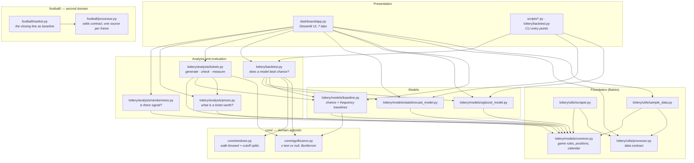
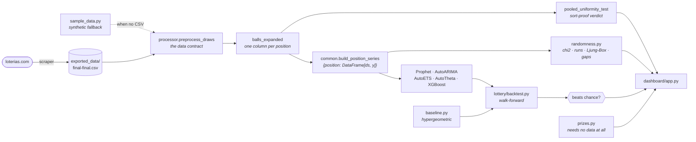
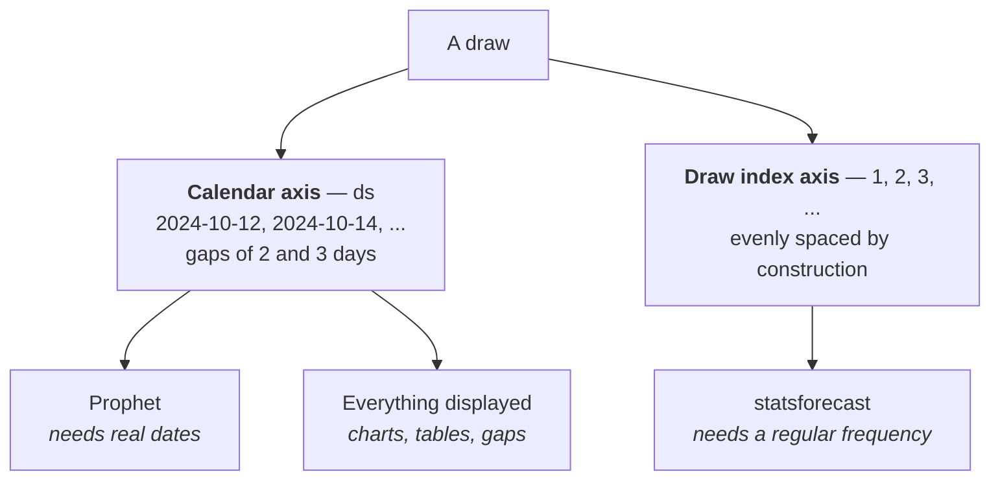

# Architecture

How the system is put together, and why it is shaped this way. For *what problem
it solves*, read [Domain and Premise](domain-and-premise.md) first.

## 1. Layers

The codebase is five layers with a strict dependency direction: nothing in a lower
layer imports from a higher one.

The bottom layer, `core/`, is **domain-agnostic**: it knows nothing about balls,
draws or lotteries. It holds walk-forward splits, the z-test against a null, and
the multiple-comparison correction — the machinery for judging a predictor
honestly. Everything Baloto-specific lives under `lottery/`, which supplies the
two things `core/` deliberately does not have: the null distribution to compare
against, and the scoring rule. A second domain plugs in at exactly that seam.



`lottery/models/common.py` is at the bottom and imports nothing from the project. It is the
single source of truth for the game's rules, and everything else derives from it.

## 2. Data flow

One pass, from the website to a verdict on screen.



Note the bottom-right: **`prizes.py` takes no historical data**. Prize
probabilities and expected value are pure combinatorics, which is why that tab
works before you have scraped anything.

## 3. The central data structure

Everything downstream of preprocessing speaks one of two shapes.

### `balls_expanded` — wide

A DataFrame with one column per ball position, one row per draw. Column index *is*
the position. Used by anything that reasons across positions within a draw
(pooled uniformity, sorted-data detection).

| row | 0 | 1 | 2 | 3 | 4 | 5 |
| --- | --- | --- | --- | --- | --- | --- |
| 2024-10-12 | 3 | 12 | 19 | 27 | 41 | 8 |

### `position_series` — per position

`{position: DataFrame[ds, y]}` from `common.build_position_series()`. One time
series per ball slot, sorted by date. Used by every model and every per-position
statistic.

```python
position_series[0]   # DataFrame[ds, y] — first main ball over time
position_series[5]   # DataFrame[ds, y] — the superbalota
```

## 4. Position semantics

A **position** is a column index into `balls_expanded`. The last column is the
superbalota; the rest are main balls. This is never spelled out inline — it is
derived from `lottery/models/common.py`:

| Helper | Returns |
| --- | --- |
| `super_position(n_columns)` | Index of the superbalota column |
| `main_positions(n_columns)` | `range` over the main-ball columns |
| `range_for_position(p, n)` | `(1, 43)` or `(1, 16)` |
| `min_for_position` / `max_for_position` | Bounds for that position |
| `clip_to_range(value, p, n)` | Round and clamp a raw prediction into range |
| `series_label(p, n)` | `"Balota 3"` / `"Superbalota"` for display |

**Why derive rather than hardcode.** `n_columns - 1` and `5` happen to be the same
number only when there are exactly 6 columns. Nothing else in the codebase assumes
6 columns, so hardcoding either one couples every call site to that assumption.
Writing `range(5)` for "the main balls" is the specific mistake these helpers exist
to prevent.

> **Rule:** any model that produces a raw number must pass it through
> `clip_to_range()` before that number is treated as a ball. Otherwise it will emit
> a 47 or a 0.

## 5. Two time axes

This is the least obvious thing in the codebase, and getting it wrong produces
silently wrong dates.



Draws happen Monday, Wednesday and Saturday — **gaps of 2 and 3 days**. No pandas
frequency string describes that, so:

- **Prophet and all display code** use real calendar dates (`ds`).
- **statsforecast models** use a sequential integer draw index, assigned by
  `common.to_long_format()`, with `freq=1`. The calendar is irrelevant to them.

To generate future dates, never invent a frequency:

```python
weekdays = infer_draw_weekdays(history["ds"])       # read the schedule off the data
dates = next_draw_dates(last_date, h, weekdays=weekdays)
```

`infer_draw_weekdays()` reads the schedule from the **recent tail** of the data
rather than assuming Mon/Wed/Sat. The schedule changed historically (Monday was
added to an original Wed/Sat pair), so a pre-Monday history keeps generating Wed/Sat
dates instead of phantom Monday draws. This is why it looks at the tail and not the
whole history: the union of both eras would be wrong for both.

## 6. Cross-cutting invariants

These hold across modules. Breaking one produces a plausible-looking wrong answer
rather than a crash, which is why they are written down.

### 6.1 Backtest scoring is set-based and order-agnostic

`backtest._score_window()` compares the **set** of the 5 main predictions against
the **set** of actual main balls. Slot order is irrelevant.

Two things depend on this:
- It is what makes the hypergeometric baseline the *correct* comparison — that
  distribution describes "how many of my m numbers got drawn", with no notion of
  slots.
- It makes order-statistic artifacts in the source data (see
  [the sorted-data trap](domain-and-premise.md#4-the-sorted-data-trap)) unable to
  inflate a score.

Preserve this property in any new scoring code.

### 6.2 Chance comparisons are one-sided

`baseline.beats_chance_test()` returns two p-values:

| Key | Question it answers |
| --- | --- |
| `p_value` | Two-sided: "does this differ from chance at all?" |
| `p_value_greater` | One-sided: "is this **better** than chance?" |

Only `p_value_greater` may back a "beats chance" claim. A model significantly
*worse* than chance also produces a small two-sided p-value, and reporting that as
a win is a real bug this project has already shipped and fixed.

### 6.3 One owner per contract

| Contract | Sole owner |
| --- | --- |
| Ball ranges, pool sizes, draw calendar, positions | `lottery/models/common.py` |
| CSV shape (`Date`, `Ball`) | `lottery/utils/processor.py:preprocess_draws` |
| Chance baseline | `lottery/models/baseline.py` |
| Prize probabilities | `lottery/analysis/prizes.py` |

Every entry point routes through the owner. `preprocess_draws` in particular is
reached by all three ingestion paths — CSV file, dashboard upload, synthetic data —
so the contract cannot drift between them.

### 6.4 Prediction intervals are opt-in

`fit_predict_all(..., level=None)` by default. Intervals cost real time per window
and nothing currently consumes them; pass `level=[80, 95]` where you actually plot
them.

## 6.5 statsforecast returns `unique_id` as a column

Normalized inside `fit_predict_all()` rather than left to callers — it is an index
before statsforecast 2.0. `requirements.txt` floors the version, but the helper
makes it true by construction regardless.

## 7. Repository map

```
├── README.md                     Front door
├── CLAUDE.md                     Terse conventions summary for AI agents
├── docs/                         This documentation
│
├── core/                         Domain-agnostic evaluation — knows no lottery
│   ├── windows.py                Walk-forward and date-cutoff splits
│   └── significance.py           ★ z-test vs a null, Bonferroni correction
│
├── football/                     Second domain — real signal, market baseline
│   ├── common.py                 ★ The three outcomes and their (H, D, A) ordering
│   ├── processor.py              ★ football-data.co.uk contract + opening/closing guard
│   ├── market.py                 Odds → calibrated probabilities (football's baseline.py)
│   └── sample_data.py            Synthetic seasons carrying the generative truth
│
├── lottery/                      Everything Baloto-specific
│   ├── backtest.py               Walk-forward evaluation vs chance (CLI)
│   ├── constants.py              Colombian holidays (opt-in Prophet regressor)
│   ├── models/
│   │   ├── common.py             ★ Game rules, positions, calendar, long-format
│   │   ├── baseline.py           Hypergeometric chance baseline + beats_chance_test
│   │   ├── statsforecast_model.py  AutoARIMA / AutoETS / AutoTheta (Nixtla)
│   │   ├── xgboost_model.py      Features, chronological splits, forecast_next
│   │   └── prophet_model.py      Prophet per position (named so it cannot shadow
│   │                             the `prophet` package it imports)
│   ├── analysis/
│   │   ├── randomness.py         Frequency, gaps, hot/cold, chi2, runs, ACF
│   │   ├── prizes.py             Exact prize probabilities, EV, RTP, breakeven
│   │   └── tickets.py            Generate, check and measure ticket strategies
│   └── utils/
│       ├── processor.py          ★ Data contract + forecast comparison
│       ├── scraper.py            loterias.com → the project CSV
│       ├── sample_data.py        Synthetic i.i.d. draws for demo/testing
│       ├── csv_merger.py         Legacy: merge hand-exported yearly CSVs
│       └── lib_detector.py       Print installed library versions
│
├── scripts/                      CLI entry points, run with `python -m scripts.<name>`
│   ├── prophet_forecast.py       Prophet forecast per position
│   ├── statsforecast_forecast.py statsforecast forecast per position
│   ├── xgboost_forecast.py       XGBoost held-out evaluation
│   └── summary_charts.py         Legacy: original static matplotlib charts
│
├── tests/                        pytest suite — the Baloto invariants
└── dashboard/app.py              Streamlit UI — the primary surface
```

`contants.py` was misspelled; the move to `lottery/` corrected it to
`lottery/constants.py`. Nothing imported it by name — only a comment in the
Prophet script referenced it — so the rename cost nothing.

## 8. Why these libraries

| Choice | Reason |
| --- | --- |
| **Nixtla statsforecast** over hand-rolled SARIMAX | Searches the order per series by AIC instead of one hand-picked `(p,d,q)` for all six; fits every position and all three models in **one vectorized call**. Replaced the previous `ARIMA.py`. |
| **Prophet** kept, but stripped down | Retained for continuity with the project's origin. The fabricated seasonalities were removed — see [Models](models.md#5-prophet). |
| **Streamlit** for the UI | Whole app is one Python file; no separate frontend build for a local analysis tool. |
| **Plotly** over matplotlib for the dashboard | Hover, zoom and inspection matter for exploring per-number distributions. matplotlib survives in the legacy `scripts/summary_charts.py`. |
| **scipy / statsmodels** | `hypergeom` and `chisquare`; `acf` and `acorr_ljungbox`. Exact distributions and standard tests, not reimplementations. |

---

**Next:** [Data Pipeline](data-pipeline.md) · [Models](models.md) · [Evaluation](evaluation.md)
