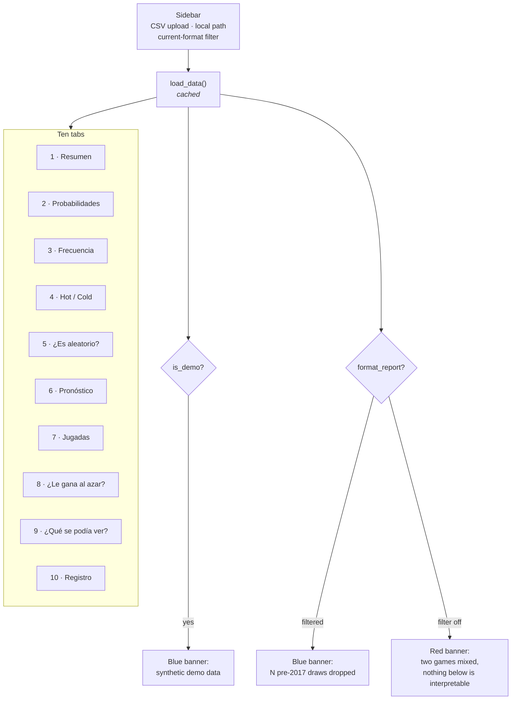

# Dashboard

`streamlit run dashboard/app.py` — the primary surface of the project.

**One app, three domains, chosen from the sidebar.** The UI text is in **Spanish**
(it is the end-user-facing product); this guide and all other documentation are in
English.

## 0. The three domains

The sidebar's first control picks the domain, and each page then adds its own data
controls below it. The three are **not equally built**, and the selector says so —
the caption under each option names what exists there today:

| Domain | Page | The baseline | What is there |
| --- | --- | --- | --- |
| 🎯 Baloto | `dashboard/baloto_page.py` | exact chance | Ten tabs: models, the chance baseline, backtest, tickets, power, registry |
| ⚽ Fútbol | `dashboard/football_page.py` | the closing price | Five tabs: the data contract, the market, a two-team forecast, a multi-model verdict, and staking |
| 🚴 Ciclismo | `dashboard/cycling_page.py` | the pre-race ranking | Five tabs: the result contract, attrition, gaps, a race forecast, and the verdict |

All three can now answer "did this beat its baseline?", but they are **not the
same question**, and the caption under each option names which one. That is what
the selector's copy is for: the domains differ in what can be found in them at
all — nothing in Baloto, a great deal in the other two — not in how far the code
has got. A launcher that listed them identically would imply three
interchangeable products.

The shell (`dashboard/app.py`) owns the page config, the selector and the dispatch,
and **imports each page lazily** — Baloto's pulls in statsforecast and xgboost, and
there is no reason to pay for that while looking at cycling results.

```
dashboard/
  app.py            # the shell: page config, domain selector, dispatch
  ui.py             # HELP / PLAIN / READ / GLOSSARY + section() / chart() / plain_verdict()
  baloto_page.py    # render(): the ten Baloto tabs
  football_page.py  # render(): Datos · Mercado · Pronóstico · ¿Le gana al mercado? · Valor
  cycling_page.py   # render(): Datos · Abandonos · Tiempos · Pronóstico · ¿Le gana al ranking?
```

The `_page` suffix is not decoration. Streamlit puts the script's own directory on
`sys.path`, so a `dashboard/football.py` would shadow the `football/` package it
imports — the same trap `lottery/models/prophet_model.py` is named around.

## 1. Baloto: layout



Streamlit re-runs the whole script on every widget interaction, so the expensive
work is either cached (`@st.cache_data`) or behind an explicit button.

**Solo sorteos del formato actual** (sidebar, on by default) drops draws from before
the 2017 rule change — see
[Data Pipeline §1.2](data-pipeline.md#12-two-eras-of-the-game). The banner says how
many were dropped and from when. Turning it off on a mixed file swaps that banner
for a red one: every tab below is then computed over two different games, and the
warning says so rather than letting the numbers look ordinary.

## 2. Baloto tab guide

### 1 · Resumen — start here

| Element | Source |
| --- | --- |
| Draw count, date range | the loaded data |
| "Balotas guardadas ordenadas asc." | `is_sorted_ascending()` |
| Pooled uniformity p-values, main and superbalota | `pooled_uniformity_test()` |

**How to read it.** A **high** p-value (> 0.05) is the healthy result: no evidence
against uniformity, exactly what a fair lottery should produce. A low p-value here
would be genuinely surprising and is more likely to indicate a data problem than a
beatable lottery.

If the sorted-data warning appears, your source publishes balls sorted ascending —
the per-position tests in tab 5 will show spurious structure. See
[the sorted-data trap](domain-and-premise.md#4-the-sorted-data-trap).

### 2 · Probabilidades — the one exact answer

The only tab that needs **no historical data**. Pure combinatorics.

- Jackpot odds and total combinations (15,401,568).
- An **editable prize table** — the amounts ship as clearly-marked placeholders.
  Replace them with the current official table; the probabilities do not depend on
  what you type.
- Ticket price input (5,700 base, ~9,000 with Revancha).
- Expected return, **expected value**, RTP, odds of winning anything.
- The jackpot that would make EV zero.

**How to read it.** The expected value is negative and exact. No selection strategy
changes it, because all 15,401,568 tickets are equally likely.

### 3 · Frecuencia y Gaps

Per-position frequency bars against the uniform expectation, plus a gap table:
times seen, average/σ gap in days, days since last, and an **overdue score**.

**How to read it.** Deviation from the expected line is ordinary sampling noise —
with a few hundred draws across 43 numbers, visible spread is expected.

> The overdue score is the classic "this number is due" heuristic. It is
> **gambler's fallacy**: for independent draws, time since last appearance carries
> zero information about the next draw. Included because people look for it, not
> because it works.

### 4 · Hot / Cold

Diverging bars: each number's share of a recent window minus its all-time share.
Window size is adjustable.

**How to read it.** With ~20 draws in the window, most of what you see is noise. A
number appearing twice instead of once in 20 draws produces a dramatic-looking bar
and means nothing.

### 5 · ¿Es aleatorio? — the diagnostic

Per-position table of chi-square, runs-test and Ljung–Box p-values with a
"Parece aleatorio" verdict, plus an ACF plot with 95% confidence bands.

**How to read it.**
- High p-values = healthy.
- **Six positions are tested at once.** At α = 0.05, roughly one in twenty tests
  flags by chance, so one or two "No" verdicts across six positions is expected
  noise. The tab says this on screen.
- The pooled test in tab 1 is the verdict; these are diagnostics.
- A low Ljung–Box p-value is the one result that would justify a time-series model.
  Do not expect one.

Below the ACF, **¿Se combinan bien las balotas, o solo se reparten bien?** adds
the three order-agnostic summaries — the sum of the five, the odd count, and how
many fall at or below 31 — each against its exact combinatorial reference. This
answers a different question from the pooled test: that one is about how often
each number appears, this one is about how they are *combined*, and a machine can
pass the first and fail the second. See
[Evaluation §4.1](evaluation.md#41-the-order-agnostic-summaries).

The sum chart is also the clearest answer to the question the whole premise turns
on. It is a bell curve, and a reader's first instinct is that middling sums are
better to play. They are not: there is one combination summing to 15 and 14,090
summing to 110, and all 14,091 are equally likely. The caption says exactly that,
and points at **7 · Jugadas → Reparto de premios** for the one thing an unusual
sum does change — how many people you would split with.

### 6 · Pronóstico

Pick a model, press the button, get a suggested combination for the next real draw
date.

Available: `FrequencyBaseline`, `Prophet`, `AutoARIMA`, `AutoETS`, `AutoTheta`,
`XGBoost`. All produce **genuine forecasts of the next undrawn date** — the XGBoost
path uses `forecast_next()`, not a fitted value for an already-drawn result.

**How to read it.** The tab opens with a warning for a reason. These are outputs of
a forecasting exercise; check tab 8 before attaching any weight to them.

Watch for the note about **collisions**: when fewer than 5 distinct numbers come
back, two positions predicted the same value. That is characteristic of a model with
no real signal — with nothing to differentiate the slots, each converges to the same
central estimate.

### 7 · Jugadas — generate, check, measure

Three sub-tabs, and the only place the project turns its own central claim into an
experiment you run rather than a statement you read. Full module reference in
[Tickets](tickets.md).

**Generar.** Pick how many plays, a strategy (`random`, `hot`, `cold`) and whether
the tickets should avoid repeating numbers between them. Shows the portfolio's
distinct-number coverage and jackpot odds.

> Read the coverage figures correctly: buying N tickets divides the jackpot odds by
> N and costs N times as much. That is arithmetic, not a strategy. Spreading over
> more of the pool changes how outcomes are distributed across the set, not the
> expected value of anything.

**Verificar.** Type a play and see how it would have done in every draw in your
history: the last draw's category, the full distribution by prize category, and its
best-ever result. Invalid plays (repeated numbers, out of range) are rejected with
the reason.

The distribution will closely track the exact probabilities in tab 1. Any other
play would give a statistically equivalent one — which is the finding.

**Medir estrategias.** The experiment: for each historical draw, generate plays
using **only** the draws before it, then compare hits against the exact
hypergeometric expectation.

Two guards are built into how the verdict is reported, and both matter:

- The verdict column uses a **Bonferroni-corrected** threshold, because testing
  three strategies at once means three chances at a false positive (~14% at a naive
  α = 0.05).
- **¿El resultado se sostiene?** repeats the whole experiment across many seeds and
  reports how often each strategy flagged. `random` cannot have an edge, so its
  flag rate is your measured false-positive floor — typically near 5%. A strategy
  that does not flag clearly more often than `random` has shown nothing.

If you only read one thing on this tab, read the stability table. A single positive
run is the most common way people convince themselves a lottery system works.

> **Jugadas** has a fourth sub-tab, **Reparto de premios**: enter the jackpot and
> tickets sold, and compare what a win is worth for popular versus unpopular
> combinations. Generated tickets also carry a popularity column. It changes
> `E[payout | win]` and never `P(win)` — see [Jackpot Splitting](jackpot-splitting.md).

### 8 · ¿Le gana al azar? — the verdict

Walk-forward evaluation, with a radio at the top choosing **which draws to hold
out**:

| Choice | Controls | Produces |
| --- | --- | --- |
| **Últimos N sorteos** | window count, minimum training size | The summary table and bar chart |
| **Corte por fecha (holdout)** | a date picker, and a mode | The same, **plus** a draw-by-draw table and a hits-over-time chart |

Both carry an **Incluir Prophet** checkbox that ships **on**. It used to ship off
on the grounds that Prophet was far slower; measured, it costs about +11% (see
[Models: performance notes](models.md#performance-notes)), and a table that
silently drops a model compares five things while the Bonferroni correction
printed beside it says six. It is unticked and disabled only when the package is
genuinely missing, which is a broken install rather than a choice.

Beside it is **Incluir TimesFM**, which ships **off** and is hidden entirely when
the package is absent. That is not the same judgement as Prophet's: TimesFM is a
genuinely optional dependency (torch plus a downloaded checkpoint), and its first
run pulls several hundred MB, so an unannounced download behind a button is the
surprise being avoided. When it is missing the dashboard says so rather than
quietly offering one model fewer. See
[Deployment](deployment.md#timesfm-and-what-it-costs).

The date option is the concrete one: pick 31 July, and the panel trains on
everything up to it and predicts the draws of August and September that have
already happened. Its **Modo** radio maps to the two experiments in
[Evaluation §2.2](evaluation.md#22-holdout-by-date) — *Reentrenar en cada sorteo*
(`expanding`, how you would really play) and *Entrenar una vez en el corte*
(`frozen`, the literal "fit in July, predict August blind").

`expanding` refits every model once per held-out draw, so its cost grows with the
horizon while `frozen` stays flat — a two-month cutoff in expanding mode is minutes,
the same cutoff frozen is seconds. The panel warns before the click rather than
after: an unannounced five-minute spinner reads as a hung app.

Both paths write into the same `st.session_state["backtest_summary"]`, so the
grouped bar chart and summary table below are shared. Switching back to the window
mode clears the per-draw table rather than leaving a stale one under a new run.

**How to read it.** In order: the **corrected** verdict column, then the gap
between the model and chance bars, then the p-value, then `n_windows`. A single run
at 15 windows is an anecdote, and the naive column is cleared by luck far more
often than 5% of the time because several models are tested at once — the table
shows the Bonferroni threshold next to it. Full detail in
[Evaluation §7](evaluation.md#7-how-to-read-a-backtest-result).

In the per-draw table, a row with 3 hits is not a finding: three or more of five
from 43 comes up about 1% of the time by luck, so one such row across several
models and a dozen draws is expected. The caption under the chart says so.

### 9 · ¿Qué se podía ver? — what the verdict is worth

Two panels, both answering questions that come *before* any result. Full detail
in [Power and Sensitivity](power-and-sensitivity.md).

**1. Efecto mínimo detectable.** Sliders for draw count, α and target power;
returns the smallest edge that much data could see, a power curve, and the table
of how much history each edge size would need. The backtest tab now prints the
MDE of the run you just executed beside its verdict, so "no model beat chance"
arrives with its own resolution attached.

**2. ¿Detectan estas pruebas una ventaja real?** Plants a known bias and reports
how often each detector fires. The `strength = 0` row is the control and the
panel refuses to run without it — a detection rate far above α there means the
detector is broken, and the tab says so in place of the usual verdict.

Note the `hot` and `random` detectors regenerate data *and* tickets per seed, so
they are slow; the panel warns when the grid gets large. `pooled` alone is
near-instant and is the one to start with.

### 10 · Registro — predictions made in advance

Record a play against an upcoming draw, score what has already happened, and see
the per-label result. The tab's value is in what it refuses: a draw date that is
not in the future, and a second prediction under the same label. Both refusals
render in Spanish with the module's English detail beneath, since
`lottery/analysis/registry.py` is library code and raises in English.

Every scored table carries `min_detectable_effect` beside the p-value, because a
young registry cannot say much and should say so. Full detail in
[The Prediction Registry](registry.md).

## 3. Fútbol: the data contract, the market and the model

Five tabs, and a **Europa / Colombia** source toggle at the top: *Europa
(football-data)* loads the per-league season files through `football/processor.py`;
*Colombia (archivo extra)* loads a `new/COL.csv`-style file through
`football/extra_processor.py`. Colombia mode is always opening odds, and every
model surface in that mode carries a banner saying so — an edge against those
prices is against a soft market, not a finding.

| Tab | Shows | The point |
| --- | --- | --- |
| **Datos** | Match count, date span, resolved odds source, closing-or-opening, price coverage, first rows | Which odds source a file resolved to is the thing that decides whether it can serve as a baseline at all. It is invisible in the frame, so it is a metric here. |
| **Mercado** | Overround distribution, the market's calibration curve for home wins, **the Dixon-Coles model's own calibration curve** (in-sample, and it says so), the three de-margining methods side by side on one match | The margin has to come off before prices mean anything, and how it comes off is a modelling choice. The model curve is fit on the seasons shown, so it flatters the model — the out-of-sample verdict is in **Resultados**. |
| **Pronóstico** | Two team pickers, optional current decimal odds; head-to-head and recent form (descriptive), then the Dixon-Coles 1X2 vector, **the Elo vector and rating table**, a scoreline heatmap, over/under and BTTS | The two-team view. Model probabilities appear **only beside the de-margined market**, or under an explicit "no baseline for this match" caption — never alone. Elo is here as the cheap baseline: if Dixon-Coles cannot separate itself from one number per team, that is worth seeing. |
| **¿Le gana al mercado?** | Outcome shares, goals per side, observed rates against the market's mean probabilities, then a gated **multi-model walk-forward backtest against the closing line** | The descriptive charts carry the usual disclaimer — two matching bars are not a result. The backtest is the verdict: one row per selected model, the corrected threshold printed as 0.05 divided by however many ran, and the effect with its 95% interval, through the same `core/` machinery as the lottery backtest. |
| **Valor** | The market's belief, its margin stacked on top, the model as a diamond; then edge, the break-even price and a quarter-Kelly stake per outcome | The staking surface, and the one able to lose someone money. It shows **no stake at all** until the measured verdict from the previous tab is on screen beside it, and it draws the margin rather than describing it: there is a bet only when the diamond clears the whole column. |

The backtest is behind a button and needs ~150 matches; it exposes a
walk-forward window count, a half-life for time decay, which models to score, and
the blend's weight and pooling rule. On opening-odds data it prints the
soft-market warning in place of a corrected claim. See
[Evaluation §9](evaluation.md#9-football-dixon-coles-vs-the-market) and
[§9.1](evaluation.md#91-several-models-at-once).

**Valor is rendered after the backtest block, not beside Pronóstico.** Streamlit
executes every tab body on each rerun in source order, so a Valor placed earlier
would read the verdict out of session state one rerun stale — and tell the reader
nothing had been measured on the very click that measured it.

Loading is where the domain's guard shows up in the UI. The sidebar lists the season
files in `exported_data/football/` and lets you select several; selecting two that
resolve to **different odds sources** does not silently merge them — `load_seasons`
raises, and the page renders the refusal with a Spanish explanation and the original
message as technical detail. That is the
[opening/closing trap](football.md#the-trap-never-mix-opening-and-closing-odds) made
visible at the moment someone would otherwise walk into it. Colombia mode enforces
its own version: one `League` value per file, or `MatchFormatError`.

With no files present the page falls back to a synthetic season and says so, exactly
as the Baloto page does.

## 4. Ciclismo: the result contract, the ranking and the model

Five tabs. The first three are the part that costs most when it goes unnoticed —
the three invariants the contract protects are all invisible in the shape of a
frame, so they are put on screen. The last two are the forecast and its verdict.

| Tab | Shows | The point |
| --- | --- | --- |
| **Datos** | Rows, result kind, races, riders, non-finishers, rows with no time, **time-order violations** | The kind is a metric because a file holds exactly one; the violation count is a metric because a column of gaps stored as totals looks completely normal otherwise. |
| **Abandonos** | Counts per status, the peloton shrinking stage by stage, abandons per stage | Abandons are kept, not dropped, and the caption says why: they concentrate among the riders in worst form, so filtering them makes every accuracy figure optimistic. |
| **Tiempos** | Seconds behind the leader by placing, the leader's own time, how many share it | A flat opening stretch is a bunch finish; a step is where the race split. **If the curve ever goes down, the times are wrong** — which is what the violation metric counts. |
| **Pronóstico** | Win and top-N probabilities for one race from the fitted model **and** the ranking baseline, with the uniform draw as a dotted line; a scatter of where the two disagree | Everything is built from results strictly before that race's date. The uniform line is drawn rather than argued: at ~180 riders it is 0.55%, which is why it is not the baseline. |
| **¿Le gana al ranking?** | A gated walk-forward comparison: the model and the uniform draw, each scored against the ranking | The verdict, through the same `core/` machinery as the other two domains. The uniform draw stays in the table on purpose — it comes out worse than the ranking, which is the demonstration that it is not a baseline. See [Evaluation §10](evaluation.md#10-cycling-a-model-vs-the-pre-race-ranking). |

The **Plackett-Luce log score is the verdict** and the rank correlations are
diagnostics, the same split as "the pooled test is the verdict" on the Baloto
page. The evaluation warns about its own sample size on screen: a Grand Tour is
21 scored races, and on a sprint stage the finishing order is close to noise by
construction, so no forecast can or should beat a ranking there.

Selecting a stage-results file and a general-classification file together is refused
the same way football's mixed sources are, for the same reason: one `rank` column
cannot mean a day's placing and a three-week standing at once.

The "hide non-finishers" checkbox filters the table **after** the checks have run, so
the "not one abandon in the whole file" warning still fires on the file as published
rather than on the filtered view.

## 5. The four layers of explanation

The dashboard used to explain itself only to a reader who already knew the
answer: every "what am I looking at" lived behind a hover ⓘ, and ten unordered
tabs of p-values left a newcomer to assemble the conclusion themselves. Most
assemble the wrong one — they find the tab with the biggest number and stop.

**All explanatory copy still lives in `dashboard/ui.py`, and nowhere else.**
There are now four dicts, all keyed the same way, so one key carries every layer
a surface needs:

| Dict | Where it appears | What it is for |
| --- | --- | --- |
| `HELP` | the hover ⓘ | there when you want it, out of the way when you don't |
| `PLAIN` | an always-visible bordered box under the section header | *Qué estás viendo · Qué puedes concluir · **Lo que NO significa*** |
| `READ` | one line under a chart's title, before the figure | where to point your eyes |
| `GLOSSARY` | an expander in every page's sidebar | the jargon, once, with a concrete example each |

`section()` and `chart()` pull `PLAIN` and `READ` in automatically off the key
they already take, so a surface gets the guided layer without a new argument at
the call site and the copy can never drift into a page module:

```python
section("Sorteo por sorteo", "holdout_detail")   # subheader + ⓘ + the PLAIN box
chart(fig, "Aciertos por sorteo", "holdout_chart")  # title + ⓘ + READ line + figure
```

A key with no `PLAIN` entry simply renders no box, so partial coverage is fine:
the tab-level and conceptually hard keys are the ones that need it.

### The third field is the point

`PLAIN`'s `ojo` — *lo que NO significa* — is **required by the shape**, and a
test enforces it. It is not a disclaimer bolted on at the end: it is the sentence
that stops a reader walking away with the conclusion the surface merely *looks*
like it supports. A frequency chart saying "el 7 salió más" and nothing else has
misinformed someone; the same chart with "eso no lo hace más probable" has not.

### Verdicts in words, numbers underneath

`plain_verdict(passed, headline, detail, good_is_pass=True)` states a finding as
a sentence and keeps the number where it can still be checked. A bare `p = 0.412`
tells a reader who already knows the answer what they already knew, and everyone
else nothing. `good_is_pass` flips the colour without touching the wording,
because "passed" is not always the welcome outcome: a lottery failing a
uniformity test is alarming, while a model failing to beat chance is the expected
result.

### Numbered tabs

Tab labels carry their position (`5 · ¿Es aleatorio?`). Ten tabs in an unordered
row read as ten equally good places to start, and the one a newcomer picks first
is usually the forecast — the single tab whose output means least without the
three that come before it.

### Mechanics

`chart()` moves the title **out of the Plotly figure** and into Streamlit. Plotly's
own title has nowhere to hang a help icon, so every chart in the dashboard gets the
same typography and the same affordance this way. Note that clearing the figure
title needs `title={"text": ""}` — passing `title=None` leaves Plotly rendering the
literal string `undefined` above the plot.

Splitting the pages into modules was exactly the moment this rule was easiest to
lose, which is why the dicts did not move into the pages: three files with their own
inline strings cannot be reviewed as a whole. Keys are prefixed `fb_` and `cy_` for
the two newer domains.

Keeping the texts together is what makes them reviewable as a set. The house rule
is that no chart or table appears without saying what it does *not* mean, and that
is only checkable when the copy sits in one block. When adding a surface, add its
key to `HELP` and route it through `section()` or `chart()`; a plain
`st.plotly_chart` call is the signal that one was missed. `tests/test_dashboard_help.py`
checks all of this without launching Streamlit: every key a page asks for exists,
no page declares its own copy dict, every `PLAIN`/`READ` key is a real `HELP` key,
and every `PLAIN` entry has all three fields filled.

## 6. Performance notes

Streamlit re-executes every tab on every interaction. The design keeps that cheap:

| Work | Strategy |
| --- | --- |
| Loading and preprocessing | `@st.cache_data` on each page's loader (`load_data`, `load_matches`, `load_results`); Baloto's also derives `position_series` so the frames are never re-hashed as arguments |
| Importing a domain's stack | The shell imports the chosen page only, so cycling never pays for statsforecast |
| Six randomness reports | `@st.cache_data` on `randomness_reports` |
| Gap table, pooled tests | `@st.cache_data` |
| ACF for the selected position | Reused from the cached report, not recomputed |
| Model fitting, backtests | Behind buttons; results parked in `st.session_state` |

Consequence: moving a slider in tab 7 does not re-fit anything. Only pressing
**Ejecutar backtest** does.

## 7. Extending the UI

- Tabs are positional (`tabs[0]` … `tabs[9]` on the Baloto page, and their **labels carry a 1-based number** that must stay in step). **Inserting a tab
  shifts every index after it** — update them all. Appending at the end is the safe move.
- A new domain is a new `<name>_page.py` exporting `render()`, plus one entry in
  `DOMAINS` in `app.py` naming what exists there. Keep the `_page` suffix so the
  module cannot shadow the domain package it imports.
- `label_to_pos` is built once near the top and used by several tabs. Streamlit runs
  top to bottom and `with` does not create scope, so ordering matters.
- Follow the house rule: any surface showing a model output or a heuristic also
  shows the chance level or a note on what it does not mean — in the visible caption
  for what a reader must not miss, and in the `HELP` tooltip for the rest.

---

**Next:** [Development](development.md) · [Evaluation](evaluation.md)
