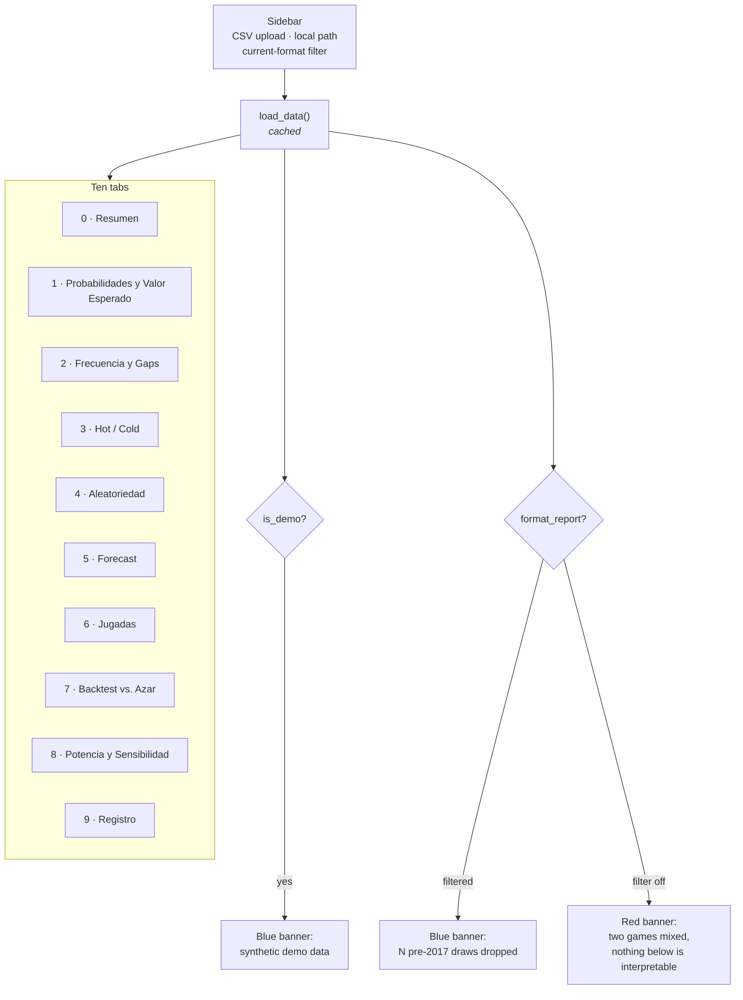

# Dashboard

`streamlit run dashboard/app.py` — the primary surface of the project.

Ten tabs. The UI text is in **Spanish** (it is the end-user-facing product); this guide and
all other documentation are in English.

## 1. Layout



Streamlit re-runs the whole script on every widget interaction, so the expensive
work is either cached (`@st.cache_data`) or behind an explicit button.

**Solo sorteos del formato actual** (sidebar, on by default) drops draws from before
the 2017 rule change — see
[Data Pipeline §1.2](data-pipeline.md#12-two-eras-of-the-game). The banner says how
many were dropped and from when. Turning it off on a mixed file swaps that banner
for a red one: every tab below is then computed over two different games, and the
warning says so rather than letting the numbers look ordinary.

## 2. Tab guide

### 0 · Resumen — start here

| Element | Source |
| --- | --- |
| Draw count, date range | the loaded data |
| "Balotas guardadas ordenadas asc." | `is_sorted_ascending()` |
| Pooled uniformity p-values, main and superbalota | `pooled_uniformity_test()` |

**How to read it.** A **high** p-value (> 0.05) is the healthy result: no evidence
against uniformity, exactly what a fair lottery should produce. A low p-value here
would be genuinely surprising and is more likely to indicate a data problem than a
beatable lottery.

If the sorted-data warning appears, your source publishes balls sorted ascending —
per-position tests in tab 4 will show spurious structure. See
[the sorted-data trap](domain-and-premise.md#4-the-sorted-data-trap).

### 1 · Probabilidades y Valor Esperado — the one exact answer

The only tab that needs **no historical data**. Pure combinatorics.

- Jackpot odds and total combinations (15,401,568).
- An **editable prize table** — the amounts ship as clearly-marked placeholders.
  Replace them with the current official table; the probabilities do not depend on
  what you type.
- Ticket price input (5,700 base, ~9,000 with Revancha).
- Expected return, **expected value**, RTP, odds of winning anything.
- The jackpot that would make EV zero.

**How to read it.** The expected value is negative and exact. No selection strategy
changes it, because all 15,401,568 tickets are equally likely.

### 2 · Frecuencia y Gaps

Per-position frequency bars against the uniform expectation, plus a gap table:
times seen, average/σ gap in days, days since last, and an **overdue score**.

**How to read it.** Deviation from the expected line is ordinary sampling noise —
with a few hundred draws across 43 numbers, visible spread is expected.

> The overdue score is the classic "this number is due" heuristic. It is
> **gambler's fallacy**: for independent draws, time since last appearance carries
> zero information about the next draw. Included because people look for it, not
> because it works.

### 3 · Hot / Cold

Diverging bars: each number's share of a recent window minus its all-time share.
Window size is adjustable.

**How to read it.** With ~20 draws in the window, most of what you see is noise. A
number appearing twice instead of once in 20 draws produces a dramatic-looking bar
and means nothing.

### 4 · Aleatoriedad — the diagnostic

Per-position table of chi-square, runs-test and Ljung–Box p-values with a
"Parece aleatorio" verdict, plus an ACF plot with 95% confidence bands.

**How to read it.**
- High p-values = healthy.
- **Six positions are tested at once.** At α = 0.05, roughly one in twenty tests
  flags by chance, so one or two "No" verdicts across six positions is expected
  noise. The tab says this on screen.
- The pooled test in tab 0 is the verdict; these are diagnostics.
- A low Ljung–Box p-value is the one result that would justify a time-series model.
  Do not expect one.

### 5 · Forecast

Pick a model, press the button, get a suggested combination for the next real draw
date.

Available: `FrequencyBaseline`, `Prophet`, `AutoARIMA`, `AutoETS`, `AutoTheta`,
`XGBoost`. All produce **genuine forecasts of the next undrawn date** — the XGBoost
path uses `forecast_next()`, not a fitted value for an already-drawn result.

**How to read it.** The tab opens with a warning for a reason. These are outputs of
a forecasting exercise; check tab 6 before attaching any weight to them.

Watch for the note about **collisions**: when fewer than 5 distinct numbers come
back, two positions predicted the same value. That is characteristic of a model with
no real signal — with nothing to differentiate the slots, each converges to the same
central estimate.

### 6 · Jugadas — generate, check, measure

Three sub-tabs, and the only place the project turns its own central claim into an
experiment you run rather than a statement you read. Full module reference in
[Tickets](tickets.md).

**Generar.** Pick how many plays, a strategy (`random`, `hot`, `cold`) and whether
the tickets should avoid repeating numbers between them. Shows the portfolio's
distinct-number coverage and jackpot odds.

> Read the coverage figures correctly: buying N tickets divides the jackpot odds by
> N and costs N times as much. That is arithmetic, not a strategy. Spreading over
> more of the pool changes how outcomes are distributed across the set, not the
> expected value of anything.

**Verificar.** Type a play and see how it would have done in every draw in your
history: the last draw's category, the full distribution by prize category, and its
best-ever result. Invalid plays (repeated numbers, out of range) are rejected with
the reason.

The distribution will closely track the exact probabilities in tab 1. Any other
play would give a statistically equivalent one — which is the finding.

**Medir estrategias.** The experiment: for each historical draw, generate plays
using **only** the draws before it, then compare hits against the exact
hypergeometric expectation.

Two guards are built into how the verdict is reported, and both matter:

- The verdict column uses a **Bonferroni-corrected** threshold, because testing
  three strategies at once means three chances at a false positive (~14% at a naive
  α = 0.05).
- **¿El resultado se sostiene?** repeats the whole experiment across many seeds and
  reports how often each strategy flagged. `random` cannot have an edge, so its
  flag rate is your measured false-positive floor — typically near 5%. A strategy
  that does not flag clearly more often than `random` has shown nothing.

If you only read one thing on this tab, read the stability table. A single positive
run is the most common way people convince themselves a lottery system works.

> **Jugadas** has a fourth sub-tab, **Reparto de premios**: enter the jackpot and
> tickets sold, and compare what a win is worth for popular versus unpopular
> combinations. Generated tickets also carry a popularity column. It changes
> `E[payout | win]` and never `P(win)` — see [Jackpot Splitting](jackpot-splitting.md).

### 7 · Backtest vs. Azar — the verdict

Walk-forward evaluation, with a radio at the top choosing **which draws to hold
out**:

| Choice | Controls | Produces |
| --- | --- | --- |
| **Últimos N sorteos** | window count, minimum training size | The summary table and bar chart |
| **Corte por fecha (holdout)** | a date picker, and a mode | The same, **plus** a draw-by-draw table and a hits-over-time chart |

The date option is the concrete one: pick 31 July, and the panel trains on
everything up to it and predicts the draws of August and September that have
already happened. Its **Modo** radio maps to the two experiments in
[Evaluation §2.2](evaluation.md#22-holdout-by-date) — *Reentrenar en cada sorteo*
(`expanding`, how you would really play) and *Entrenar una vez en el corte*
(`frozen`, the literal "fit in July, predict August blind").

`expanding` refits every model once per held-out draw, so its cost grows with the
horizon while `frozen` stays flat — a two-month cutoff in expanding mode is minutes,
the same cutoff frozen is seconds. The panel warns before the click rather than
after: an unannounced five-minute spinner reads as a hung app.

Both paths write into the same `st.session_state["backtest_summary"]`, so the
grouped bar chart and summary table below are shared. Switching back to the window
mode clears the per-draw table rather than leaving a stale one under a new run.

**How to read it.** In order: the **corrected** verdict column, then the gap
between the model and chance bars, then the p-value, then `n_windows`. A single run
at 15 windows is an anecdote, and the naive column is cleared by luck far more
often than 5% of the time because several models are tested at once — the table
shows the Bonferroni threshold next to it. Full detail in
[Evaluation §7](evaluation.md#7-how-to-read-a-backtest-result).

In the per-draw table, a row with 3 hits is not a finding: three or more of five
from 43 comes up about 1% of the time by luck, so one such row across several
models and a dozen draws is expected. The caption under the chart says so.

### 8 · Potencia y Sensibilidad — what the verdict is worth

Two panels, both answering questions that come *before* any result. Full detail
in [Power and Sensitivity](power-and-sensitivity.md).

**1. Efecto mínimo detectable.** Sliders for draw count, α and target power;
returns the smallest edge that much data could see, a power curve, and the table
of how much history each edge size would need. The backtest tab now prints the
MDE of the run you just executed beside its verdict, so "no model beat chance"
arrives with its own resolution attached.

**2. ¿Detectan estas pruebas una ventaja real?** Plants a known bias and reports
how often each detector fires. The `strength = 0` row is the control and the
panel refuses to run without it — a detection rate far above α there means the
detector is broken, and the tab says so in place of the usual verdict.

Note the `hot` and `random` detectors regenerate data *and* tickets per seed, so
they are slow; the panel warns when the grid gets large. `pooled` alone is
near-instant and is the one to start with.

### 9 · Registro — predictions made in advance

Record a play against an upcoming draw, score what has already happened, and see
the per-label result. The tab's value is in what it refuses: a draw date that is
not in the future, and a second prediction under the same label. Both refusals
render in Spanish with the module's English detail beneath, since
`analysis/registry.py` is library code and raises in English.

Every scored table carries `min_detectable_effect` beside the p-value, because a
young registry cannot say much and should say so. Full detail in
[The Prediction Registry](registry.md).

## 3. Explain-on-hover

Every section header, chart, metric and control carries a small ⓘ that explains
what you are looking at on hover. The copy lives in one place — the `HELP` dict at
the top of `dashboard/app.py` — rather than inline at each call site, and two
helpers consume it:

```python
section("Sorteo por sorteo", "holdout_detail")   # st.subheader + its ⓘ
chart(fig, "Aciertos por sorteo", "holdout_chart")  # titled line + ⓘ + the figure
```

`chart()` moves the title **out of the Plotly figure** and into Streamlit. Plotly's
own title has nowhere to hang a help icon, so every chart in the dashboard gets the
same typography and the same affordance this way. Note that clearing the figure
title needs `title={"text": ""}` — passing `title=None` leaves Plotly rendering the
literal string `undefined` above the plot.

Keeping the texts together is what makes them reviewable as a set. The house rule
is that no chart or table appears without saying what it does *not* mean, and that
is only checkable when the copy sits in one block. When adding a surface, add its
key to `HELP` and route it through `section()` or `chart()`; a plain
`st.plotly_chart` call is the signal that one was missed.

## 4. Performance notes

Streamlit re-executes every tab on every interaction. The design keeps that cheap:

| Work | Strategy |
| --- | --- |
| Loading and preprocessing | `@st.cache_data` on `load_data`, which also derives `position_series` so the frames are never re-hashed as arguments |
| Six randomness reports | `@st.cache_data` on `randomness_reports` |
| Gap table, pooled tests | `@st.cache_data` |
| ACF for the selected position | Reused from the cached report, not recomputed |
| Model fitting, backtests | Behind buttons; results parked in `st.session_state` |

Consequence: moving a slider in tab 6 does not re-fit anything. Only pressing
**Ejecutar backtest** does.

## 5. Extending the UI

- Tabs are positional (`tabs[0]` … `tabs[9]`). **Inserting a tab shifts every index
  after it** — update them all. Appending at the end is the safe move.
- `label_to_pos` is built once near the top and used by several tabs. Streamlit runs
  top to bottom and `with` does not create scope, so ordering matters.
- Follow the house rule: any surface showing a model output or a heuristic also
  shows the chance level or a note on what it does not mean — in the visible caption
  for what a reader must not miss, and in the `HELP` tooltip for the rest.

---

**Next:** [Development](development.md) · [Evaluation](evaluation.md)
