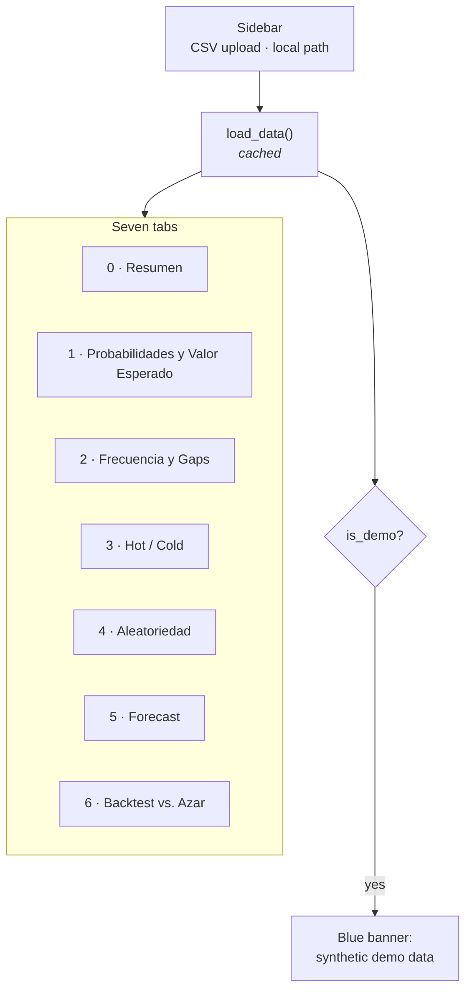

# Dashboard

`streamlit run dashboard/app.py` — the primary surface of the project.

The UI text is in **Spanish** (it is the end-user-facing product); this guide and
all other documentation are in English.

## 1. Layout

Streamlit re-runs the whole script on every widget interaction, so the expensive
work is either cached (`@st.cache_data`) or behind an explicit button.

## 2. Tab guide

### 0 · Resumen — start here

| Element | Source |
| --- | --- |
| Draw count, date range | the loaded data |
| "Balotas guardadas ordenadas asc." | `is_sorted_ascending()` |
| Pooled uniformity p-values, main and superbalota | `pooled_uniformity_test()` |

**How to read it.** A **high** p-value (> 0.05) is the healthy result: no evidence
against uniformity, exactly what a fair lottery should produce. A low p-value here
would be genuinely surprising and is more likely to indicate a data problem than a
beatable lottery.

If the sorted-data warning appears, your source publishes balls sorted ascending —
per-position tests in tab 4 will show spurious structure. See
[the sorted-data trap](domain-and-premise.md#4-the-sorted-data-trap).

### 1 · Probabilidades y Valor Esperado — the one exact answer

The only tab that needs **no historical data**. Pure combinatorics.

- Jackpot odds and total combinations (15,401,568).
- An **editable prize table** — the amounts ship as clearly-marked placeholders.
  Replace them with the current official table; the probabilities do not depend on
  what you type.
- Ticket price input (5,700 base, ~9,000 with Revancha).
- Expected return, **expected value**, RTP, odds of winning anything.
- The jackpot that would make EV zero.

**How to read it.** The expected value is negative and exact. No selection strategy
changes it, because all 15,401,568 tickets are equally likely.

### 2 · Frecuencia y Gaps

Per-position frequency bars against the uniform expectation, plus a gap table:
times seen, average/σ gap in days, days since last, and an **overdue score**.

**How to read it.** Deviation from the expected line is ordinary sampling noise —
with a few hundred draws across 43 numbers, visible spread is expected.

> The overdue score is the classic "this number is due" heuristic. It is
> **gambler's fallacy**: for independent draws, time since last appearance carries
> zero information about the next draw. Included because people look for it, not
> because it works.

### 3 · Hot / Cold

Diverging bars: each number's share of a recent window minus its all-time share.
Window size is adjustable.

**How to read it.** With ~20 draws in the window, most of what you see is noise. A
number appearing twice instead of once in 20 draws produces a dramatic-looking bar
and means nothing.

### 4 · Aleatoriedad — the diagnostic

Per-position table of chi-square, runs-test and Ljung–Box p-values with a
"Parece aleatorio" verdict, plus an ACF plot with 95% confidence bands.

**How to read it.**
- High p-values = healthy.
- **Six positions are tested at once.** At α = 0.05, roughly one in twenty tests
  flags by chance, so one or two "No" verdicts across six positions is expected
  noise. The tab says this on screen.
- The pooled test in tab 0 is the verdict; these are diagnostics.
- A low Ljung–Box p-value is the one result that would justify a time-series model.
  Do not expect one.

### 5 · Forecast

Pick a model, press the button, get a suggested combination for the next real draw
date.

Available: `FrequencyBaseline`, `Prophet`, `AutoARIMA`, `AutoETS`, `AutoTheta`,
`XGBoost`. All produce **genuine forecasts of the next undrawn date** — the XGBoost
path uses `forecast_next()`, not a fitted value for an already-drawn result.

**How to read it.** The tab opens with a warning for a reason. These are outputs of
a forecasting exercise; check tab 6 before attaching any weight to them.

Watch for the note about **collisions**: when fewer than 5 distinct numbers come
back, two positions predicted the same value. That is characteristic of a model with
no real signal — with nothing to differentiate the slots, each converges to the same
central estimate.

### 6 · Backtest vs. Azar — the verdict

Walk-forward evaluation with adjustable windows and minimum training size, plus an
optional (slow) Prophet run.

Produces a grouped bar chart of model vs chance, and a table with the one-sided
p-value and a "¿Le gana al azar?" column.

**How to read it.** In order: the verdict column, then the gap between the model and
chance bars, then the p-value, then `n_windows`. A single run at 15 windows is an
anecdote — a signal-free model clears chance about half the time by luck. Full
detail in [Evaluation §7](evaluation.md#7-how-to-read-a-backtest-result).

## 3. Performance notes

Streamlit re-executes every tab on every interaction. The design keeps that cheap:

| Work | Strategy |
| --- | --- |
| Loading and preprocessing | `@st.cache_data` on `load_data`, which also derives `position_series` so the frames are never re-hashed as arguments |
| Six randomness reports | `@st.cache_data` on `randomness_reports` |
| Gap table, pooled tests | `@st.cache_data` |
| ACF for the selected position | Reused from the cached report, not recomputed |
| Model fitting, backtests | Behind buttons; results parked in `st.session_state` |

Consequence: moving a slider in tab 6 does not re-fit anything. Only pressing
**Ejecutar backtest** does.

## 4. Extending the UI

- Tabs are positional (`tabs[0]` … `tabs[6]`). **Inserting a tab shifts every index
  after it** — update them all.
- `label_to_pos` is built once near the top and used by several tabs. Streamlit runs
  top to bottom and `with` does not create scope, so ordering matters.
- Follow the house rule: any surface showing a model output or a heuristic also
  shows the chance level or a note on what it does not mean.

---

**Next:** [Development](development.md) · [Evaluation](evaluation.md)
