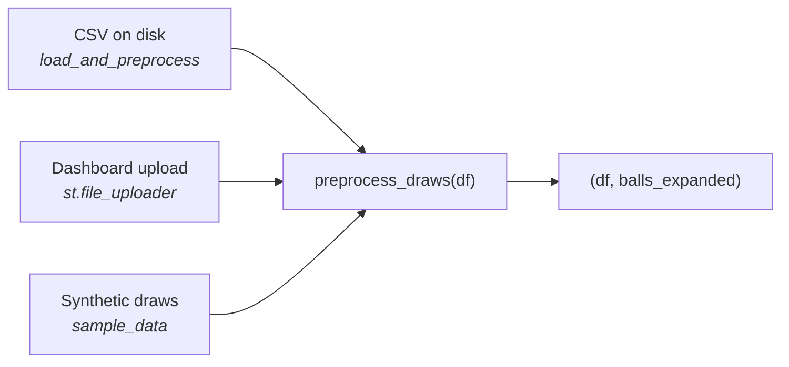
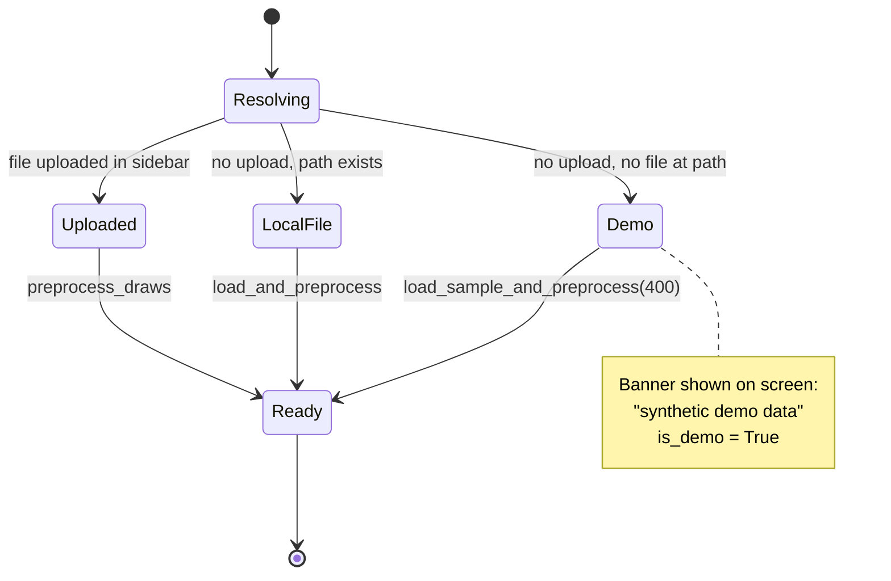
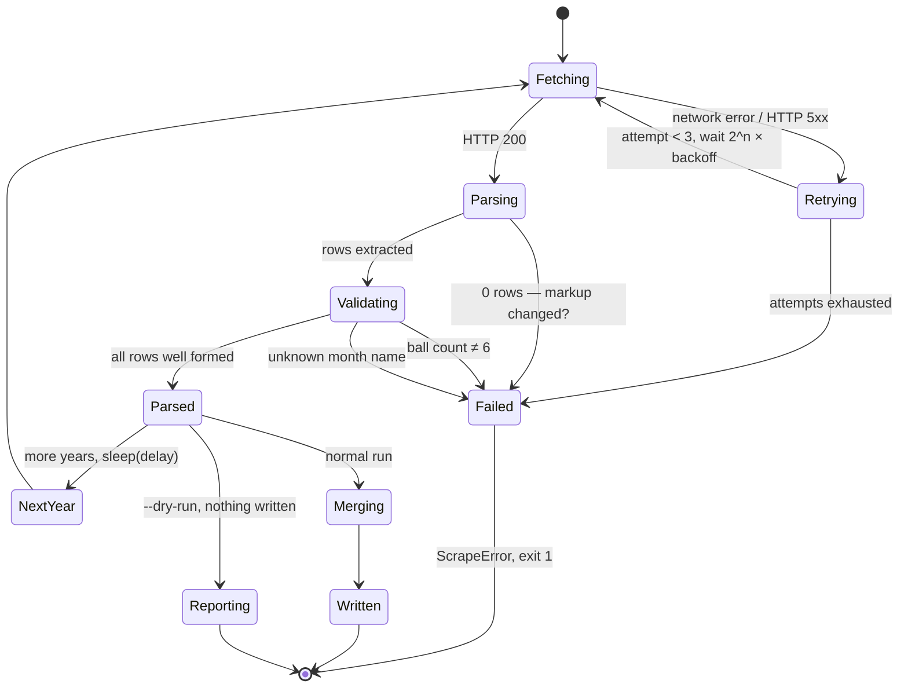

# Data Pipeline

How draw results get from a public website into the shape every model consumes.

## 1. The data contract

One file, two columns. Everything in the project depends on this shape.

**`exported_data/final-final.csv`** (gitignored — not in the repository)

```csv
Date,Ball
12/10/2024,3-12-19-27-41-8
09/10/2024,1-7-15-33-40-11
```

| Column | Format | Notes |
| --- | --- | --- |
| `Date` | `dd/mm/yyyy` | Day first. Parsed with `dayfirst=True`. |
| `Ball` | 6 dash-separated integers | 5 main balls, then **the superbalota last**. |

A `Revancha` column may also be present; nothing currently reads it.

**`utils/processor.py:preprocess_draws()` is the single owner of this contract.**
All three ingestion paths go through it, so the format cannot drift between them:



It validates that `Date` and `Ball` exist, parses the date into `ds`, and splits
`Ball` into `balls_expanded` — one numeric column per position.

> Adding a column to the contract means changing `preprocess_draws` and nothing
> else. That is the point of routing everything through it.

## 2. Data source resolution

The dashboard never fails for lack of data. It resolves a source in priority
order and tells you on screen which one it landed on.



Implemented in `dashboard/app.py:load_data()`, cached with `@st.cache_data`. It
returns `(df, balls_expanded, position_series, is_demo)` — deriving
`position_series` inside the cached call so Streamlit never re-hashes the full
frames on every rerun.

## 3. The scraper

`utils/scraper.py` builds the CSV from `loterias.com`.

```bash
python -m utils.scraper --years 2024 --dry-run     # parse and print, write nothing
python -m utils.scraper --years 2020-2025           # merge into the project CSV
python -m utils.scraper --years 2021,2024 --out other.csv --delay 3
```

| Flag | Default | Purpose |
| --- | --- | --- |
| `--years` | *required* | `2024`, a range `2020-2025`, or a list `2021,2024` |
| `--out` | `exported_data/final-final.csv` | Destination, merged not overwritten |
| `--delay` | `1.5` | Seconds between year requests — be a polite client |
| `--dry-run` | off | Print what was parsed, write nothing |

### 3.1 Design principle: fail loudly

> A scraper that silently writes an empty file when the site's markup changes is
> worse than one that crashes. You find out months later, with the analysis already
> running on stale data.

The previous implementation skipped every unexpected structure with `continue`,
then printed `Data successfully exported` over a header-only CSV. Every one of
those skips is now a `ScrapeError`.

### 3.2 Scraper state machine



Every `Failed` transition names what to check. There is no path from a broken page
to a written file.

### 3.3 Validation rules

| Check | On failure |
| --- | --- |
| Page yielded ≥ 1 row | `ScrapeError` — "Parsed 0 draws… page structure changed" |
| Each draw has exactly `MAIN_BALLS_DRAWN + 1` = 6 balls | `ScrapeError` naming the date and the count found |
| Month name recognized | `ScrapeError` — never a silent `"00"` month |

Month parsing keys on the **first three letters**, so `may`/`mayo` and
`sep`/`sept.`/`septiembre` all resolve. All twelve Spanish months are unique in
their first three characters.

### 3.4 Merge semantics

`merge_into()` never overwrites blindly:

1. Read the existing file, if any.
2. Concatenate the new rows.
3. **De-duplicate by `Date`, keeping the existing row** — a hand-corrected local
   file is not clobbered by a re-scrape.
4. Sort chronologically and write.

This makes re-running the scraper idempotent and safe to run on overlapping year
ranges.

### 3.5 Verification and its limit

`parse_results_page(html)` performs **no I/O**, so it can be tested against saved
HTML. It has been verified offline against a fixture built from the selectors the
scraper targets (`td.centred > a`, `td.baloto > ul.balls > li.ball`): date parsing,
all three error paths, merge/dedup/sort, and an end-to-end check that the output
feeds `preprocess_draws` with the superbalota in the last column.

> **What that does not prove.** Nothing in the repository can check the parser
> against the live site. The fixture confirms the transform logic, not that
> loterias.com still emits that markup. **Always run `--dry-run` first** and compare
> the first rows against the website. If ball counts come back as 5 instead of 6,
> the superbalota likely sits in a separate element and the selector needs work.

## 4. Synthetic data

`utils/sample_data.py` generates Baloto-shaped draws with `numpy`'s PRNG:

```python
from utils.sample_data import load_sample_and_preprocess
df, balls_expanded = load_sample_and_preprocess(n_draws=400, seed=42)
```

Two deliberate properties:

- **Genuinely i.i.d. uniform.** No planted pattern. Running the randomness tests
  against it is a sanity check that they correctly say "looks random" on data that
  is, by construction, random.
- **Not sorted.** Each column is an independent uniform draw, so the demo shows the
  clean case. Real published results are often sorted — see
  [the sorted-data trap](domain-and-premise.md#4-the-sorted-data-trap).

Dates come from `common.next_draw_dates()`, the same calendar helper the forecasts
use, so the demo data cannot drift from the real draw schedule.

This is what makes the whole project runnable without any private data — the
dashboard, the models and the backtest all work on it.

## 5. Legacy ingestion

`utils/csv_merger.py` concatenates hand-exported yearly CSVs from `exported_data/`.
It predates the scraper's `merge_into()` and is kept only for existing local files;
new work should use the scraper.

---

**Next:** [Models](models.md) · [Architecture](architecture.md)
