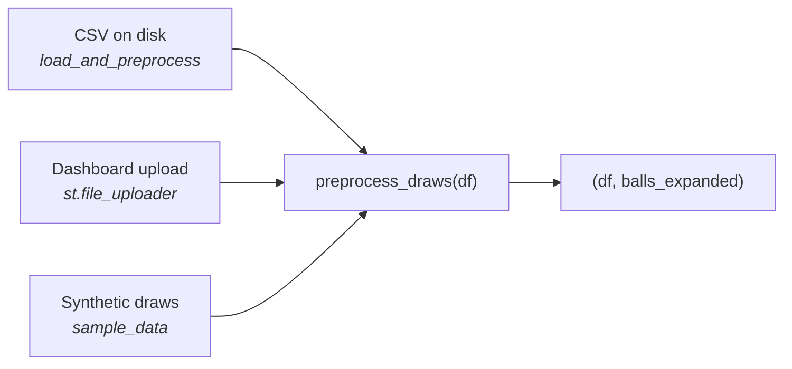
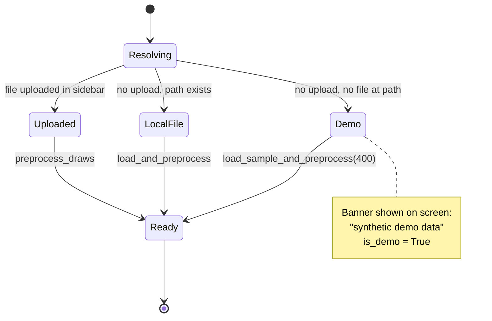
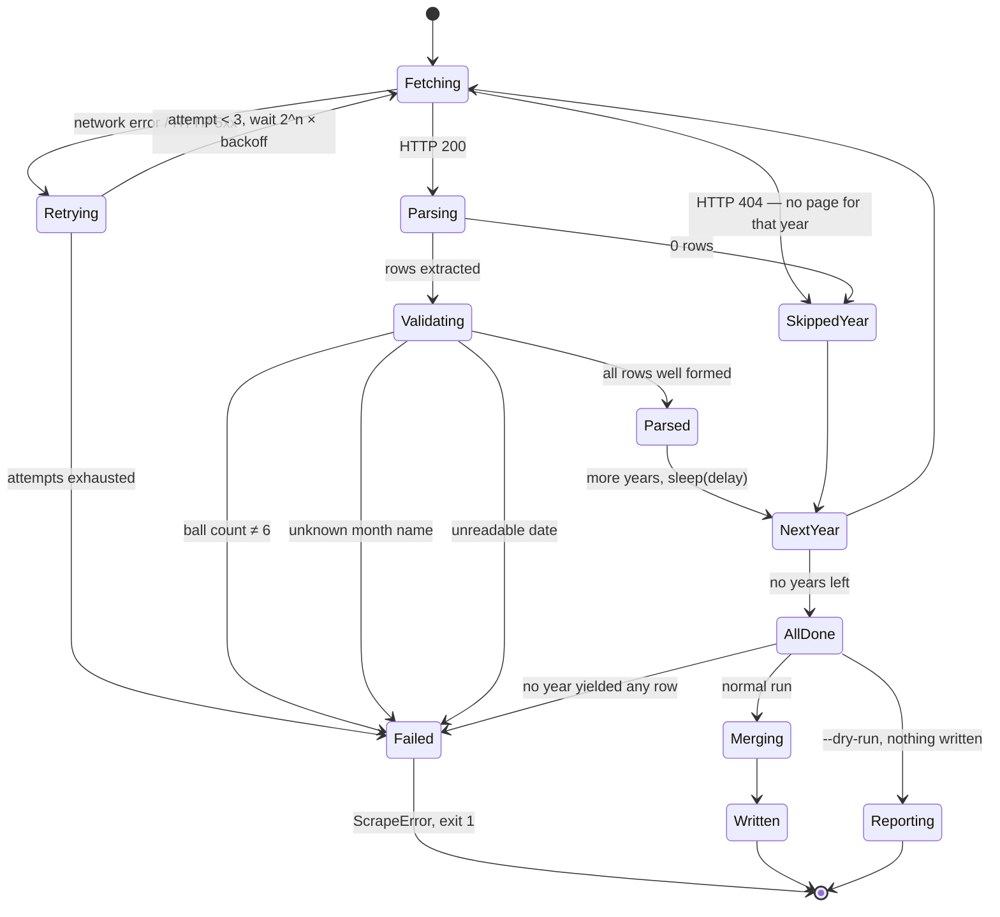

# Data Pipeline

How draw results get from a public website into the shape every model consumes.

## 1. The data contract

One file, two columns. Everything in the project depends on this shape.

**`exported_data/final-final.csv`** (gitignored — not in the repository)

```csv
Date,Ball
12/10/2024,3-12-19-27-41-8
09/10/2024,1-7-15-33-40-11
```

| Column | Format | Notes |
| --- | --- | --- |
| `Date` | `dd/mm/yyyy` | Day first. Parsed with `dayfirst=True`. |
| `Ball` | 6 dash-separated integers | 5 main balls, then **the superbalota last**. |

A `Revancha` column may also be present; nothing currently reads it.

**`lottery/utils/processor.py:preprocess_draws()` is the single owner of this contract.**
All three ingestion paths go through it, so the format cannot drift between them:



It validates that `Date` and `Ball` exist, parses the date into `ds`, and splits
`Ball` into `balls_expanded` — one numeric column per position.

> Adding a column to the contract means changing `preprocess_draws` and nothing
> else. That is the point of routing everything through it.

### 1.2 Two eras of the game

Baloto changed its rules in **April 2017**. The old game drew 6 balls from 1–45
with no superbalota; the current one draws 5 from 1–43 plus a superbalota from
1–16. Both eras are published as six dash-separated numbers, so a long history
downloaded in one go has the same *shape* throughout and nothing about the frames
gives the mix away. Only the values do.

That matters because every analysis in this project assumes the current rules. A
mixed file quietly corrupts all of them: frequency tables count balls 44 and 45
that can no longer be drawn, the superbalota column stops being a 1–16 series, and
a backtest trains on draws from a different game.

`preprocess_draws` therefore checks the values and **warns** — it does not raise,
because the rows are real draws and a caller may deliberately want the full
history. Silence is the only option ruled out.

| Function | Returns |
| --- | --- |
| `format_violations(balls_expanded)` | Boolean Series: rows that are *provably* not current-format — a main ball > 43, a last ball > 16, or a repeated main ball |
| `current_format_mask(df, balls_expanded)` | Boolean Series: rows dated **after the last violation** and themselves well formed |
| `check_draw_format(df, balls_expanded)` | Counts, the era boundary and a printable message — or `None` when the file is clean |

The two masks are not the same, and the difference is the point.
`format_violations` can only flag draws whose numbers are impossible today; an
old-era draw that happens to land inside the current bounds passes it. So
`current_format_mask` cuts at a **date** instead, discarding everything up to the
last impossible row. Keeping those would leave a tail of old-game draws mixed into
the history — precisely the contamination the check exists to remove.

```python
from lottery.utils.processor import load_and_preprocess
df, balls = load_and_preprocess("exported_data/final-final.csv", current_format_only=True)
```

The CLI equivalent is `python -m lottery.backtest --current-format-only`. The dashboard
does the filtering by default and says on screen how many draws it dropped; the
sidebar checkbox turns it off.

> A real 2010–2026 export of 1,742 draws splits 707 / 1,035 across the rule
> change. Analysed together, 41% of the history is a different game.

## 2. Data source resolution

The dashboard never fails for lack of data. It resolves a source in priority
order and tells you on screen which one it landed on.



Implemented in `dashboard/app.py:load_data()`, cached with `@st.cache_data`. It
returns `(df, balls_expanded, position_series, is_demo)` — deriving
`position_series` inside the cached call so Streamlit never re-hashes the full
frames on every rerun.

## 3. The scraper

`lottery/utils/scraper.py` builds the CSV from `loterias.com`.

### Rebuilding everything from scratch

Lost the CSV? It is gitignored and never committed, so there is nothing to
recover from the repository — rebuild it from the source:

```bash
python -m lottery.utils.scraper --years 2024 --dry-run     # 1. confirm the parser still works
python -m lottery.utils.scraper --years 2008-2026           # 2. scrape everything available
```

A wide range is safe. Years that predate the site's archive are **skipped, not
fatal** — see [§3.3](#33-empty-years-vs-a-broken-parser). Start wider than you
think you need; the run reports which years had nothing.

### First run, step by step

```bash
# 1. Inspect one year without writing anything. Compare the printed rows
#    against the website before trusting the parser.
python -m lottery.utils.scraper --years 2024 --dry-run

# 2. If those rows look right, scrape the range you want.
python -m lottery.utils.scraper --years 2020-2025

# 3. Confirm the pipeline accepts the result.
python -c "from lottery.utils.processor import load_and_preprocess; \
df, balls = load_and_preprocess('exported_data/final-final.csv'); \
print(len(df), 'draws,', balls.shape[1], 'columns'); print(df.head())"

# 4. Keeping it current — re-run any time. Merging is idempotent, so
#    overlapping ranges are safe.
python -m lottery.utils.scraper --years 2026
```

Other invocations:

```bash
python -m lottery.utils.scraper --years 2021,2024 --out other.csv --delay 3
```

| Flag | Default | Purpose |
| --- | --- | --- |
| `--years` | *required* | `2024`, a range `2020-2025`, or a list `2021,2024` |
| `--out` | `exported_data/final-final.csv` | Destination, merged not overwritten |
| `--delay` | `1.5` | Seconds between year requests — be a polite client |
| `--dry-run` | off | Print what was parsed, write nothing |

### 3.1 Design principle: fail loudly

> A scraper that silently writes an empty file when the site's markup changes is
> worse than one that crashes. You find out months later, with the analysis already
> running on stale data.

The previous implementation skipped every unexpected structure with `continue`,
then printed `Data successfully exported` over a header-only CSV. Every one of
those skips is now a `ScrapeError`.

### 3.2 Scraper state machine



Every `Failed` transition names what to check. There is no path from a broken page
to a written file.

### 3.3 Empty years vs. a broken parser

A "give me everything" scrape spans years the site may not cover. Those are not
errors, but a year yielding nothing is *also* what a broken parser looks like.
The two are separated by evidence rather than guesswork:

| Situation | Behaviour |
| --- | --- |
| Year returns 404 | No page for that year. Skipped, not retried. |
| Page loads, 0 rows, **other years worked** | That year has no results. Skipped and reported at the end. |
| Page loads, 0 rows, **no year worked** | The parser is broken. Raises. |
| Wrong ball count / unknown month / unreadable date, **any year** | The markup changed. Raises immediately. |

The logic: if other years parsed, the parser demonstrably works, so an empty year
is missing data. If nothing parsed anywhere, the parser is the suspect. Structural
errors always raise regardless — silently dropping a year would hide exactly the
failure this module is shaped to catch.

`parse_results_page()` called directly stays strict and raises on an empty page;
only `scrape_years` passes `allow_empty=True`, because only it can see the other
years' evidence.

### 3.4 Validation rules

| Check | On failure |
| --- | --- |
| Page yielded ≥ 1 row | `ScrapeError` — "Parsed 0 draws… page structure changed" |
| Each draw has exactly `MAIN_BALLS_DRAWN + 1` = 6 balls | `ScrapeError` naming the date and the count found |
| Month name recognized | `ScrapeError` — never a silent `"00"` month |

Month parsing keys on the **first three letters**, so `may`/`mayo` and
`sep`/`sept.`/`septiembre` all resolve. All twelve Spanish months are unique in
their first three characters.

### 3.5 Merge semantics

`merge_into()` never overwrites blindly:

1. Read the existing file, if any.
2. Concatenate the new rows.
3. **De-duplicate by `Date`, keeping the existing row** — a hand-corrected local
   file is not clobbered by a re-scrape.
4. Sort chronologically and write.

This makes re-running the scraper idempotent and safe to run on overlapping year
ranges.

### 3.6 Verification and its limit

`parse_results_page(html)` performs **no I/O**, so it can be tested against saved
HTML. It has been verified offline against a fixture built from the selectors the
scraper targets (`td.centred > a`, `td.baloto > ul.balls > li.ball`): date parsing,
all three error paths, merge/dedup/sort, and an end-to-end check that the output
feeds `preprocess_draws` with the superbalota in the last column.

> **What that does not prove.** Nothing in the repository can check the parser
> against the live site. The fixture confirms the transform logic, not that
> loterias.com still emits that markup. **Always run `--dry-run` first** and compare
> the first rows against the website. If ball counts come back as 5 instead of 6,
> the superbalota likely sits in a separate element and the selector needs work.

### 3.7 Troubleshooting

Every failure exits with status 1 and a message naming what to check. The scraper
never writes a partial or empty file.

| Message | What happened | What to do |
| --- | --- | --- |
| `Could not fetch … after 3 attempts` | Network, DNS, proxy, or the site returned 5xx three times. Retries already ran with exponential backoff. | Check connectivity, then retry. Behind a corporate proxy or a sandbox with an egress policy, the host may simply be blocked — the underlying error is included in the message. |
| `No draws parsed from any of [...]` | **No** year in the range yielded rows. | The markup probably changed. Save one page you know has results and iterate with `parse_results_page()` offline. Also possible: the whole range predates the archive. |
| `No results for: 2001, 2005` (printed, not an error) | Those years had nothing, but others worked. | Nothing to do — that is missing data upstream, not a failure. |
| `Draw on <date> has N balls (…), expected 6` | A row parsed, but not into 5 main + superbalota. | If N is 5, the superbalota probably moved into its own element — the `ul.balls` selector in `parse_results_page` needs updating. The message prints the numbers found, which usually makes it obvious. |
| `Unknown month '<x>' in date '<text>'` | A month name outside the twelve Spanish months. | Check `MONTHS` in the module. Matching is on the first three letters, so this means genuinely different wording (or a different language on the page). |
| `Could not read a date from '<text>'` | The date cell did not match `DD <month> YYYY`. | The date format on the page changed; adjust `DATE_PATTERN`. |
| Runs fine, but numbers look wrong | The selectors matched something else that is shaped like a draw. | This is exactly what `--dry-run` is for. Nothing automatic can catch it. |

When the markup has changed, the fastest loop is offline:

```python
from lottery.utils.scraper import parse_results_page
html = open("saved_page.html").read()      # save the page from your browser
rows = parse_results_page(html)            # iterate here — no network, no rate limit
```

### 3.8 Module API

Importable, so the pieces can be reused or tested independently:

| Function | Signature | Notes |
| --- | --- | --- |
| `parse_results_page` | `(html, year=None, allow_empty=False) -> list[dict]` | **No I/O.** The testable seam. Returns `{Date, Ball, Revancha}` rows. |
| `fetch_year` | `(year, session=None, timeout=30, retries=3, backoff=2.0) -> str \| None` | Browser `User-Agent`; retries 5xx and network errors with backoff. **Returns `None` on 404** — no page for that year. |
| `scrape_years` | `(years, delay=1.5, session=None) -> DataFrame` | Reuses one session, sleeps between years, tolerates empty years (see §3.3). |
| `merge_into` | `(new_draws, path) -> DataFrame` | Dedup by date, existing rows win, chronological sort, creates the directory. |
| `parse_spanish_date` | `(text) -> str` | `'12 oct 2024'` → `'12/10/2024'`. |
| `parse_years` | `(spec) -> list[int]` | `'2020-2023'`, `'2021,2024'`, `'2024'`. |
| `ScrapeError` | — | Raised for every failure above. |

## 4. Synthetic data

`lottery/utils/sample_data.py` generates Baloto-shaped draws with `numpy`'s PRNG:

```python
from lottery.utils.sample_data import load_sample_and_preprocess
df, balls_expanded = load_sample_and_preprocess(n_draws=400, seed=42)
```

Two deliberate properties:

- **Genuinely i.i.d. uniform.** No planted pattern. Running the randomness tests
  against it is a sanity check that they correctly say "looks random" on data that
  is, by construction, random.
- **Not sorted.** Each column is an independent uniform draw, so the demo shows the
  clean case. Real published results are often sorted — see
  [the sorted-data trap](domain-and-premise.md#4-the-sorted-data-trap).

Dates come from `common.next_draw_dates()`, the same calendar helper the forecasts
use, so the demo data cannot drift from the real draw schedule.

This is what makes the whole project runnable without any private data — the
dashboard, the models and the backtest all work on it.

## 5. The sibling domains' ingestion

Everything above is Baloto's. The other two domains have their own sources, and
each carries a trap that is invisible in the shape of the frame — the same
class of problem as [the two eras](#12-two-eras-of-the-game) here.

| Domain | Source | Fetched by | The trap |
| --- | --- | --- | --- |
| Football | [football-data.co.uk](https://www.football-data.co.uk/) CSVs | `football/downloader.py` ([docs](football.md#5-getting-real-data)) | [Opening odds silently standing in for closing ones](football.md#the-trap-never-mix-opening-and-closing-odds) |
| Cycling | [procyclingstats.com](https://www.procyclingstats.com/) pages | `cycling/scraper.py` ([docs](cycling.md#4-the-scraper)) | [A stage result and a classification in one `rank` column](cycling.md#3-the-three-traps) |

Both keep this scraper's [design principle](#31-design-principle-fail-loudly)
and its [missing-data-vs-broken-parser distinction](#33-empty-years-vs-a-broken-parser):
a page or file that is simply absent is skipped and named in the summary, while
anything structural — a changed table, an unknown marker, a response that is
not a CSV — raises from the first row that shows it.

### 5.1 Football's "extra" files

football-data.co.uk publishes the rest of the world (Colombia, Argentina,
Brazil, Mexico, USA, ...) as `new/COL.csv` and siblings, on a **different
contract** from the main league files:

| | Main league file | Extra file |
| --- | --- | --- |
| Teams / goals | `HomeTeam` / `AwayTeam` / `FTHG` / `FTAG` | `Home` / `Away` / `HG` / `AG` |
| Scope | one league, one season per file | many leagues **and** seasons stacked, with `League` / `Season` columns |
| Odds | closing from 2019/20 (`AvgCH`, `B365CH`) | **opening only** (`AvgH` / `PH` / `B365H`) |

`football/extra_processor.py` owns this contract — `preprocess_extra`,
`load_extra`, `available_leagues` — and maps it onto the same tidy frame
(`MATCH_COLUMNS` + `odds_home/draw/away`) as `football/processor.py`, so the
model, market, scoring and dashboard consume it unchanged. Two rules are
enforced hard:

- **One league per load.** A file with more than one `League` value raises
  `MatchFormatError` unless `league=` names one — stacking two competitions is
  the same mistake as [merging two odds sources](football.md#the-trap-never-mix-opening-and-closing-odds).
- **`odds_are_closing` is always `False`.** An extra file can never resolve to
  a closing source; `odds_source` is always an `extra_*_opening` name.

`python -m football.downloader --leagues COL --extra` fetches these (writing
`exported_data/football/COL.csv` verbatim, validated through `preprocess_extra`
first); `--seasons` is ignored on that path. Without `--extra` the codes are
refused by name. **The limit:** opening odds mean the market baseline is the
soft one, so no corrected edge claim is possible on Colombian data — a model
that beats these prices has probably beaten a bookmaker's first guess.

## 6. The store: a file that can describe itself

`core/storage.py` and the store path in `lottery/utils/processor.py`.

A CSV has no schema. That is fine until a column is renamed upstream, a dtype
widens, or a re-scrape appends a window that is already there — each of which
produces a file that **loads perfectly and means something different**. The
contracts above catch that at load time; the store catches it at write time,
which is where the evidence of what changed still exists.

```bash
python -m scripts.store_sync import --csv exported_data/final-final.csv
python -m scripts.store_sync status
python -m scripts.store_sync check          # exit 1 if the store is stale, missing or mis-versioned
```

### The store replaces the file, not the contract

`load_and_preprocess` takes either path. A `.csv` goes through pandas and a
`.sqlite` through `core/storage.py`, and **both hand the same raw `Date`/`Ball`
rows to `preprocess_draws`** — so nothing downstream changes and nothing
downstream has to know which it got. The store holds the raw contract rows
rather than the tidy frame, deliberately: `preprocess_draws` stays the single
owner of what a draw looks like, and the store is only where the rows live.

`import_csv` validates **before** it writes, so a file whose format has drifted
never reaches the store. That ordering is the whole point of having one.

### Why SQLite and not Parquet

Parquet is the better columnar format and it needs `pyarrow`. The deciding
difference is appending: appending to Parquet means writing *another file*, and
a store whose append is "another file in the directory" has reintroduced exactly
the multi-file drift that `load_seasons` and `load_races` refuse to concatenate
through. SQLite is in the standard library, appends in place, and keeps its own
metadata in a sibling table, so a store is one file that describes itself — and
there is nothing new to install in CI.

### What it records, and what it refuses

Each table carries its **schema version**, its column names, its **dtypes**, the
row count, a `core/manifest.py` fingerprint and when it was written. From that:

- **A schema version mismatch is refused on read.** Reading anyway hands back a
  frame whose shape is wrong in a way the caller discovers three
  transformations later.
- **A column renamed or reordered on append is refused**, and so is a **dtype
  drift** — pandas will concatenate a float column onto an int one and object
  onto either, leaving a column that means two things.
- **An empty write is refused.** A scraper that writes nothing when the markup
  changes is the failure mode these parsers are already shaped against, and a
  store that accepts the empty frame moves that failure one step further from
  where it can be seen.
- **A duplicate is a decision, not a default.** Re-scraping an overlapping
  window is the ordinary case; `on_duplicate="error"` says the caller has not
  decided and `"skip"` keeps the stored copy. There is no "overwrite", because
  silently replacing a stored row with a re-scraped one is how a corrected
  result quietly becomes an uncorrected one again.

**Dtypes are restored, not re-inferred.** SQLite has no datetime type, so a `ds`
column round-trips as text unless something puts it back — and an ISO date
string compares *correctly* against another ISO date string, which is why this
bug survives casual testing and then fails on the first arithmetic or the first
non-ISO value. `read_frame` replays the recorded dtype map and raises on a
column it cannot restore rather than handing back text.

### The scheduled half, and what is still manual

`store_sync check` is the piece written for a schedule. It exits non-zero on the
three ways a pipeline goes quietly wrong — the store missing, the schema version
not the one this code expects, or **no new draw in longer than `--max-age-days`**.
That last one is the failure a cron job that only logs will hide: a scraper whose
markup changed keeps exiting 0 and appending nothing, and every number downstream
goes on being computed from a history that stopped.

What is **not** built: the scheduled workflow itself. Adding
`.github/workflows/refresh.yml` needs a push carrying GitHub's `workflow` scope,
which this repository's automation does not currently have — the same block that
keeps ruff and mypy out of CI (see
[Development §3](development.md#3-verification)). The job it would run is three
lines and they are the three commands above: scrape, `import`, `check`, with the
non-zero exit doing the alerting. Re-scoring the registries on the same schedule
is the natural next step and is not wired either.

## 7. Legacy ingestion

`lottery/utils/csv_merger.py` concatenates hand-exported yearly CSVs from `exported_data/`.
It predates the scraper's `merge_into()` and is kept only for existing local files;
new work should use the scraper.

---

**Next:** [Models](models.md) · [Football](football.md) · [Cycling](cycling.md) · [Architecture](architecture.md)
