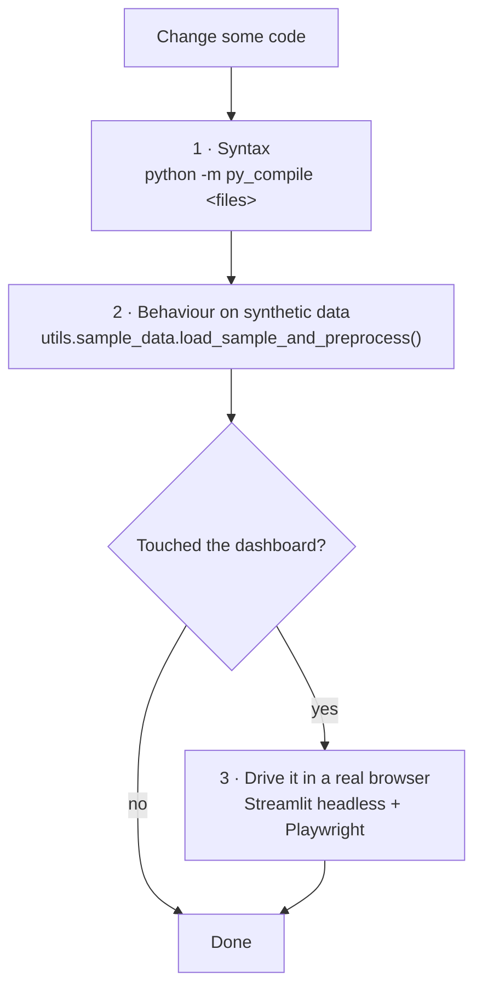

# Development

Setup, how work is verified, conventions, and how to extend the project.

## 1. Setup

```bash
python -m venv venv && source venv/bin/activate
pip install -r requirements.txt
```

| Dependency | Used for |
| --- | --- |
| pandas, numpy | Everything |
| scipy | `hypergeom`, `chisquare`, `norm` |
| statsmodels | `acf`, `acorr_ljungbox` |
| prophet (+ cmdstanpy) | `Prophet.py` |
| statsforecast **≥ 2.0** | AutoARIMA / AutoETS / AutoTheta |
| xgboost, scikit-learn | `models/xgboost_model.py` |
| streamlit, plotly | Dashboard |
| requests, beautifulsoup4 | Scraper |
| matplotlib, seaborn | Legacy `summary_charts.py` |

The statsforecast floor is **not cosmetic**: `unique_id` is an index rather than a
column before 2.0. `fit_predict_all()` normalizes it anyway, but the floor keeps the
two in agreement.

Check what is installed with `python -m utils.lib_detector`.

## 2. Running things

```bash
streamlit run dashboard/app.py                      # main entry point

python Prophet.py                                    # per-position Prophet forecast
python StatsForecast.py AutoARIMA                    # or AutoETS / AutoTheta
python XGBoost.py                                    # held-out evaluation
python backtest.py --n-windows 20 --min-train 100    # the verdict
python backtest.py --n-windows 20 --include-prophet  # slower

python -m utils.scraper --years 2024 --dry-run       # inspect a scrape
python -m utils.scraper --years 2020-2025             # build/update the CSV
```

The three model scripts additionally expect
`exported_data/exported_data_2024.csv` for their comparison step, and write into
`prophet_results/`, `statsforecast_<model>_results/` and `xgboost_results/`.

## 3. Verification

**There is no test suite, linter, or CI.** Work is verified in three ways.



### 3.1 Syntax

```bash
python -m py_compile Prophet.py StatsForecast.py XGBoost.py backtest.py \
    contants.py analysis/*.py models/*.py dashboard/*.py utils/*.py
```

### 3.2 Behaviour, against synthetic data

`utils.sample_data.load_sample_and_preprocess()` returns the same
`(df, balls_expanded)` shape as the real loader, so any module can be exercised
without private CSVs:

```python
from utils.sample_data import load_sample_and_preprocess
from models.common import build_position_series
import backtest as bt

df, balls_expanded = load_sample_and_preprocess(n_draws=300)
position_series = build_position_series(df, balls_expanded)
results = bt.run_all(position_series, balls_expanded.shape[1], n_windows=5, min_train=60)
print(bt.summarize(results).to_string(index=False))
```

Because the synthetic data is genuinely i.i.d., it doubles as a correctness check
on the statistics: the randomness tests **should** report "looks random", and no
model should beat chance significantly.

### 3.3 Dashboard changes

Two traps make casual checking useless here:

> **An HTTP 200 on `/` proves nothing.** Streamlit only executes the script when a
> client connects over the websocket. You must load the page in a real browser.

> **All tab panels stay mounted in the DOM.** A bare locator matches across tabs.
> Scope every locator: `page.get_by_role("tabpanel", name="Forecast").get_by_...`

```bash
streamlit run dashboard/app.py --server.headless true --server.port 8765
```

Then drive it with Playwright (Chromium is at `/opt/pw-browsers/chromium`), check
each tab's text for `Traceback` and "This app has encountered an error", and click
through the Forecast and Backtest buttons — those code paths only execute on click.

## 4. Conventions

| Area | Rule |
| --- | --- |
| **Language** | Code, docstrings, comments, documentation and commit messages in **English**. Dashboard UI strings in **Spanish** (end-user facing). |
| **Constants** | Game rules live in `models/common.py` and are imported, never re-declared. |
| **Positions** | Derive from `main_positions()` / `super_position()`. Never `range(5)` or `n - 1`. |
| **Clipping** | Every raw model output passes through `clip_to_range()`. |
| **Future dates** | `next_draw_dates(..., weekdays=infer_draw_weekdays(history))`. Never a fixed pandas `freq=`. |
| **Splits** | Chronological only. Never shuffle a time series. |
| **Chance claims** | `p_value_greater` (one-sided), never `p_value`. |
| **Errors** | Raise with a message naming what to check. No bare `except` that swallows a failure into a success message. |

## 5. How to add things

### A model

See [Models §7](models.md#7-adding-a-model). In short: implement in `models/`,
clip the output, add a `@_predictor("Name")` window function in `backtest.py`,
register in `run_all()`, add to the dashboard selector.

**Never return the actual draw as a fallback** when a model cannot predict —
return `None` and let `_run_windows()` skip the window.

### A statistical test

1. Add it to `analysis/randomness.py`, taking `position_series` or `balls_expanded`.
2. If it is per-position, note whether it is affected by the sorted-data problem —
   and if so, provide or point at a pooled alternative.
3. Surface it in dashboard tab 4, **with the multiple-comparisons caveat** if it is
   run across all six positions.

### A dashboard tab

Tabs are positional; inserting one shifts every later index. Keep the house rule:
model output and heuristics always appear next to their chance level or a note on
what they do not mean.

## 6. Gotchas

| Thing | Why it bites |
| --- | --- |
| `contants.py` | Misspelled, but imported under that name. Renaming means updating importers. |
| Two time axes | Prophet/display use calendar dates; statsforecast uses a draw index. Mixing them silently produces wrong dates. See [Architecture §5](architecture.md#5-two-time-axes). |
| `train_predict` vs `forecast_next` | The first predicts draws that already happened. Presenting it as "the next draw" was a real bug. |
| `exported_data/` | Gitignored. Absent on a fresh clone; the dashboard falls back to synthetic data and says so. |
| Prophet in the backtest | Refits per position per window. Off by default for that reason. |
| Streamlit reruns | The whole script executes on every widget interaction. Expensive work must be cached or behind a button. |
| Legacy files | `summary_charts.py` and `utils/csv_merger.py` predate the current pipeline. Superseded, kept for existing local workflows. |

## 7. Git workflow

- Commit messages in English, imperative mood, explaining **why** rather than
  restating the diff.
- The default branch is `master`.
- A merged pull request is finished; follow-up work starts from the updated
  `master` as a new change, not as more commits on the merged branch.

---

**Next:** [Architecture](architecture.md) · [Domain and Premise](domain-and-premise.md)
