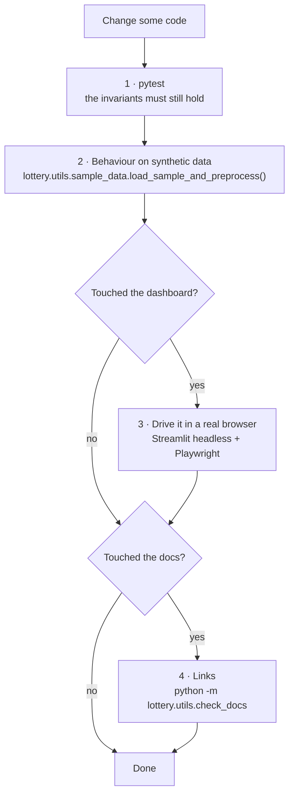

# Development

Setup, how work is verified, conventions, and how to extend the project.

## 1. Setup

```bash
python -m venv venv && source venv/bin/activate
pip install -r requirements.txt
```

| Dependency | Used for |
| --- | --- |
| pandas, numpy | Everything |
| scipy | `hypergeom`, `chisquare`, `norm` |
| statsmodels | `acf`, `acorr_ljungbox` |
| prophet (+ cmdstanpy) | `lottery/models/prophet_model.py` |
| statsforecast **≥ 2.0** | AutoARIMA / AutoETS / AutoTheta |
| xgboost, scikit-learn | `lottery/models/xgboost_model.py` |
| streamlit, plotly | Dashboard |
| requests, beautifulsoup4 | Scraper |
| matplotlib, seaborn | Legacy `scripts/summary_charts.py` |

The statsforecast floor is **not cosmetic**: `unique_id` is an index rather than a
column before 2.0. `fit_predict_all()` normalizes it anyway, but the floor keeps the
two in agreement.

Check what is installed with `python -m lottery.utils.lib_detector`.

`pytest` is needed to run the test suite (§3.1).

## 2. Running things

```bash
streamlit run dashboard/app.py                      # main entry point

python -m scripts.prophet_forecast                                    # per-position Prophet forecast
python -m scripts.statsforecast_forecast AutoARIMA                    # or AutoETS / AutoTheta
python -m scripts.xgboost_forecast                                    # held-out evaluation
python -m lottery.backtest --n-windows 20 --min-train 100    # the verdict
python -m lottery.backtest --n-windows 20 --include-prophet  # slower

python -m lottery.utils.scraper --years 2024 --dry-run       # inspect a scrape
python -m lottery.utils.scraper --years 2020-2025             # build/update the CSV
```

The three model scripts additionally expect
`exported_data/exported_data_2024.csv` for their comparison step, and write into
`prophet_results/`, `statsforecast_<model>_results/` and `xgboost_results/`.

## 3. Verification

**There is a test suite, a linter and CI.** Work is verified in four ways
locally, and CI re-runs the first and the fourth on every push to `master` and
every pull request.

Lint and type-check first, because they are the fastest signal:

```bash
ruff check .          # everything; --fix applies the safe ones
mypy                  # strict, scoped to core/ (the scope is in pyproject.toml)
```

These are **not yet wired into CI.** They belong in the `static` job, which
needs no third-party install and reports in seconds — add these steps after
the documentation-link check in `.github/workflows/tests.yml`:

```yaml
      # numpy and pandas-stubs are here because mypy reads core/'s imports;
      # nothing in this job runs any of this project's code.
      - name: Install lint tools
        run: pip install ruff mypy pandas-stubs numpy

      - name: Lint
        run: ruff check .

      - name: Type-check core/
        run: mypy
```

Two configuration choices are worth knowing before you fight them. **The line
limit is 120, not 88 or 100.** Measured, this codebase sits at p50 = 46 and
p95 = 97 characters; the overruns are almost entirely explanatory prose and the
dashboard's Spanish copy strings, and a sentence broken across lines to satisfy
a linter is harder to review for meaning — which is the only thing that matters
about those strings. At 100 there were 454 violations and essentially no
defects among them; at 120 there are none, and the rule still catches a
genuinely runaway line. **mypy runs `strict` over `core/` alone.** `core/` is
~150 lines of domain-free numerics, so strict mode is achievable there, and it
is the one package where a wrong type is silently wrong rather than loud: a
z-test handed the wrong shape returns a number, not an error. The domain
packages pass DataFrames through every signature and would need a long ignore
list to say very little.

One rule ruff enforces that is worth calling out, because it changed behaviour
rather than formatting: **every `zip` carries an explicit `strict=`.** A `zip`
over two sequences of different lengths silently truncates to the shorter one,
which in this codebase would mean pairing riders with the wrong worths or
columns with the wrong outcomes and producing a frame whose shape reveals
nothing. Every call that pairs things which *must* line up is `strict=True`;
the four `zip(x, x[1:])` pairwise-adjacent idioms are `strict=False` because
their lengths differ by one on purpose.



There is a fifth check that applies to the statistics rather than the code:
`lottery/analysis/sensitivity.py` plants a known bias and confirms the detectors
fire on it. Synthetic i.i.d. data proves the tests do not cry wolf; only a planted
signal proves they can hear one. See
[Power and Sensitivity](power-and-sensitivity.md#2-sensitivity-lotteryanalysissensitivitypy).

Note how §3.1 and that fifth check divide the work: the suite pins what the code
*does*, the sensitivity run checks what the statistics can *see*. Neither
substitutes for the other.

### 3.1 The test suite

```bash
pytest                      # everything
pytest -m "not slow"        # skip the runs that fit real models (~2s)
```

Every test builds its data from a seeded generator — `lottery/utils/sample_data.py`
for uniform draws, `lottery/analysis/sensitivity.py:biased_draws` where a planted
bias is needed, `football/sample_data.py` for match results with a known truth, `cycling/sample_data.py` for stage races with a known rider strength — so the suite is deterministic and needs no private CSV. The one exception is `tests/test_dashboard_help.py`, which reads the dashboard's *source* with `ast` rather than importing it: the dashboard needs streamlit and plotly, which are deliberately absent from `requirements-test.txt`, and reading the source is also the only way to check `dashboard/app.py` at all. Tests
that fit real models, or that repeat an experiment across many seeds, are marked
`slow`.

What the suite is *for* is worth being explicit about: it does not chase coverage,
it pins the **invariants** listed in [CLAUDE.md](../CLAUDE.md) and throughout these
docs — the ones a refactor breaks silently and no reader would notice:

| Pinned behaviour | Why it needs a test |
| --- | --- |
| Positions derived from the helpers | `n_columns - 1` and `range(5)` coincide only at 6 columns |
| No fixed `freq=` for future dates | A fixed frequency invents draws on non-draw days |
| `current_format_mask` cuts at a **date** | Row-wise validation cannot catch a legal-looking old-era draw |
| One-sided vs two-sided p-values | A model *worse* than chance also gets a small two-sided p-value |
| Bonferroni on every k-way table | Six models clear the naive 5% bar by luck ~26% of the time |
| Set-based, order-agnostic scoring | It is what makes the hypergeometric baseline the right comparison |
| Pooled uniformity refuses mixed ranges | 1-16 is a subset of 1-43, so range-checking cannot catch the mistake |
| Chronological-only XGBoost splits | A shuffled split was the original bug |
| Effect sizes travel with p-values | A p-value cannot separate "no edge" from "no edge detectable here" |
| The MDE falls only with sqrt(N) | Four times the data buys half the resolution |
| The superbalota uses a Bernoulli variance | Reusing the main-ball figures understates the data needed ~3.3x |
| `independent_seeds` splits the streams | One shared seed couples draws to tickets and invents an edge |
| `strength = 0` is a true control | Every positive sensitivity row is meaningless if it is not |
| Popularity moves `E[payout \| win]`, never `P(win)` | The claim the module is careful not to make |
| The registry refuses past dates and duplicates | Its entire value is in what it will not record |
| Scoring the registry is all-or-nothing | Choosing which predictions count is the failure it prevents |
| Opening and closing odds are never mixed | One column meaning two markets is invisible in the frame's shape |
| A partial price triple is blanked whole | Two of three prices cannot be normalised into probabilities |
| De-margining recovers a noiseless market exactly | Ties the odds generator and the normalisation together |
| The `(H, D, A)` ordering | Transposing two probability columns passes every range check |
| One kind of cycling result per frame | A stage placing and a GC standing are different quantities in one `rank` column |
| Cycling non-finishers survive loading | Abandons are not random, so dropping them makes the problem easier than it is |
| Cycling non-finishers stay in the **scoring** denominator | Dropping them renormalises the field to the riders who finished — the same bug one layer down |
| A uniform draw loses to the ranking baseline | It is the claim `cycling/baseline.py` makes about itself, measured |
| Structural summaries are bit-identical under a column shuffle | It is the property that makes them immune to the sorted-data trap |
| The sum reference totals exactly C(43,5) | The identity that proves it is a count and not an estimate |
| Elo fits identically from a shuffled frame | Ratings advance by date, not by row order; nothing else would notice the sort being dropped |
| A blend at weight 0 scores exactly like the market | The whole reading of the ensemble backtest rests on that endpoint |
| Every model in a comparison is scored on the same matches | Two models scored on different subsets are not comparable and the table cannot show it |
| The margin band is a distinct state from "no value" | "Model > market" reads as a bet until the spread is accounted for |
| `time_seconds` is a total, never a gap | A column of gaps looks normal and ranks the field backwards by hours |
| An unknown rank marker raises | Defaulting to "not ranked" is how a changed page quietly loses riders |
| A results table is found by its headers | A CSS selector that misses returns zero rows instead of failing |
| An HTML error page is never written as a CSV | `pd.read_csv` turns one into a plausible one-column frame |
| Every HELP key a dashboard page asks for exists | A missing one is a KeyError raised from inside a tab nobody opened for months |
| No page calls `st.plotly_chart` directly | `ui.chart()` requires a HELP key; a bare call is a chart with no explanation |

A syntax-only check is still occasionally useful on files the suite does not import:

```bash
python -m py_compile $(find core lottery football cycling scripts dashboard tests -name '*.py')
```

This is not redundant with the suite: pytest imports `core/`, `lottery/`,
`football/` and `cycling/`, but never `dashboard/app.py` or the entry points
under `scripts/`. A syntax error in either passes the whole suite. The `static` CI job runs this
command for that reason, and its `find` paths have to be extended whenever a new
top-level package appears — `cycling/` was missing from that list for a while,
so the third domain was compiled locally and not in CI.

### 3.2 Behaviour, against synthetic data

`lottery.utils.sample_data.load_sample_and_preprocess()` returns the same
`(df, balls_expanded)` shape as the real loader, so any module can be exercised
without private CSVs:

```python
from lottery.utils.sample_data import load_sample_and_preprocess
from lottery.models.common import build_position_series
import lottery.backtest as bt

df, balls_expanded = load_sample_and_preprocess(n_draws=300)
position_series = build_position_series(df, balls_expanded)
results = bt.run_all(position_series, balls_expanded.shape[1], n_windows=5, min_train=60)
print(bt.summarize(results).to_string(index=False))
```

Because the synthetic data is genuinely i.i.d., it doubles as a correctness check
on the statistics: the randomness tests **should** report "looks random", and no
model should beat chance significantly.

### 3.3 Dashboard changes

Two traps make casual checking useless here:

> **An HTTP 200 on `/` proves nothing.** Streamlit only executes the script when a
> client connects over the websocket. You must load the page in a real browser.

> **All tab panels stay mounted in the DOM.** A bare locator matches across tabs.
> Scope every locator: `page.get_by_role("tabpanel", name="Forecast").get_by_...`

```bash
streamlit run dashboard/app.py --server.headless true --server.port 8765
```

Then drive it with Playwright (Chromium is under `/opt/pw-browsers/`; check the exact
versioned path, e.g. `/opt/pw-browsers/chromium-1194/chrome-linux/chrome`), check
each tab's text for `Traceback` and "This app has encountered an error", and click
through the Forecast and Backtest buttons — those code paths only execute on click.

**Drive all three domains, not just the one you changed.** The sidebar selector
decides which page module is even imported, so an error in `cycling_page.py` is
invisible from the Baloto page. The radio's `<input>` is covered by its label, so
click the label: `page.locator('label:has-text("Ciclismo")').first.click()`.


### 3.4 Documentation changes

```bash
python -m lottery.utils.check_docs
```

Exits non-zero and names the near-miss anchors. It reimplements github-slugger
exactly rather than approximating: headings here use `·` and `—`, GitHub strips
those characters *without* collapsing the spaces they leave, and so
`### 6 · Jugadas — generate, check, measure` anchors as
`6--jugadas--generate-check-measure` with doubled hyphens. A checker that
normalises runs of hyphens reports success on links that 404 in the browser —
which is how one broken cross-reference survived several review passes here.

### 3.5 Continuous integration

[`.github/workflows/tests.yml`](../.github/workflows/tests.yml) runs on every
push to `master` and every pull request. A push to a branch with an open PR
arrives as `pull_request: synchronize`, so listing both triggers does not
double-run the suite on feature branches.

Two jobs:

| Job | What it does | Needs installing |
| --- | --- | --- |
| `static` | Byte-compiles every module; verifies documentation links | Nothing — both are pure standard library, so it reports in about a second |
| `tests` | The full suite, `slow` markers included, on Python 3.11, behind a 90% coverage floor | `requirements-test.txt` |

#### Why CI installs a different requirements file

[`requirements-test.txt`](../requirements-test.txt) is deliberately smaller than
`requirements.txt`. The suite never imports prophet, streamlit, plotly,
matplotlib, seaborn, requests or beautifulsoup4 — those are reached only from
the dashboard, from `scripts/`, or lazily from inside a function body
(`lottery/models/prophet_model.py` is imported on demand by
`lottery/backtest.py`, which is also why it is named that rather than
`Prophet.py`). Installing prophet and cmdstanpy in CI would dominate the job's
runtime to exercise code no test touches.

**If a future test needs one of them, add it to both files.** It fails loudly
with an `ImportError` rather than skipping quietly, which is the intended
behaviour — a silently skipped test is worse than a red build.

#### One Python version, not a matrix

3.11 only. It is the developed-on version and the one every other piece of
configuration already names — `requires-python = ">=3.11"`, ruff's
`target-version = "py311"`, mypy's `python_version = "3.11"`.

There used to be a 3.11 / 3.12 / 3.13 matrix, which was dropped because of what
it cost against what it bought. The expensive part of the job is the install,
not the suite: scipy, statsforecast, xgboost and scikit-learn come down three
times over, and the pip cache is keyed per version so a cold cache pays it
three times in full. What it bought was re-running a deterministic suite — every
fixture comes from the seeded generators — against two interpreters nothing in
this project is deployed to. The dashboard runs locally on 3.11; there is no
library here for anyone else to install on 3.13.

If a later version becomes the developed-on one, **move the pin** rather than
adding a second entry beside it, and move `requires-python`, `target-version`
and `python_version` with it.

#### The coverage floor, and what it is not

```bash
pytest -q --cov --cov-report=term-missing        # the gate, as CI runs it
```

Everything — the packages measured, the omissions, the floor — is in
`[tool.coverage.*]` in [`pyproject.toml`](../pyproject.toml), so the flag here
carries no configuration of its own.

**The number is 92.6%, and the floor is 90.** The floor sits just under the
measured number rather than at some round target below it: a gate thirteen
points under the real figure permits thirteen points of silent rot, which is the
only thing a gate is for. Two points of slack absorb a line moving. Raise the
floor when the number rises; do not lower it to make a red build green.

**What it measures.** `core/`, `lottery/`, `football/` and `cycling/`.

**What it deliberately does not.** `dashboard/` and `scripts/` are outside the
source list. pytest never imports them, the `static` job byte-compiles them, and
the dashboard's real check is a browser (§3.3). Measuring them would report
about 1,500 statements of untested surface and invite the wrong fix — unit tests
wrapped around `st.*` calls — instead of the Playwright pass that actually
catches a broken page. Three files are omitted individually and each says why in
the config: `lottery/models/prophet_model.py` (prophet is not installed in CI by
design, so no test is *allowed* to cover it), and the two legacy scripts
`csv_merger.py` and `lib_detector.py`, which do their work on import and so
could only be "covered" by being run. `if __name__ == "__main__":` blocks are
excluded as argparse wiring.

**What the number is for.** It catches a module arriving with no tests at all.
It cannot tell you whether the invariants in [CLAUDE.md](../CLAUDE.md) are
pinned, and those are what a refactor breaks silently — a suite can sit at 95%
and still not notice `beats_chance_test` losing its one-sided p-value. Treat 80%
as a floor a change has to clear, never as the thing being aimed at. When the
number goes up, the question to ask is which invariant the new tests pin.

#### What CI does not do

No linter, no deployment. `ruff` and `mypy` are configured in
[`pyproject.toml`](../pyproject.toml) and run locally (§3.1); wiring them into
the `static` job needs a push with GitHub's `workflow` scope. The dashboard is
run locally (§3.3), and the Playwright check is **not** in CI — it needs a
browser and a running Streamlit server, and the value it adds is a human looking
at the result. Treat it as a pre-merge step for dashboard changes, not something
the build will catch for you.

## 3.6 Reproducibility

A backtest result is evidence only for as long as you can say what produced it.
Six months on, "nothing beat chance" and "some version of this beat nothing on
some version of the data" read identically in a results table, and nothing in
its shape tells them apart.

So every walk-forward and holdout entry point attaches a manifest from
[`core/manifest.py`](../core/manifest.py):

```python
results = bt.run_all(position_series, n_columns)
bt.summarize(results).attrs["manifest"]
# {'generated_at': '2026-09-20T...', 'git': {'commit': '...', 'dirty': False, 'branch': 'master'},
#  'python': '3.11.15', 'platform': ..., 'libraries': {'numpy': '2.1.0', ...},
#  'inputs': {'data': '9f3c...', 'n_draws': 1035, 'n_windows': 15, ...}}
```

Three things about it are deliberate.

**The dirty flag matters more than the commit.** A result produced from an
edited working tree is reproducible from no commit at all, and mid-change is
the state most results get looked at in. A manifest recording only a SHA would
be confidently wrong exactly there.

**The fingerprint covers dtypes and column order, not just values.** Row counts
and date ranges are the usual stand-ins and both miss a single corrected cell.
Column order is in there because a frame whose superbalota column moved scores
differently while hashing identically under a values-only digest, and position
semantics are the thing this codebase is most careful about.

**The library list is not a dependency list.** It holds the libraries whose
version can move a number. Adding streamlit would record something that cannot
change a result, which is the whole point of the list.

`attrs` does not survive most pandas operations, so a manifest is copied
explicitly from one frame to the next rather than inherited —
`lottery/backtest.py:summarize` and `cycling/evaluation.py:compare_forecasters`
both do this, and both say why in a comment. The football CLI prints it as one
compact provenance line rather than in the aligned key column, because a nested
dict there is one unreadable row.

A new evaluation entry point that forgets the manifest looks identical in every
results table, so the wiring is pinned by a test per domain in
[`tests/test_core_manifest.py`](../tests/test_core_manifest.py) rather than
left to review.

## 4. Conventions

| Area | Rule |
| --- | --- |
| **Language** | Code, docstrings, comments, documentation and commit messages in **English**. Dashboard UI strings in **Spanish** (end-user facing). |
| **Constants** | Game rules live in `lottery/models/common.py` and are imported, never re-declared. |
| **Positions** | Derive from `main_positions()` / `super_position()`. Never `range(5)` or `n - 1`. |
| **Clipping** | Every raw model output passes through `clip_to_range()`. |
| **Future dates** | `next_draw_dates(..., weekdays=infer_draw_weekdays(history))`. Never a fixed pandas `freq=`. |
| **Splits** | Chronological only. Never shuffle a time series. |
| **Chance claims** | `p_value_greater` (one-sided), never `p_value`. |
| **Errors** | Raise with a message naming what to check. No bare `except` that swallows a failure into a success message. |

## 5. How to add things

### A model

See [Models §7](models.md#7-adding-a-model). In short: implement in `models/`,
clip the output, add a `@_predictor("Name")` window function in `lottery/backtest.py`,
register in `run_all()`, add to the dashboard selector.

**Never return the actual draw as a fallback** when a model cannot predict —
return `None` and let `_run_windows()` skip the window.

### A statistical test

1. Add it to `lottery/analysis/randomness.py`, taking `position_series` or `balls_expanded`.
2. If it is per-position, note whether it is affected by the sorted-data problem —
   and if so, provide or point at a pooled alternative.
3. Surface it in dashboard tab 4, **with the multiple-comparisons caveat** if it is
   run across all six positions.

### A dashboard tab

Tabs are positional; inserting one shifts every later index. Keep the house rule:
model output and heuristics always appear next to their chance level or a note on
what they do not mean.

## 6. Gotchas

| Thing | Why it bites |
| --- | --- |
| `lottery/constants.py` | Was misspelled `contants.py` at the repo root; corrected during the move to `lottery/`. |
| Two time axes | Prophet/display use calendar dates; statsforecast uses a draw index. Mixing them silently produces wrong dates. See [Architecture §5](architecture.md#5-two-time-axes). |
| `train_predict` vs `forecast_next` | The first predicts draws that already happened. Presenting it as "the next draw" was a real bug. |
| `exported_data/` | Gitignored. Absent on a fresh clone; the dashboard falls back to synthetic data and says so. |
| Prophet in the backtest | Refits per position per window. Off by default for that reason. |
| Streamlit reruns | The whole script executes on every widget interaction. Expensive work must be cached or behind a button. |
| Legacy files | `scripts/summary_charts.py` and `lottery/utils/csv_merger.py` predate the current pipeline. Superseded, kept for existing local workflows. |

## 7. Git workflow

- Commit messages in English, imperative mood, explaining **why** rather than
  restating the diff.
- The default branch is `master`.
- A merged pull request is finished; follow-up work starts from the updated
  `master` as a new change, not as more commits on the merged branch.

---

**Next:** [Architecture](architecture.md) · [Domain and Premise](domain-and-premise.md)
