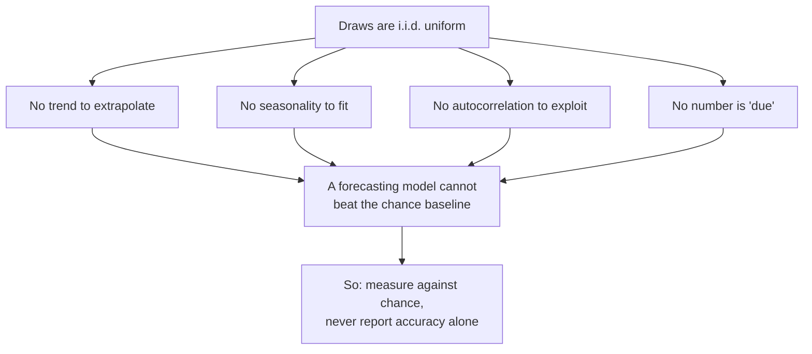
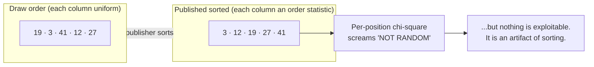

# Domain and Premise

> Read this before anything else. Every architectural decision in this repository
> follows from what is written here, and several of them look wrong until you know it.

## 1. The game

Baloto is a Colombian lottery. One ticket is:

| Component | Rule |
| --- | --- |
| Main balls | 5 distinct numbers from **1–43**, order irrelevant |
| Superbalota | 1 number from **1–16**, drawn independently, may repeat a main number |
| Draw days | Monday, Wednesday, Saturday |
| Revancha | An optional second draw on the same ticket, at extra cost |

The number of distinct tickets is therefore:

```
C(43, 5) × 16 = 962,598 × 16 = 15,401,568
```

Every one of those 15,401,568 tickets is equally likely. That single sentence is
the premise the whole project is built on.

## 2. The premise: this is an i.i.d. uniform process

A fair lottery draw is **independent and identically distributed**. Concretely:

- **Independent** — the outcome of Saturday's draw carries no information about
  Monday's. The machine has no memory. Balls are returned to the pool.
- **Identically distributed** — every draw comes from the same uniform
  distribution over the 15,401,568 combinations. The distribution never shifts,
  so there is no trend to extrapolate and no season to fit.

This is not an assumption we made for convenience. It is the *design goal* of the
physical apparatus, and it is audited. A lottery where past draws predicted future
ones would be a broken lottery.

### What follows from it



If a time-series model appears to work here, one of three things is true, in
descending order of likelihood:

1. **Variance.** With few evaluation windows, a signal-free model beats chance
   roughly half the time by luck alone. This is why [evaluation](evaluation.md)
   reports a p-value, not just an average.
2. **A methodology bug.** Leakage, a wrong baseline, or scoring against data the
   model already saw. The project has had two of these; both are documented in
   [evaluation](evaluation.md#8-known-failure-modes-we-have-already-hit).
3. **The data source is not what you think.** For example, results published
   sorted ascending — see §4.

A genuine exploitable pattern in a national lottery is not on that list because
it would be a scandal, not a side project.

## 3. So why does this repository exist?

Because "you cannot predict it" and "there is nothing to build" are very different
claims. Generating tickets is legitimate; checking them is legitimate; **measuring
whether a way of choosing them works is the whole point.** The project does five
things, and only one of them is forecasting.

| # | What we do | Can it produce a true answer? |
| --- | --- | --- |
| 1 | **Prize probability and expected value** — what a ticket is worth | **Yes, exactly.** Pure combinatorics. |
| 2 | **Ticket generation and checking** — produce plays, score them against real draws | **Yes.** Generating and scoring are exact. |
| 3 | **Strategy measurement** — does a way of picking beat random picking? | **Yes**, up to statistical power. This is the experiment. |
| 4 | **Randomness testing** — is this data consistent with a fair draw? | **Yes**, up to statistical power. |
| 5 | **Forecasting** — Prophet, ARIMA, XGBoost on each ball position | Runs, but must not beat chance. |

Item 1 answers a real decision exactly. Which numbers will come up is unknowable;
**what a ticket returns on average is arithmetic**. See
[`lottery/analysis/prizes.py`](../lottery/analysis/prizes.py) and
[evaluation](evaluation.md#5-expected-value-the-one-exact-answer).

Items 2 and 3 are the experimental core. The claim "no strategy beats random" is
not something this project asks you to accept on authority — it is the thing it
**measures**, on your own data, with a significance test and a stability check
across seeds. See [tickets](tickets.md). A null result you can reproduce is a real
result, and reproducing it is how you learn to tell a real effect from a lucky run.

Item 5 exists as a **forecasting exercise and a negative control**. It is a real,
non-trivial engineering problem — walk-forward backtesting, leakage avoidance,
multi-series model fitting — and the lottery is an unusually clean domain in which
to practise it, precisely *because* the correct answer is known in advance: the
model should not win. A pipeline that reports "no signal" on data that provably
has none is a pipeline you can trust on data where the answer is unknown.

### The design rule that follows

> **Every result is paired with the chance baseline it must beat.**

There is no screen, no CSV, and no function in this repository that reports model
accuracy without the corresponding chance level next to it. That is the single
convention that keeps the project honest, and it is enforced structurally:
`backtest.summarize()` cannot emit an accuracy row without a `chance_avg_main_hits`
column beside it.

## 4. The sorted-data trap

This one is subtle and it is worth understanding, because it will otherwise look
like a discovery.

Official lottery results are frequently published with the main balls **sorted
ascending**: `3-12-19-27-41` rather than the order they physically came out. When
that happens, column 1 is no longer "a uniform draw from 1–43" — it is the
**minimum of five draws**, an *order statistic*, whose distribution is heavily
skewed toward low numbers. Column 5 is the maximum, skewed high.



Consequences, all of which the code handles:

- A **per-position chi-square test** against a uniform distribution will report a
  vanishingly small p-value. This is a true statement about the column and a
  false statement about the lottery.
- [`lottery.analysis.randomness.is_sorted_ascending()`](../lottery/analysis/randomness.py) detects
  the condition and the dashboard warns about it.
- [`lottery.analysis.randomness.pooled_uniformity_test()`](../lottery/analysis/randomness.py) is
  the sort-proof alternative: it pools all five main columns and asks only whether
  each number 1–43 appears equally often overall. Sorting cannot affect that count.
- **Per-position tests are diagnostics; the pooled test is the verdict.**
- Backtest scoring is set-based (see [evaluation](evaluation.md)), so slot order
  cannot inflate a score either.

## 5. Heuristics we include but do not endorse

The dashboard shows "hot/cold numbers" and an "overdue score". Both are
**gambler's fallacy** — for an independent process, the time since a number last
appeared carries exactly zero information about when it will appear next.

They are included because they are the first thing most people look for, and it is
more useful to show them *next to the statistical verdict* than to omit them and
leave the user to find a worse tool elsewhere. Every such surface carries an
explicit note saying it has no predictive value.

## 6. Anti-patterns

These are changes that would make the project worse while appearing to improve it.
They are listed because the repository has already been refactored *away* from
several of them.

| Anti-pattern | Why it is wrong |
| --- | --- |
| Adding seasonalities, holiday regressors, or Fourier terms to Prophet | Fits noise. There is no periodic signal in an i.i.d. process. The original code had weekly, biweekly *and* yearly terms on a series observed 3 days a week. |
| Tuning hyperparameters until backtest accuracy improves | Overfitting to the evaluation set. The chance baseline does not move when you tune. |
| Reporting MAE/RMSE as evidence a model "works" | These measure numeric closeness on a categorical draw. A model predicting 22 every time scores well and wins nothing. |
| Reporting a two-sided p-value as "beats chance" | A model significantly *worse* than chance also gets a small two-sided p-value. Use `p_value_greater`. |
| Shuffled train/test split | Leaks future draws into training. Splits must be chronological. This was a real bug here. |
| Treating a per-position chi-square as proof of non-randomness | See §4. |

> **The test for any change:** does it make a model look better on history without
> beating the chance baseline in [`lottery/backtest.py`](../lottery/backtest.py)? If so, it made the
> project worse.

## 7. Responsible use

This is an analysis tool, not a betting system. The expected value of a Baloto
ticket is materially negative — the dashboard computes exactly how negative for
the prize table you enter. Nothing here improves the odds of any ticket over any
other, because all 15,401,568 are equally likely.

---

**Next:** [Architecture](architecture.md) · [Evaluation](evaluation.md)
