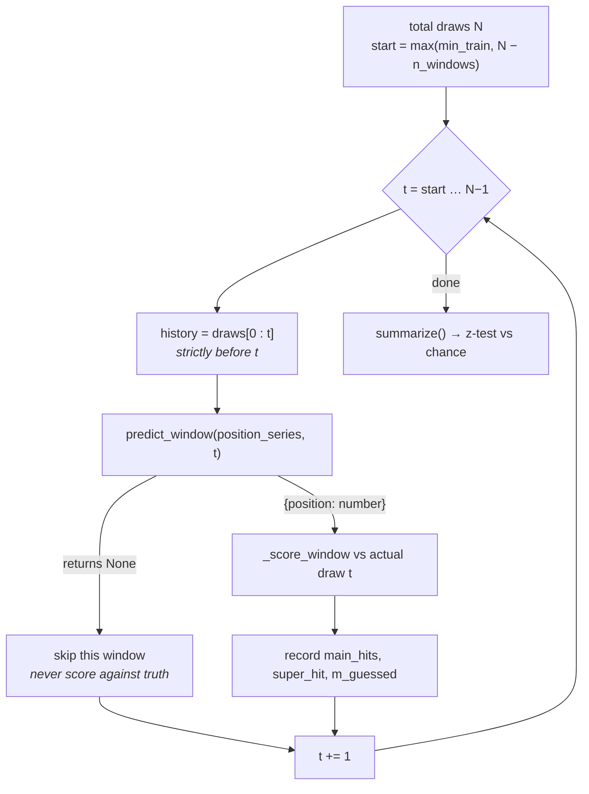
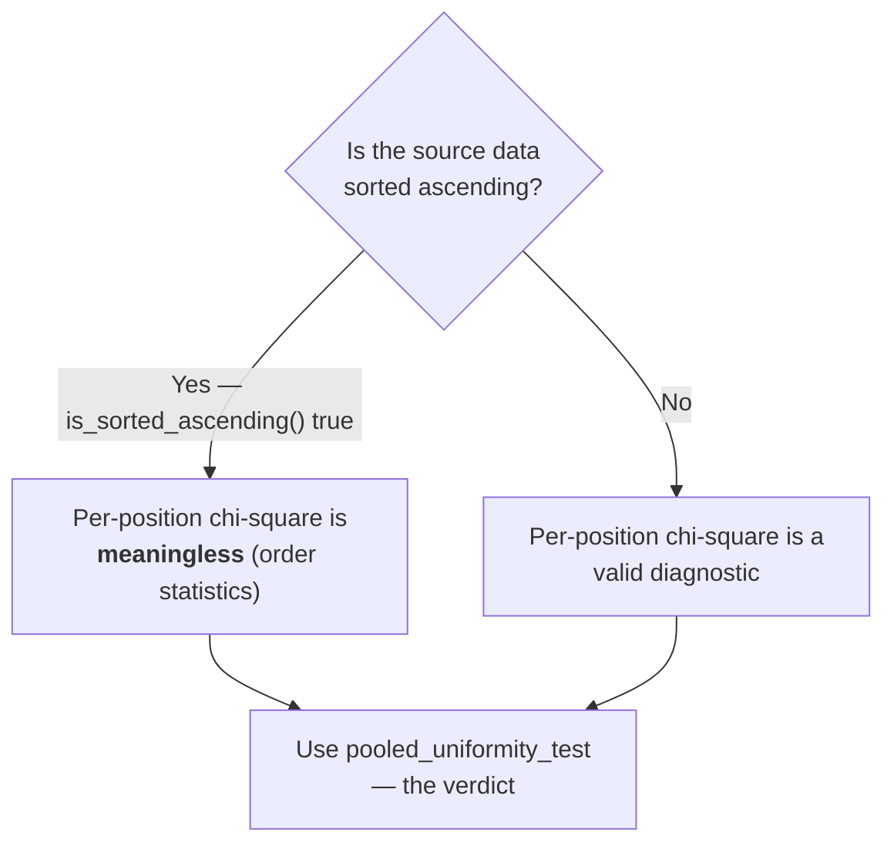

# Evaluation

How this project decides whether anything works. This is the most important
document in the repository after [Domain and Premise](domain-and-premise.md),
because it is where the honesty is enforced mechanically rather than by intention.

## 1. The governing rule

> **Raw accuracy is meaningless without the chance level next to it.**

"The model matched 0.8 of 5 numbers on average" is not information. Pure luck
already gives you ~0.58. The only interesting quantity is the **difference**, and
whether that difference survives a significance test.

Every accuracy number this project reports is paired with its chance baseline.
`lottery.backtest.summarize()` cannot emit an accuracy column without a
`chance_avg_main_hits` column beside it.

### Where the rule is enforced

The rule is deliberately split across two packages, because it is the one part
of this project that is not about lotteries at all.

| Layer | Owns | Knows about balls? |
| --- | --- | --- |
| `core/significance.py` | The z-test against a null, both p-values, the Bonferroni threshold, and the paired naive/corrected verdicts | No |
| `core/windows.py` | Walk-forward and date-cutoff splits | No |
| `lottery/models/baseline.py` | Turning `m_guessed` into the per-draw hypergeometric mean and variance | Yes |
| `lottery/backtest.py` | The scoring rule (`_score_window`) | Yes |

`core/` asks the domain for two things and supplies everything else: **the null's
mean and variance per observation**, and **the score**. For Baloto the null is the
exact hypergeometric distribution. For a different domain it would be something
else — a market's implied probabilities, a climatological base rate — and none of
the arithmetic in `core/` would change.

That split is why `verdicts()` returns `beats_chance` and
`beats_chance_corrected` **together**, as one dict: an evaluation surface cannot
report the naive verdict without the corrected one, because it never gets the
chance to build the row by hand.

## 2. Walk-forward backtesting

`lottery/backtest.py`. For each of the last `n_windows` real draws, every model is trained
**only on data before that draw** and scored against what actually came out.



```bash
python -m lottery.backtest --n-windows 20 --min-train 100
python -m lottery.backtest --n-windows 20 --include-prophet     # slower
```

| Flag | Default | Meaning |
| --- | --- | --- |
| `--n-windows` | 15 | How many recent draws to evaluate |
| `--min-train` | 60 | Minimum history before the first evaluated window |
| `--include-prophet` | off | Prophet refits per position per window; far slower |
| `--cutoff` | off | Hold out every draw after a date instead — see [§2.2](#22-holdout-by-date) |
| `--mode` | `expanding` | With `--cutoff`: `expanding` or `frozen` |
| `--current-format-only` | off | Drop pre-2017 draws ([data contract](data-pipeline.md#12-two-eras-of-the-game)) |
| `--file` | `exported_data/final-final.csv` | Input |

Writes `backtest_summary.csv`.

### 2.1 Multiple comparisons

A run scores k models against the **same** held-out draws, so it gets k chances at
a false positive. At α = 0.05 with six models there is a ~26% chance that at least
one signal-free model clears the bar — and "one of my six models beat chance" is
exactly the sentence a lottery system is built on.

`summarize()` therefore emits two verdicts, matching
[`compare_strategies`](tickets.md#multiple-comparisons):

| Column | Meaning |
| --- | --- |
| `beats_chance` | Naive per-test verdict at α = 0.05. **This is the one that misleads.** |
| `bonferroni_threshold` | α / k |
| `beats_chance_corrected` | The verdict to read |

### 2.2 Holdout by date

Picking the last N draws gives an average. Picking a **date** gives something you
can check against your own memory of what came out:

```bash
python -m lottery.backtest --cutoff 2026-07-31 --mode frozen --current-format-only
```

> Train on everything up to 31 July, then predict the draws of August and
> September — which have already happened, so the answer is known.

Two modes, because they are not the same experiment and the gap between them is
itself informative:

| Mode | What it does | What it answers |
| --- | --- | --- |
| `expanding` | Refits before every held-out draw, on all data preceding it | "How would this do if I retrained before each draw?" — how you would really play |
| `frozen` | Fits **once** at the cutoff and forecasts the whole remaining horizon | "I fit this in July. What did it say about August?" — the literal test, and the harder one |

Both use the same `_score_window`, so their summaries are directly comparable.

`cutoff_bounds(dates, cutoff)` is the single owner of the split arithmetic —
it returns `(n_train, n_holdout)` for a date, and the dashboard calls it to
preview the split before you press the button, so the CLI and the UI cannot
disagree about what a cutoff means. (`window_bounds` plays the same role for the
last-N-draws mode.)

`run_holdout()` returns `(results_by_model, info)`; `info` carries the cutoff, the
mode and both split sizes so a caller can report the experiment next to its result.
`holdout_detail()` turns the results into one row per held-out draw — the actual
numbers, and each model's hits against them. That table is the point of this mode:
the summary is the verdict, the detail is what makes it concrete.

```
        ds                 sorteo  superbalota  AutoTheta aciertos  XGBoost aciertos
2026-08-01    1 - 7 - 8 - 14 - 24            5                   0                 1
2026-08-15  2 - 10 - 15 - 23 - 30            2                   3                 0
2026-08-31  1 - 18 - 25 - 31 - 43            8                   0                 0
```

Three hits on 15 August looks like a hit. It is not: three or more of five from 43
happens about 1% of the time by luck, so across several models and a dozen draws
one such row is expected. The average at the bottom of the run is what decides.

**A note on `frozen` + XGBoost.** Projecting a lag model past one step means
feeding its own predictions back as lags (`xgboost_model.forecast_horizon`). With
no genuine signal the model regresses toward the pool mean, that mean becomes the
lag, and the output converges on a fixed point — later steps come out identical.
That flattening is a real property of the model, shown rather than hidden.

### Scoring is set-based

`_score_window()` compares the **set** of the 5 main predictions against the
**set** of the 5 actual main balls. Slot order is irrelevant.

```python
main_pred   = {21, 22, 23, 24}     # note: 4 distinct — two positions collided
main_actual = {3, 12, 19, 24, 41}
main_hits   = 1                     # |intersection|
m_guessed   = 4                     # distinct numbers actually committed to
```

`m_guessed` is tracked per window because **collisions matter**. If two positions
both predict 22, you have committed to four numbers, not five, and your chance of
matching is correspondingly lower. Scoring that against a five-number baseline
would understate the model. This is common: models with no signal converge toward
the same central value in every slot.

### No prediction is ever replaced by the truth

If a model cannot predict a window (too little history), the window is **skipped**.
An earlier version substituted the actual draw as the prediction, handing the model
free 5/5 windows that flowed straight into the significance test.

## 3. The chance baseline

`lottery/models/baseline.py`. Computed **exactly**, not simulated.

If you commit to `m` distinct numbers and the lottery draws 5 from a pool of 43,
the count you match follows a **hypergeometric distribution**:

```
matches ~ Hypergeometric(M = 43, n = m, N = 5)
mean = 5m / 43
```

| Numbers committed (`m`) | Expected matches |
| --- | --- |
| 5 | 0.581 |
| 4 | 0.465 |
| 3 | 0.349 |

For the superbalota it is simply `1/16 = 0.0625`.

### The significance test

```python
from lottery.models.baseline import beats_chance_test
result = beats_chance_test(observed_hits, m_guessed)
```

Each historical draw is an independent hypergeometric trial — the pool resets every
draw — so the **sum** of observed hits is asymptotically normal around the sum of
per-window chance means:

```
z = (Σ observed − Σ expected) / sqrt(Σ variance)
```

`m_guessed` may be a per-window list, so windows with different collision counts
each contribute their own mean and variance.

### One-sided vs two-sided: this matters

| Returned key | Question |
| --- | --- |
| `p_value` | Two-sided: "does this **differ** from chance?" |
| `p_value_greater` | One-sided: "is this **better** than chance?" |

**Only `p_value_greater` may back a "beats chance" claim.** A model significantly
*worse* than chance also gets a small two-sided p-value. Reporting that as a win
was a real bug here — the FrequencyBaseline, which underperforms chance, was being
labelled a winner.

## 4. Randomness testing

`lottery/analysis/randomness.py`. Run **before** trusting any forecast: if the series shows
no exploitable structure, a model that appears to find some is fitting noise.

| Test | Function | What a **high** p-value means |
| --- | --- | --- |
| Chi-square uniformity | `chi_square_uniformity` | Numbers appear equally often — expected for a fair draw |
| Pooled uniformity | `pooled_uniformity_test` | Same, but immune to sort-order artifacts |
| Wald–Wolfowitz runs | `runs_test` | Values sequence randomly around the median |
| Ljung–Box / ACF | `autocorrelation_check` | No autocorrelation — no "memory" to exploit |

Note the inversion relative to normal ML practice: here a **high p-value is the
healthy result**. It means the data behaves like a fair lottery.

A low Ljung–Box p-value would be the one finding that could justify a time-series
model at all. Do not expect one.

### The effect size, and why the interval matters more than the p-value

`beats_chance_test` also returns the observed edge with a confidence interval,
because a p-value on its own hides precision — "no edge detected" over 15
windows and over 1,000 draws produce the same kind of number while differing by
an order of magnitude in what they actually establish.

| Returned key | Meaning |
| --- | --- |
| `effect` | Observed mean minus chance mean, in matches per draw |
| `ci_low` / `ci_high` | 95% interval on that effect (`confidence=` to change it) |
| `relative_effect` | The same edge as a fraction of the chance mean |
| `observed_mean` / `chance_mean` | The two averages being compared |
| `n_observations` | Sample size behind all of it |

A wide interval straddling zero is not "there is no edge". It is "this run could
not tell", which is the same message
[Power](power-and-sensitivity.md#the-minimum-detectable-effect) delivers from the
other direction — and over 8 windows the intervals visibly cross zero in both
directions. Both the backtest summary and the strategies table carry the interval
as a column, and so do their dashboard renderings.

### On several tickets sharing one draw

The exact hypergeometric variance is used even when `tickets_per_draw > 1`,
which was checked rather than assumed. Sharing a draw induces positive
correlation in principle, so the statistic was measured under the null: sd(z)
came out at 0.997 at one ticket per draw and 0.927 at five, against the 1.0 a
calibrated statistic gives. No inflation. A cluster-robust variance was written
for this and removed — see [§8](#the-one-that-nearly-got-fixed) for how the
phantom came to be believed.

### Per-position vs pooled



**Per-position tests are diagnostics; the pooled test is the verdict.** See
[the sorted-data trap](domain-and-premise.md#4-the-sorted-data-trap).

### Multiple comparisons

Six positions are tested simultaneously. At α = 0.05 you should *expect* roughly
one in twenty tests to flag by chance. One or two red flags across six positions is
noise, not a finding. The dashboard says so on screen; any new test surface should
too.

## 5. Expected value: the one exact answer

`lottery/analysis/prizes.py`. No historical data required, no model, no uncertainty.

```python
from lottery.analysis.prizes import category_probabilities, expected_value, breakeven_jackpot

probs = category_probabilities()                       # all 12 categories, exact
ev = expected_value(probs, payouts, ticket_price=5700)
```

| Output | Meaning |
| --- | --- |
| `expected_return` | Average payout per ticket |
| `expected_value` | `expected_return − ticket_price` — the real number |
| `return_to_player` | Fraction of the stake returned on average (RTP) |
| `odds_any_prize_one_in` | Chance of winning anything |
| `breakeven_jackpot()` | Top prize that would make EV zero |

The 12 categories are every `(main matches 0–5) × (superbalota hit or not)`
combination. Main matches are hypergeometric; the superbalota is independent, so
each category is a product. Probabilities sum to exactly 1.0 and the jackpot comes
out at 1 in 15,401,568 — matching the published odds.

**Payouts are caller-supplied, never hardcoded.** Most tiers are operator-set and
the top prize accumulates, so the dashboard exposes an editable table rather than
inventing numbers.

On `breakeven_jackpot`: a positive EV on paper is not the whole story. A large
jackpot attracts more players, and a shared jackpot pays each winner less than the
calculation assumes; withholding tax cuts it further.

## 6. Forecast-accuracy metrics (Prophet cross-validation)

`lottery/models/prophet_model.py:evaluate_model_performance()` wraps Prophet's own cross-validation.

| Metric | Meaning | Direction |
| --- | --- | --- |
| MSE | Mean squared error | lower better |
| RMSE | Root MSE, in ball units | lower better |
| MAE | Mean absolute error | lower better |
| MAPE / MDAPE / SMAPE | Percentage error variants | lower better |
| Coverage | Fraction of actuals inside the prediction interval | should ≈ the interval level |

**Read these with care in this domain.** They measure how numerically close a
prediction was — but a lottery ticket pays on an exact set match, not proximity.
A model that predicts 22 every draw scores a respectable MAE and wins nothing. A
low RMSE here is not evidence of anything useful.

Coverage is the one that is genuinely diagnostic: if you use 95% intervals and
coverage is 0.80, the intervals are too narrow and the model is understating its
own uncertainty.

> These metrics describe a *fit*. `beats_chance_test` describes whether there is
> *signal*. Only the second one answers "is this worth using".

## 7. How to read a backtest result

```
            model  n_windows  avg_main_hits  chance_avg_main_hits  p_value_better_than_chance  beats_chance  bonferroni_threshold  beats_chance_corrected
        AutoARIMA         15           0.73                  0.46                       0.081         False                0.0167                   False
          XGBoost         15           0.60                  0.50                       0.561         False                0.0167                   False
FrequencyBaseline         15           0.40                  0.58                       0.894         False                0.0167                   False
```

Reading order:

1. **`beats_chance_corrected`** — the verdict. Expect `False`. Read this column,
   not `beats_chance`; see [§2.1](#21-multiple-comparisons).
2. **`avg_main_hits` vs `chance_avg_main_hits`** — the raw gap. AutoARIMA is above
   chance here.
3. **`p_value_better_than_chance`** — 0.081. Not significant even naively, and
   nowhere near the corrected 0.0167. With 15 windows, a gap that size is ordinary
   variance.
4. **`n_windows`** — the sample size behind all of the above. Fifteen is small.
   Treat a single run at 15 windows as an anecdote.

The FrequencyBaseline row is instructive: it is *below* chance, and its one-sided
p-value of 0.894 correctly reports "no evidence this is better". Under the old
two-sided test this same row could read as a win.

## 8. Known failure modes we have already hit

Documented because they are easy to reintroduce and each one produced a
plausible-looking wrong answer rather than a crash.

| Bug | Effect | Fix |
| --- | --- | --- |
| Shuffled `train_test_split` on a time series | Future draws in training; inflated accuracy | Chronological splits everywhere |
| Ground truth as fallback prediction | Free 5/5 windows fed the significance test | Skip the window instead |
| Two-sided p-value for "beats chance" | A model *worse* than chance reported as beating it | `p_value_greater` |
| Fitted value presented as a forecast | The dashboard showed a hindcast of an already-drawn result | `forecast_next()` |
| Pooling the 1-16 superbalota into a 1-43 test | Spurious "not uniform" verdict from the sort-proof test | Range derived from positions; mixing is now inexpressible |
| Per-position chi-square on sorted data | Spurious "non-random" structure | `is_sorted_ascending` + pooled test |
| One seed driving both the draw generator and the ticket generator | A 17.5% false-positive rate on bias-free data, blamed on the estimator | `sensitivity.independent_seeds` — `SeedSequence.spawn`, never the loop variable |

### The one that nearly got "fixed"

The last row deserves its own note, because it is the only entry here that
produced a *plausible statistical story* rather than an obvious mistake, and
that story survived a round of investigation.

`lottery/analysis/sensitivity.py` measured `evaluate_strategy("hot")` flagging a winner
17.5% of the time on data built with no bias at all, against a nominal α of 5%.
The explanation was ready-made and correct-sounding: tickets scored against the
same draw are positively correlated for a history-dependent strategy, so
treating them as independent understates the standard error. `random`, whose
tickets genuinely are independent, was unaffected — which fit the story exactly.
A cluster-robust variance was written, wired in, documented, and shipped.

It moved the rate from 17.5% to 15.0%. That near-miss is what forced the actual
measurement:

```
tickets/draw   sd(z) under the null    P(z > 1.645)
     1               0.997                 5.0%
     5               0.927                 3.3%
```

The test was calibrated all along. The correlation is real but does not distort
z at these ticket counts. The 17.5% came from the harness: `detection_rate`
passed the same integer seed to `load_biased_and_preprocess` and to
`evaluate_strategy`, so both consumed `np.random.default_rng(seed)` from the
same state and the numbers played were drawn from the same stream as the numbers
drawn. That is a genuine ticket/draw dependence — the exact thing the detector
exists to find. It found it. Decoupling the streams drops the rate to **0/40**.

Three things to take from it:

1. **Measure the statistic before replacing it.** sd(z) under the null is one
   loop and would have settled this before any code changed.
2. **A plausible mechanism is not evidence.** The correlation story was true in
   every particular except being the cause.
3. **Suspect the harness.** The control arm firing is a fact about the whole
   experiment, and the newest code in it — the measuring apparatus — is the
   likeliest suspect, not the code it was pointed at.

---

**Next:** [Dashboard](dashboard.md) · [Development](development.md)
