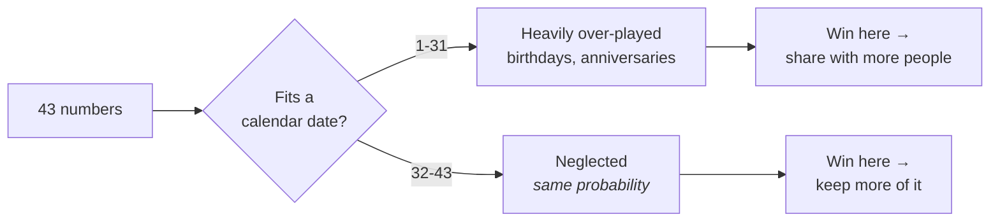

# Jackpot Splitting

The one lever in this game worth pulling — and the only place in this project
where a choice about which numbers to play has a defensible effect.

Everything else here ends the same way: nothing changes your probability of
winning, because all 15,401,568 combinations are equally likely. That stays
true. **Picking unpopular numbers does not make you win more often.**

What it changes is the other half of expected value:

```
P(win)           unchanged, always, by anything
E[payout | win]  genuinely improvable, by avoiding what other people play
```

A jackpot is split among everyone holding the winning combination, and people do
not choose uniformly. The shared-jackpot effect is well documented across
national lotteries, and it is the only lottery edge that survives contact with
the mathematics.

## 1. Why players are not uniform



The date bias is the largest and best-established: 1–31 can be a day of the
month, 32–43 cannot. `analysis/popularity.py` also scores runs of consecutive
numbers, arithmetic spacing (5-10-15-20-25), clustering in one row of the ticket
grid, and the usual "lucky" numbers — all documented choices people make when
asked to pick a "random" set.

## 2. What the model is, precisely

A heuristic scoring function whose weights **this project cannot calibrate**.
Calibrating them needs data on which tickets people *bought*, and no operator
publishes it.

So `popularity_score` is **ordinal**: 0.6 does not mean 60% of anything, it means
more commonly played than 0.4. Comparing two combinations is what it is for.

| Treat as | Because |
| --- | --- |
| **Solid** — dates are over-played, the effect is large | Consistent across published lottery research |
| **Rough** — any specific number | The weights are uncalibrated by necessity |

`split_adjusted_value` therefore reports a **band**, not a figure, by varying the
popularity multiplier across 4×–25×. If a decision flips inside that band, this
model cannot make it for you, and saying so is the point of the band.

## 3. Using it

```bash
python -m analysis.popularity --jackpot 5000000000 --tickets-sold 3000000
```

```
ticket                      popularity  other winners  expected share
33 - 36 - 38 - 41 - 43 + 14      0.188          0.095   4,566,148,008
2 - 14 - 23 - 31 - 38  + 11      0.540          0.213   4,120,403,092
3 - 7 - 12 - 19 - 25   +  8      0.694          0.304   3,833,899,343
5 - 10 - 15 - 20 - 25  +  7      0.710          0.316   3,800,078,559
1 - 2 - 3 - 4 - 5      +  6      0.902          0.491   3,352,346,202
```

The all-above-31 ticket is worth **1.36×** the consecutive run *if it wins*. Both
win once every 15,401,568 tickets.

### When the effect is small — and when it is not

At 3 million tickets sold against 15.4 million combinations, most winners have
nobody to share with, so the spread is modest. The effect grows with ticket
volume — which is exactly when the jackpot has rolled over and more people are
playing. **`tickets_sold` is the caller's to supply**; nothing here estimates it,
because operators publish it inconsistently and inventing it would turn a
documented ordering into a fabricated number.

### API

| Function | Returns |
| --- | --- |
| `popularity_score(ticket)` | 0 (unusual) to 1 (commonly played). Ordinal. |
| `popularity_components(ticket)` | Each bias separately, 0-1, for explaining a score |
| `expected_winners(ticket, tickets_sold, ...)` | Expected *other* holders of the same combination |
| `split_adjusted_value(ticket, jackpot, tickets_sold, ...)` | What the jackpot is worth, with a band |
| `unpopular_ticket(...)` | Least popular of a random sample |
| `compare_tickets(tickets, jackpot, tickets_sold)` | One row per ticket |
| `jackpot_probability()` | P(5 main + superbalota), restated so callers need not import `prizes` |

## 4. The strategy that the accuracy tests cannot see

`unpopular` is registered in `analysis.tickets.STRATEGIES`, so
`evaluate_strategy` and `compare_strategies` hold it to the same standard as
every other strategy. **It does not beat chance**, and that verdict is both
correct and beside the point.

> The hit rate measures `P(win)`. This strategy targets `E[payout | win]`. It is
> the one entry in the registry whose value the accuracy machinery is
> structurally unable to measure — which is worth knowing before reading its row
> as a failure.

That is also why it is not exempted from the tests. A strategy that quietly
skipped evaluation because "it works differently" is exactly the pattern this
project exists to avoid; it takes the same measurement as everything else, and
the reason its result looks unimpressive is stated rather than hidden.

## 5. In the dashboard

**Jugadas → Reparto de premios**: enter the jackpot and tickets sold, compare
example combinations or your own generated ones, and see the bias breakdown.
Generated tickets also carry a popularity column — see
[Dashboard](dashboard.md#6--jugadas--generate-check-measure).

---

**Next:** [Tickets](tickets.md) · [Evaluation](evaluation.md)
