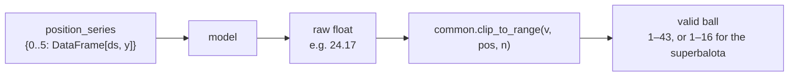
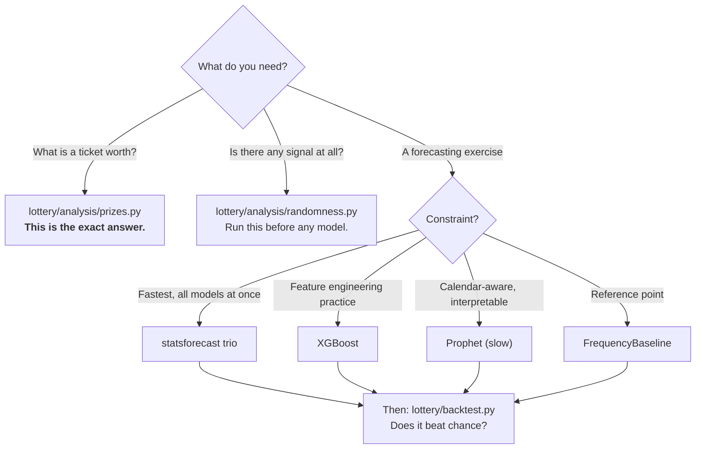

# Models

Every predictor in the project, what it does, and how to call it.

> All of these are forecasting exercises. None of them should beat chance on a fair
> lottery — see [Domain and Premise](domain-and-premise.md). Read
> [Evaluation](evaluation.md) before drawing any conclusion from their output.

## 0. The common shape

Every model consumes `position_series` — `{position: DataFrame[ds, y]}` — and
produces one number per position, clipped into that position's valid range.



Skipping `clip_to_range()` produces out-of-range balls. It is not optional.

## 1. Model roster

| Model | Module | Fits | Speed | Real forecast? |
| --- | --- | --- | --- | --- |
| **FrequencyBaseline** | `lottery/models/baseline.py` | mode per position | instant | n/a — a baseline |
| **AutoARIMA** | `lottery/models/statsforecast_model.py` | all positions in one call | fast | yes |
| **AutoETS** | same call | " | fast | yes |
| **AutoTheta** | same call | " | fast | yes |
| **XGBoost** | `lottery/models/xgboost_model.py` | per position | fast | yes, via `forecast_next` / `forecast_horizon` |
| **Prophet** | `lottery/models/prophet_model.py` | per position | slow | yes |

## 2. FrequencyBaseline

The "play the hottest number in each slot" strategy.

```python
from lottery.models.baseline import most_frequent_pick
preds = most_frequent_pick(position_series)            # {position: number}
preds = most_frequent_pick(position_series, upto=t)    # walk-forward: history before t
```

Takes the statistical mode of each position's history. It has **no predictive
edge** on i.i.d. draws — it is here to be beaten, and to give the backtest and the
dashboard one shared definition of the baseline so the two cannot diverge.

Do not confuse it with the **chance baseline**
([`beats_chance_test`](evaluation.md#3-the-chance-baseline)), which is the
theoretical reference every model including this one is measured against.

## 3. statsforecast trio: AutoARIMA, AutoETS, AutoTheta

Nixtla's `statsforecast`. This replaced a hand-rolled `SARIMAX` with a single
hard-coded `(1,2,1)(4,1,1,7)` order applied to all six series.

**Why it is better:** each series gets its own order selected by AIC search per
model, rather than one guess for all; and all six positions × three models are fit
in **one vectorized call**.

```python
from lottery.models.statsforecast_model import MODEL_NAMES, fit_predict_all, adjusted_predictions

forecast = fit_predict_all(position_series, h=1)               # all positions, all 3 models
clipped = adjusted_predictions(forecast, n_columns, model_name="AutoARIMA")
# clipped: DataFrame[unique_id, ds, AutoARIMA, yhat_adjusted]
```

| Parameter | Default | Notes |
| --- | --- | --- |
| `h` | 8 | Horizon in draws |
| `season_length` | 1 | i.e. no seasonality — see below |
| `n_jobs` | 1 | Parallel fitting |
| `level` | `None` | Prediction intervals. Opt-in: they cost time and nothing plots them today. |

**Do not loop per position for these models.** One `fit_predict_all` call covers
everything; a per-position loop multiplies the cost by six for identical output.

`season_length=1` is deliberate: there is no periodic structure in an i.i.d.
process. It is exposed as a parameter for experimentation, not because a different
value is expected to help.

These models run on the **draw-index axis**, not calendar dates — see
[Architecture §5](architecture.md#5-two-time-axes).

## 4. XGBoost

Gradient boosting on lag features. `lottery/models/xgboost_model.py`.

### Features

All strictly backward-looking:

| Feature | Source |
| --- | --- |
| `dayofweek`, `month` | The row's own `ds` (known in advance for a future draw) |
| `lag_1`, `lag_2`, `lag_3` | `y.shift(1..3)` |
| `rolling_mean` | `y.shift(1).rolling(20).mean()` |
| `rolling_freq_of_last_value` | How often the previous value occurred in the last 20 draws |

Calendar features alone carry no information about which ball is drawn, which is
why the lag features exist at all.

### The leakage fix

> The original code called `train_test_split(..., random_state=42)` with its default
> `shuffle=True` **on a time series**. That puts future draws in the training set and
> past draws in the test set, silently inflating reported accuracy.

Every split here is chronological. `chronological_split()` takes the last fraction
as the future; `train_predict_one_step()` trains on everything before the target
row.

### Four entry points

```python
from lottery.models.xgboost_model import (
    train_predict, train_predict_one_step, forecast_next, forecast_horizon,
)

# 1. Held-out evaluation: train on the first 80%, predict the chronological tail
result = train_predict(df, position, n_columns, test_size=0.2)
result["test"]["yhat_adjusted"]     # out-of-sample predictions for past draws

# 2. Walk-forward: train on all rows but the last, predict that last row
yhat = train_predict_one_step(df_upto_t, position, n_columns)   # None if history too short

# 3. Real forecast of a draw that has not happened
yhat = forecast_next(df, position, n_columns, next_date)

# 4. Many draws ahead from a single fit — the frozen holdout mode
yhats = forecast_horizon(df_train, position, n_columns, future_dates)
```

`forecast_horizon` is the only one that goes past a single step. It has to feed each
prediction back in as the next step's lag, and with no real signal the model
regresses toward the pool mean, that mean becomes the lag, and the output settles on
a fixed point — later steps come out identical. That is a genuine property of a lag
model with nothing to learn, and it is shown rather than smoothed over. See
[Evaluation §2.2](evaluation.md#22-holdout-by-date).

**These are not interchangeable.** `train_predict` predicts draws that already
happened — correct for comparing against known results, wrong to present as "the
next draw". That distinction was a real bug in the dashboard.

`forecast_next` appends a row for the future date carrying **`y = NaN`**.
`create_features` drops rows on missing *features* only, so the future row survives
with no target. If someone later adds a feature that reads the row's own `y`, this
produces `NaN` rather than silently turning the forecast into a function of the last
drawn number.

`min_history_required()` reports how many draws are needed before the model can
predict at all; short histories return `None` rather than a fabricated number.

## 5. Prophet

`lottery/models/prophet_model.py`. Kept for continuity with the project's origin, stripped of the parts
that were fitting noise.

```python
from Prophet import define_and_fit_model, predict_at_dates, forecast_position

model = define_and_fit_model(position_series[0])
fc = predict_at_dates(model, 0, n_columns, [next_date])   # evaluate one date
result = forecast_position(position_series[0], 0, n_columns, periods=8)
```

### What was removed and why

The original configuration stacked custom seasonalities on a series observed three
days a week:

```python
# REMOVED — all of this was fitting noise
m.add_seasonality(name='midweek_weekend', period=7,  fourier_order=3)
m.add_seasonality(name='biweekly',        period=14, fourier_order=5)
m.add_seasonality(name='yearly',          period=365.25, fourier_order=10)
holidays=COLOMBIA_HOLIDAYS
```

There is no weekly, biweekly or annual cycle in an i.i.d. draw, and a public
holiday has no causal effect on which ball leaves the machine. Seasonality and
holidays are now **off by default and opt-in**:

```python
from lottery.constants import COLOMBIA_HOLIDAYS
forecast_position(series, pos, n, holidays=COLOMBIA_HOLIDAYS)   # if you want to experiment
```

### Performance notes

- Prophet refits per position per window, which makes it far slower than the rest.
  It is **off by default in the backtest** (`--include-prophet` to enable).
- Use `predict_at_dates()` when you need one date. `make_predictions()` rebuilds the
  full history frame, and Prophet's uncertainty sampling makes predicting ~1500
  historical rows to read one value genuinely expensive.

## 6. Choosing a model



## 7. Adding a model

1. Put the implementation in `models/`, taking `position_series` and returning
   `{position: number}`.
2. Clip through `common.clip_to_range()`.
3. Derive positions from `common.main_positions()` / `super_position()` — never
   `range(5)` or `n - 1`.
4. Add a window predictor in `lottery/backtest.py` decorated with `@_predictor("YourModel")`.
5. Register it in `run_all()`.
6. Add it to the dashboard's Forecast tab selector.

The backtest's `_run_windows()` handles windowing, scoring and skipping; your
predictor only maps `(position_series, t) → {model_name: {position: prediction}}`,
returning `None` for a window it cannot predict. **Never return the actual draw as
a fallback** — that scores free hits into the chance test.

---

**Next:** [Evaluation](evaluation.md) · [Dashboard](dashboard.md)
