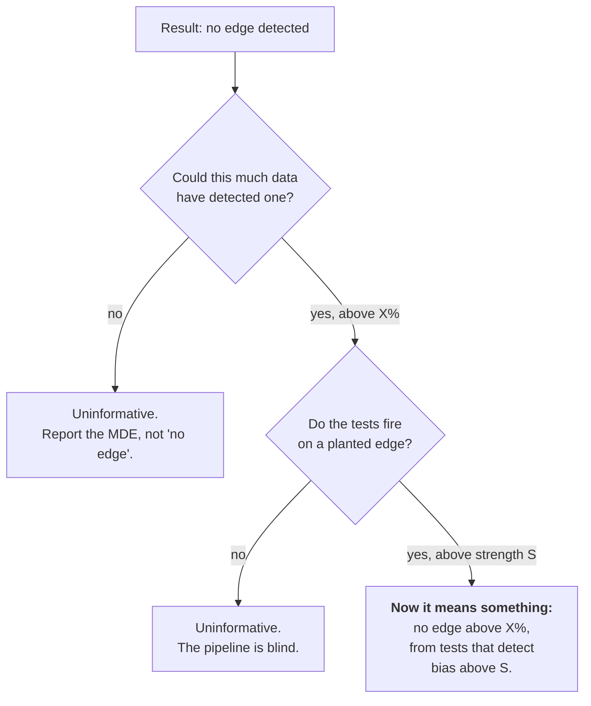

# Power and Sensitivity

The two questions that come *before* any result. Every other page in this
project answers "did I find an edge?"; this one answers "could I have?" and
"would I have?".

Without both, a null result is uninterpretable. "No model beat chance" is
compatible with three very different worlds:

1. There is no edge. *(the true one, for a fair lottery)*
2. There is an edge, but too small for this much data to reveal. → **§1 Power**
3. There is an edge of any size, and the tests are blind to it. → **§2 Sensitivity**



## 1. Power: `lottery/analysis/power.py`

```bash
python -m lottery.analysis.power --n-draws 1035
```

### The minimum detectable effect

The chance mean is 5×5/43 = 0.5814 matches with an SD of 0.6818. That SD is
larger than the mean, which is why lottery evaluation needs so much data. The
arithmetic mirrors `lottery/models/baseline.py:beats_chance_test` exactly, since the
point is to characterise *that* test:

```
z = (Σhits − N·μ) / √(N·σ²) = √N · (observed_mean − μ) / σ
power = 1 − Φ(z_α − √N · δ / σ)
```

Solving for the effect at a target power gives the **minimum detectable
effect** — the smallest edge a run of this size can reliably see:

| Draws evaluated | MDE (α=0.05, power=80%) | Model would need |
| --- | --- | --- |
| 15 | +75% | 1.019 |
| 40 | +46% | 0.849 |
| 137 | +25% | 0.726 |
| 200 | +21% | 0.701 |
| 1,035 | +9% | 0.634 |

> A backtest over 15 windows reporting "no model beats chance" has established
> almost nothing: it could not have detected a **50%** edge. The same sentence
> over 1,035 draws rules out anything above +9%. Same words, wildly different
> claims.

### How much history each edge would need

| Relative edge | Target mean | Draws needed | Years of history |
| --- | --- | --- | --- |
| +50% | 0.872 | 35 | 0.2 |
| +25% | 0.727 | 137 | 0.9 |
| +10% | 0.640 | 851 | 5.5 |
| +5% | 0.611 | 3,401 | 21.8 |
| +2% | 0.593 | 21,257 | 136.3 |

The years column is the honest answer to "why has nobody ever proven a lottery
system works?". Detecting a 2% edge needs more draws than the game has ever
held — and a 2% edge on a losing bet is still a losing bet.

Because the MDE falls with √N, **quadrupling your data only halves it.** There
is no amount of scraping that gets you to a 1% resolution.

### The one approximation

The alternative is assumed to have the same variance as the null. A model with
a real edge has no first-principles variance — it depends on how the edge
arises — and the null variance is the only defensible default. For small edges
the difference is negligible; for a huge edge the required-N figures come out
slightly pessimistic, which is the safe direction.

### API

| Function | Returns |
| --- | --- |
| `minimum_detectable_effect(n_draws, ...)` | The smallest visible edge, absolute / relative / as a target mean |
| `required_draws(relative_edge, ...)` | Draws needed to see an edge that size |
| `achieved_power(n_draws, relative_edge, ...)` | Probability of detecting it |
| `power_curve(n_draws, ...)` | Power against edge size — the curve to plot |
| `required_draws_table(...)` | The table above, with a years column |
| `super_minimum_detectable_effect(n_draws, ...)` | Same for the superbalota — **Bernoulli, not hypergeometric** |
| `describe(n_draws, ...)` | One-line English summary |
| `chance_moments(m_guessed)` | `(mean, sd)` per draw under chance — the two numbers everything else is built from |
| `draws_to_years(n_draws)` | The same count on the real Mon/Wed/Sat calendar |

The superbalota helper is separate rather than a parameter because using the
hypergeometric variance for a 1-in-16 Bernoulli trial understates the required
data by roughly a factor of three, and the two are easy to confuse.

## 2. Sensitivity: `lottery/analysis/sensitivity.py`

```bash
python -m lottery.analysis.sensitivity --n-draws 500 --n-seeds 10
```

`lottery/utils/sample_data.py` checks one direction: run the tests on i.i.d. uniform
draws, confirm they say "looks random". That is **specificity** — it proves the
tests do not cry wolf. It says nothing about whether they can hear a wolf. *A
test that always returns "looks random" passes that check perfectly.*

So this module plants a **known bias** and measures how often each detector
fires. Three run together, and the pattern across them is the information:

| Detector | What it exercises | On uniform draws | On biased draws |
| --- | --- | --- | --- |
| `pooled` | `pooled_uniformity_test` — the data directly | ~α | should fire |
| `hot` | `evaluate_strategy("hot")` — the whole chain | ~α | should fire |
| `random` | `evaluate_strategy("random")` — the control | ~α | **still ~α** |

`random` staying at the floor on biased data is the control working, not a
failure. A uniformly drawn ticket has expected matches 5×5/43 no matter how the
balls are weighted: the expectation sums P(drawn) over five numbers chosen
without regard to the bias, and that sum is unchanged. Only a strategy that
*learns* which numbers are favoured converts bias into hits — which is exactly
what separates `hot` from `random` here.

If `pooled` fires and `hot` does not, the bug is downstream of the statistics,
in the ticket path.

### Reading the report

**Read the `strength = 0` rows first.** If any detector fires much above α
there, something in the experiment is broken — and not necessarily the detector,
as the note below explains.

Measured over 20 seeds, 500 draws each, 200 evaluated draws × 5 tickets:

| strength | favoured share | `pooled` | `hot` | `random` |
| --- | --- | --- | --- | --- |
| 0.00 | 7.13% | 5% | 0% | 0% |
| 0.25 | 8.59% | 15% | 5% | 10% |
| 0.50 | 9.99% | **75%** | 0% | 0% |
| 1.00 | 12.68% | **100%** | 30% | 10% |
| 2.00 | 17.10% | 100% | **100%** | 5% |

The controls land where they should: 5%, 0%, 0% against α = 0.05.
`sensitivity_threshold()` reports where each detector crosses 80% — `pooled` at
strength 1.0, `hot` only at 2.0. **The direct uniformity test is substantially
more sensitive than the ticket path**, which makes sense: `hot_ticket` samples
*weighted toward* hot numbers rather than picking them outright, so it dilutes
the very signal it is looking for.

`random` never crosses, at any strength. That is the correct and expected
result, and it is what makes the other two columns trustworthy. Its scattered
5–10% rows are 1–2 flags in 20 — ordinary noise at this seed count.

### The seeding trap this module walked into

`detection_rate` regenerates the data *and* the tickets on every seed. Both need
randomness, and the obvious wiring — pass the loop variable to each — is wrong
in a way that is invisible and severe: `np.random.default_rng(seed)` twice with
the same integer yields the same stream, so the numbers drawn and the numbers
played come out of one sequence. That is a real dependence between ticket and
draw, which is precisely what a lottery test is built to detect. It duly
detected it, on data planted with no bias whatsoever, at a 17.5% rate with five
tickets per draw.

The failure was convincing enough to survive a round of investigation and a
shipped "fix" aimed at `evaluate_strategy` — the full story is in
[Evaluation §8](evaluation.md#the-one-that-nearly-got-fixed), and it is worth
reading before trusting any control arm.

`independent_seeds()` now splits one seed into non-overlapping streams via
`SeedSequence.spawn`. **Any new detector that needs randomness must take its
seed from there**, never from the loop variable.

### API

| Function | Returns |
| --- | --- |
| `minimum_detectable_effect(n_draws, ...)` | The smallest visible edge, absolute / relative / as a target mean |
| `required_draws(relative_edge, ...)` | Draws needed to see an edge that size |
| `achieved_power(n_draws, relative_edge, ...)` | Probability of detecting it |
| `power_curve(n_draws, ...)` | Power against edge size — the curve to plot |
| `required_draws_table(...)` | The table above, with a years column |
| `super_minimum_detectable_effect(n_draws, ...)` | Same for the superbalota — **Bernoulli, not hypergeometric** |
| `describe(n_draws, ...)` | One-line English summary |
| `chance_moments(m_guessed)` | `(mean, sd)` per draw under chance — the two numbers everything else is built from |
| `draws_to_years(n_draws)` | The same count on the real Mon/Wed/Sat calendar |

The superbalota helper is separate rather than a parameter because using the
hypergeometric variance for a 1-in-16 Bernoulli trial understates the required
data by roughly a factor of three, and the two are easy to confuse.

## 3. Football: the same pair, with the variance measured

`football/power.py` and `football/sensitivity.py` are the same two halves
pointed at the closing line. The structure carries over unchanged — a minimum
detectable effect from arithmetic, a planted-edge detection rate from running
the thing, a control that must sit near alpha. Three things do not.

### The variance has to be measured

On the lottery side the null's variance is exact: the hypergeometric
distribution hands it over, so the minimum detectable effect is a function of
`n` alone. In football the tested quantity is a **paired difference of two
proper scores**, and nothing gives its spread in advance — it depends on the
league, the season, how sharp the book is, and how far the model strays from
it.

So every function takes the spread as an argument, and `observed_score_sd`
computes it from a run that has already happened. `REFERENCE_SCORE_SD` exists
only so `describe()` can say something before any backtest, and it carries the
measurement it came from:

| `market_noise` | Dixon-Coles | Elo |
| --- | --- | --- |
| 0.0 (sharp) | 0.072 | 0.093 |
| 0.5 | 0.129 | 0.137 |
| 1.0 | 0.205 | 0.205 |
| 1.5 (soft) | 0.249 | 0.241 |

The constant is 0.08, the sharp end, because a closing line is sharp by
definition. **An earlier version of it was 0.05, written from intuition before
the measurement, and it was wrong by a factor of two at the sharp end and five
at the soft one.** Required match counts scale with the square of the spread,
so that is a factor-of-ten error in the answer — which is the whole argument
for the rule.

The headline it produces is brutal and meant to be. A season of one league is
~380 matches, which bottoms out around **0.010** of RPS. Detecting a realistic
0.002 takes roughly 10,000 matches — twenty-six seasons of one league. That is
not a defect in the test; it is why [`football/clv.py`](football.md#13-closing-line-value)
exists.

### A perfect market leaves nothing to plant

`sensitivity.py` plants an edge by blending each match's generative truth into
the forecast at a known weight. At `market_noise = 0` the de-margined price
**is** the truth, so the blend returns the price and every strength collapses
onto the control. That is not a broken harness — it is the domain's own
statement that nothing beats a perfect market — but it does make the dial inert,
so the default is a book that is good but beatable.

### Detection falls as the planted edge grows

The counter-intuitive one, measured over 240 matches at `market_noise = 0.3`:

| strength | mean effect | sd | z |
| --- | --- | --- | --- |
| 0.05 | 0.00081 | 0.00258 | 4.83 |
| 0.10 | 0.00159 | 0.00515 | 4.77 |
| 0.25 | 0.00381 | 0.01281 | 4.59 |
| 0.50 | 0.00704 | 0.02542 | 4.27 |
| 1.00 | 0.01177 | 0.05012 | 3.62 |

The effect grows fifteenfold; the spread grows nineteenfold; the statistic
*shrinks*. A forecast that departs further from the price disagrees with it on
more matches and by more, and the paired difference gets noisier faster than it
gets bigger. **A model that knows a little and hugs the price is easier to
prove right than one that knows more and says so loudly** — which is
[`ensemble.py`](football.md#10-pooling-with-the-market)'s argument for pooling,
arriving from a completely different direction.

### The bug this module shipped once

The first version joined each match's truth to its market vector **by row
order**. `preprocess_matches` is entitled to reorder and reindex, so the two
drifted apart: the first few rows happened to line up and the rest did not.
The symptom was unmistakable once the control was read — the *omniscient*
forecast at strength 1 scored **worse** than the market, because it was the
truth about a different fixture. The join is now on the match keys and raises
if it comes up short. Suspect the harness before the statistic, for the third
time in this repository.

## 3. In the dashboard

The **Potencia y Sensibilidad** tab wraps both, and the backtest tab now prints
the MDE of the run you just executed beside its verdict — see
[Dashboard](dashboard.md#9--¿qué-se-podía-ver--what-the-verdict-is-worth).

---

**Next:** [Evaluation](evaluation.md) · [Domain and Premise](domain-and-premise.md)
