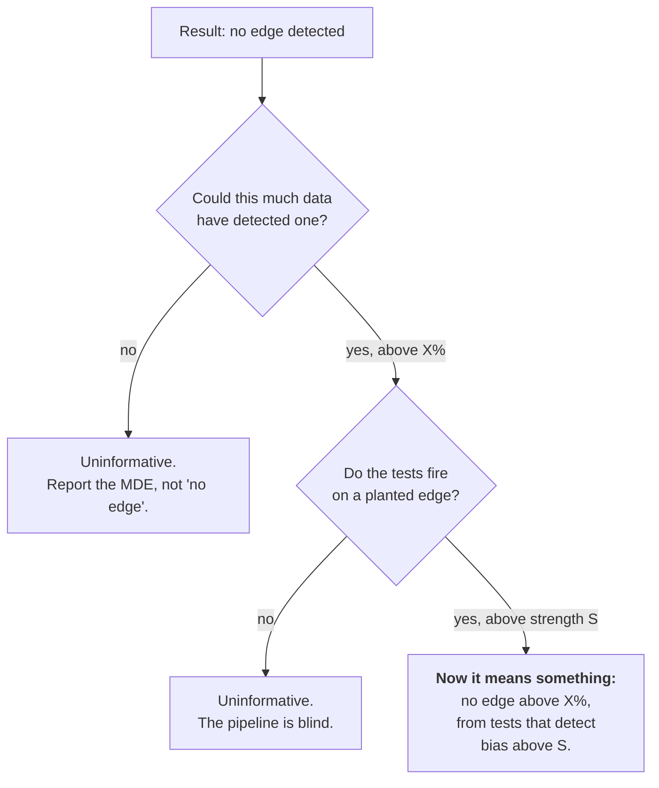

# Power and Sensitivity

The two questions that come *before* any result. Every other page in this
project answers "did I find an edge?"; this one answers "could I have?" and
"would I have?".

Without both, a null result is uninterpretable. "No model beat chance" is
compatible with three very different worlds:

1. There is no edge. *(the true one, for a fair lottery)*
2. There is an edge, but too small for this much data to reveal. → **§1 Power**
3. There is an edge of any size, and the tests are blind to it. → **§2 Sensitivity**



## 1. Power: `analysis/power.py`

```bash
python -m analysis.power --n-draws 1035
```

### The minimum detectable effect

The chance mean is 5×5/43 = 0.5814 matches with an SD of 0.6818. That SD is
larger than the mean, which is why lottery evaluation needs so much data. The
arithmetic mirrors `models/baseline.py:beats_chance_test` exactly, since the
point is to characterise *that* test:

```
z = (Σhits − N·μ) / √(N·σ²) = √N · (observed_mean − μ) / σ
power = 1 − Φ(z_α − √N · δ / σ)
```

Solving for the effect at a target power gives the **minimum detectable
effect** — the smallest edge a run of this size can reliably see:

| Draws evaluated | MDE (α=0.05, power=80%) | Model would need |
| --- | --- | --- |
| 15 | +75% | 1.019 |
| 40 | +46% | 0.849 |
| 137 | +25% | 0.726 |
| 200 | +21% | 0.701 |
| 1,035 | +9% | 0.634 |

> A backtest over 15 windows reporting "no model beats chance" has established
> almost nothing: it could not have detected a **50%** edge. The same sentence
> over 1,035 draws rules out anything above +9%. Same words, wildly different
> claims.

### How much history each edge would need

| Relative edge | Target mean | Draws needed | Years of history |
| --- | --- | --- | --- |
| +50% | 0.872 | 35 | 0.2 |
| +25% | 0.727 | 137 | 0.9 |
| +10% | 0.640 | 851 | 5.5 |
| +5% | 0.611 | 3,401 | 21.8 |
| +2% | 0.593 | 21,257 | 136.3 |

The years column is the honest answer to "why has nobody ever proven a lottery
system works?". Detecting a 2% edge needs more draws than the game has ever
held — and a 2% edge on a losing bet is still a losing bet.

Because the MDE falls with √N, **quadrupling your data only halves it.** There
is no amount of scraping that gets you to a 1% resolution.

### The one approximation

The alternative is assumed to have the same variance as the null. A model with
a real edge has no first-principles variance — it depends on how the edge
arises — and the null variance is the only defensible default. For small edges
the difference is negligible; for a huge edge the required-N figures come out
slightly pessimistic, which is the safe direction.

### API

| Function | Returns |
| --- | --- |
| `minimum_detectable_effect(n_draws, ...)` | The smallest visible edge, absolute / relative / as a target mean |
| `required_draws(relative_edge, ...)` | Draws needed to see an edge that size |
| `achieved_power(n_draws, relative_edge, ...)` | Probability of detecting it |
| `power_curve(n_draws, ...)` | Power against edge size — the curve to plot |
| `required_draws_table(...)` | The table above, with a years column |
| `super_minimum_detectable_effect(n_draws, ...)` | Same for the superbalota — **Bernoulli, not hypergeometric** |
| `describe(n_draws, ...)` | One-line English summary |

The superbalota helper is separate rather than a parameter because using the
hypergeometric variance for a 1-in-16 Bernoulli trial understates the required
data by roughly a factor of three, and the two are easy to confuse.

## 2. Sensitivity: `analysis/sensitivity.py`

```bash
python -m analysis.sensitivity --n-draws 500 --n-seeds 10
```

`utils/sample_data.py` checks one direction: run the tests on i.i.d. uniform
draws, confirm they say "looks random". That is **specificity** — it proves the
tests do not cry wolf. It says nothing about whether they can hear a wolf. *A
test that always returns "looks random" passes that check perfectly.*

So this module plants a **known bias** and measures how often each detector
fires. Three run together, and the pattern across them is the information:

| Detector | What it exercises | On uniform draws | On biased draws |
| --- | --- | --- | --- |
| `pooled` | `pooled_uniformity_test` — the data directly | ~α | should fire |
| `hot` | `evaluate_strategy("hot")` — the whole chain | ~α | should fire |
| `random` | `evaluate_strategy("random")` — the control | ~α | **still ~α** |

`random` staying at the floor on biased data is the control working, not a
failure. A uniformly drawn ticket has expected matches 5×5/43 no matter how the
balls are weighted: the expectation sums P(drawn) over five numbers chosen
without regard to the bias, and that sum is unchanged. Only a strategy that
*learns* which numbers are favoured converts bias into hits — which is exactly
what separates `hot` from `random` here.

If `pooled` fires and `hot` does not, the bug is downstream of the statistics,
in the ticket path.

### Reading the report

**Read the `strength = 0` rows first.** If any detector fires much above α
there, something in the experiment is broken — and not necessarily the detector,
as the note below explains.

Measured over 20 seeds, 500 draws each, 200 evaluated draws × 5 tickets:

| strength | favoured share | `pooled` | `hot` | `random` |
| --- | --- | --- | --- | --- |
| 0.00 | 7.13% | 5% | 0% | 0% |
| 0.25 | 8.59% | 15% | 5% | 10% |
| 0.50 | 9.99% | **75%** | 0% | 0% |
| 1.00 | 12.68% | **100%** | 30% | 10% |
| 2.00 | 17.10% | 100% | **100%** | 5% |

The controls land where they should: 5%, 0%, 0% against α = 0.05.
`sensitivity_threshold()` reports where each detector crosses 80% — `pooled` at
strength 1.0, `hot` only at 2.0. **The direct uniformity test is substantially
more sensitive than the ticket path**, which makes sense: `hot_ticket` samples
*weighted toward* hot numbers rather than picking them outright, so it dilutes
the very signal it is looking for.

`random` never crosses, at any strength. That is the correct and expected
result, and it is what makes the other two columns trustworthy. Its scattered
5–10% rows are 1–2 flags in 20 — ordinary noise at this seed count.

### The seeding trap this module walked into

`detection_rate` regenerates the data *and* the tickets on every seed. Both need
randomness, and the obvious wiring — pass the loop variable to each — is wrong
in a way that is invisible and severe: `np.random.default_rng(seed)` twice with
the same integer yields the same stream, so the numbers drawn and the numbers
played come out of one sequence. That is a real dependence between ticket and
draw, which is precisely what a lottery test is built to detect. It duly
detected it, on data planted with no bias whatsoever, at a 17.5% rate with five
tickets per draw.

The failure was convincing enough to survive a round of investigation and a
shipped "fix" aimed at `evaluate_strategy` — the full story is in
[Evaluation §8](evaluation.md#the-one-that-nearly-got-fixed), and it is worth
reading before trusting any control arm.

`independent_seeds()` now splits one seed into non-overlapping streams via
`SeedSequence.spawn`. **Any new detector that needs randomness must take its
seed from there**, never from the loop variable.

### API

| Function | Returns |
| --- | --- |
| `minimum_detectable_effect(n_draws, ...)` | The smallest visible edge, absolute / relative / as a target mean |
| `required_draws(relative_edge, ...)` | Draws needed to see an edge that size |
| `achieved_power(n_draws, relative_edge, ...)` | Probability of detecting it |
| `power_curve(n_draws, ...)` | Power against edge size — the curve to plot |
| `required_draws_table(...)` | The table above, with a years column |
| `super_minimum_detectable_effect(n_draws, ...)` | Same for the superbalota — **Bernoulli, not hypergeometric** |
| `describe(n_draws, ...)` | One-line English summary |

The superbalota helper is separate rather than a parameter because using the
hypergeometric variance for a 1-in-16 Bernoulli trial understates the required
data by roughly a factor of three, and the two are easy to confuse.

## 2. Sensitivity: `analysis/sensitivity.py`

```bash
python -m analysis.sensitivity --n-draws 500 --n-seeds 10
```

`utils/sample_data.py` checks one direction: run the tests on i.i.d. uniform
draws, confirm they say "looks random". That is **specificity** — it proves the
tests do not cry wolf. It says nothing about whether they can hear a wolf. *A
test that always returns "looks random" passes that check perfectly.*

So this module plants a **known bias** and measures how often each detector
fires. Three run together, and the pattern across them is the information:

| Detector | What it exercises | On uniform draws | On biased draws |
| --- | --- | --- | --- |
| `pooled` | `pooled_uniformity_test` — the data directly | ~α | should fire |
| `hot` | `evaluate_strategy("hot")` — the whole chain | ~α | should fire |
| `random` | `evaluate_strategy("random")` — the control | ~α | **still ~α** |

`random` staying at the floor on biased data is the control working, not a
failure. A uniformly drawn ticket has expected matches 5×5/43 no matter how the
balls are weighted: the expectation sums P(drawn) over five numbers chosen
without regard to the bias, and that sum is unchanged. Only a strategy that
*learns* which numbers are favoured converts bias into hits — which is exactly
what separates `hot` from `random` here.

If `pooled` fires and `hot` does not, the bug is downstream of the statistics,
in the ticket path.

### Reading the report

**Read the `strength = 0` rows first.** If any detector fires much above α
there, it is broken and every other row is meaningless.

Measured over 10 seeds, 500 draws each, 200 evaluated draws × 5 tickets:

| strength | favoured share | `pooled` | `hot` | `random` |
| --- | --- | --- | --- | --- |
| 0.00 | 6.96% | 0% | 20% | 0% |
| 0.25 | 8.45% | 0% | 0% | 0% |
| 0.50 | 9.76% | **80%** | 10% | 0% |
| 1.00 | 12.51% | 100% | 40% | 0% |
| 2.00 | 17.35% | 100% | **100%** | 0% |

`sensitivity_threshold()` reports where each detector crosses 80%: `pooled` at
strength 0.5, `hot` only at 2.0. **The direct uniformity test is roughly four
times more sensitive than the ticket path**, which makes sense — `hot_ticket`
samples *weighted toward* hot numbers rather than picking them outright, so it
dilutes the very signal it is looking for.

`random` never crosses, at any strength. That is the correct and expected
result, and it is what makes the other two columns trustworthy.

### What this found: `tickets_per_draw` inflates the false-positive rate

The `hot` control at 20% was not noise. Repeated at 40 seeds it held at 17.5%
(binomial(40, 0.05) gives P(≥7) ≈ 0.6%), and varying the ticket count isolates
the cause:

| detector | tickets/draw | flagged (of 40) | rate |
| --- | --- | --- | --- |
| `hot` | 1 | 0 | 0% |
| `hot` | 5 | 7 | **17.5%** |
| `hot` | 20 | 4 | **10%** |
| `random` | 1 | 0 | 0% |
| `random` | 5 | 0 | 0% |
| `random` | 20 | 3 | 7.5% |

`evaluate_strategy` passes every ticket to `beats_chance_test` as an
independent observation. For `hot` they are not: all the tickets for one draw
concentrate on the same hot numbers, so when those numbers come up they *all*
score high together. Positive within-draw correlation → the standard error is
understated → z inflated → false positives.

`random` is immune for the same reason it is a valid control: its match
distribution does not depend on the drawn numbers, so its tickets stay
independent. Its 7.5% at 20 tickets is 3 flags in 40 — ordinary noise
(P(≥3) ≈ 32%), where `hot`'s 7 in 40 is not (P(≥7) ≈ 0.6%). The asymmetry
between the two columns is the evidence; neither number alone would be.

[`docs/tickets.md`](tickets.md#note-on-tickets_per_draw) had flagged this as a
qualitative caveat ("those rows carry slightly less information"). It is
larger than "slightly": **at 5 tickets per draw the real false-positive rate is
about 3.5× the nominal α.** The dashboard's *Jugadas* tab defaults to 10
tickets per draw, so its `hot`/`cold` p-values are optimistic.

Until this is fixed, read `hot`/`cold` verdicts at `tickets_per_draw = 1`, or
treat `stability_check`'s measured flag rate — not α — as the floor. The
principled fix is a cluster-robust variance: score each draw as one cluster and
estimate the variance from across-draw variation, which absorbs the correlation
whatever its size.

### API

| Function | Returns |
| --- | --- |
| `biased_draws(n_draws, favored, strength, seed)` | Draws in the CSV contract with a planted bias |
| `load_biased_and_preprocess(**kwargs)` | `(df, balls_expanded)`, drop-in for the real loader |
| `measured_favored_share(balls_expanded, favored)` | The realised share, since `strength` has no intuitive meaning |
| `detection_rate(strength, detector, ...)` | Fraction of independent runs where it fires |
| `sensitivity_report(strengths, detectors, ...)` | The full grid |
| `sensitivity_threshold(report, detector)` | Where it reaches 80% — or `None`, which is a real answer |

`strength = 0` reproduces uniform draws exactly, which is what makes it usable
as the control arm. Each seed regenerates the data as well as the tickets, so
repetitions are independent experiments rather than re-rolls of one dataset.

## 3. In the dashboard

The **Potencia y Sensibilidad** tab wraps both, and the backtest tab now prints
the MDE of the run you just executed beside its verdict — see
[Dashboard](dashboard.md#8--potencia-y-sensibilidad--what-the-verdict-is-worth).

---

**Next:** [Evaluation](evaluation.md) · [Domain and Premise](domain-and-premise.md)
