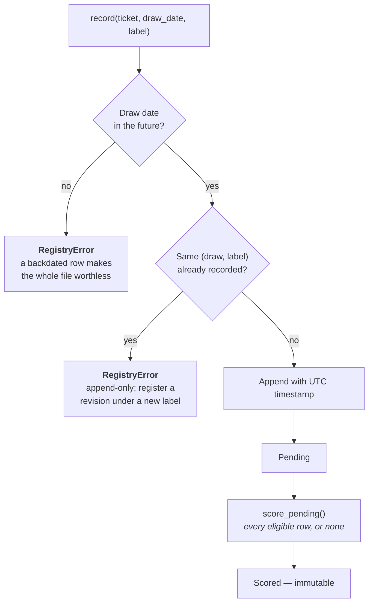

# The Prediction Registry

`analysis/registry.py` — an append-only, timestamped log of predictions recorded
**before** the draw.

Everything else in this project is retrospective, and retrospective analysis can
always be adjusted after the fact: a window shifted, a model swapped, a run
quietly not counted. None of that is dishonesty — it is what analysing data you
have already seen does to anyone, and the rest of the docs are largely about
containing it. The one thing that cannot be adjusted afterwards is a prediction
written down before the result existed.

That is all this module is.

## 1. What makes it evidence

Not the recording. The refusing.



| Rule | Why |
| --- | --- |
| A draw that already happened is **rejected**, not warned about | One backdated entry makes every other row unverifiable |
| Rows are never edited or deleted | Changing your mind is a *new* label, so both stay on the record |
| `score_pending` scores **all** eligible rows | Choosing which predictions to count is the exact failure mode |

`record()` takes an injectable `now` so the future-date guard can itself be
tested. Leave it alone in normal use — letting the caller choose "now" defeats
the point.

## 2. Where it lives

`predictions.csv`, at the repository root, and **not** gitignored — unlike
`exported_data/`. That is deliberate: committing it puts each prediction under
version control with a date attached, which is a stronger claim than any
timestamp column the file writes about itself.

| Column | Filled by |
| --- | --- |
| `recorded_at`, `draw_date`, `label`, `main`, `super_ball`, `note` | `record()` |
| `scored_at`, `actual_main`, `actual_super`, `main_matches`, `super_match` | `score_pending()` |

## 3. Using it

```bash
python -m analysis.registry record --label Prophet --main 3-12-19-27-41 --super 8
python -m analysis.registry score
python -m analysis.registry show
```

```python
from analysis.registry import record, score_pending, summary, pending, status
from analysis.tickets import Ticket

record(Ticket(main=(3, 12, 19, 27, 41), super_ball=8), "2026-09-12", "Prophet")
score_pending(df, balls_expanded)      # after the draw
summary(by_label=True)                 # against the chance baseline
```

`record_predictions()` takes a model's `{position: number}` output directly.
Note that collisions between positions get filled at random, so the registered
ticket may contain numbers the model did not choose — the registry records what
was *played*, and those differ exactly when the model had no signal.

## 4. How long until it says anything

```
3 draws/week × 52 weeks = 156 predictions/year
```

Per [Power](power-and-sensitivity.md#the-minimum-detectable-effect), 156 scored
predictions detect an edge of about **+23%** and nothing subtler. So `summary()`
reports `min_detectable_effect` beside the p-value: with a young registry, "not
beating chance" is a statement about the sample size, not about the predictions.

| Scored | Smallest edge it could reveal |
| --- | --- |
| 20 | +65% |
| 50 | +41% |
| 156 | +23% |
| 500 | +13% |

Read that column first. It is the difference between "my predictions did not
work" and "I have not run this long enough to know".

## 5. In the dashboard

The **Registro** tab wraps all of it: record against an upcoming draw, score what
has happened, and see the per-label result with its detectable-effect floor. The
refusals surface as Spanish messages there, with the module's English detail
underneath — see [Dashboard](dashboard.md#9--registro--predictions-made-in-advance).

---

**Next:** [Power and Sensitivity](power-and-sensitivity.md) · [Evaluation](evaluation.md)
