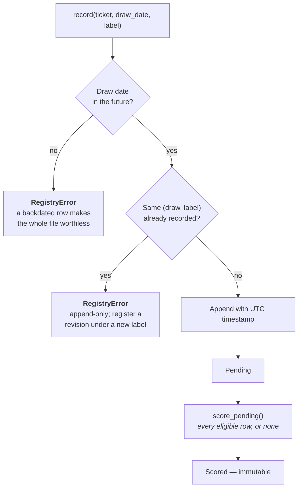

# The Prediction Registry

`core/registry.py` plus one adapter per domain — an append-only, timestamped log
of predictions recorded **before** the thing they predict happened.

Everything else in this project is retrospective, and retrospective analysis can
always be adjusted after the fact: a window shifted, a model swapped, a run
quietly not counted. None of that is dishonesty — it is what analysing data you
have already seen does to anyone, and the rest of the docs are largely about
containing it. The one thing that cannot be adjusted afterwards is a prediction
written down before the result existed.

That is all this module is.

**It now exists in all three domains, and the order that happened in is the
point.** The lottery had it first, which is exactly where it means least:
everybody already knows Baloto cannot be beaten, so a forward record there
demonstrates the discipline and nothing else. Football and cycling are the
domains where such a record would be *evidence*, and they had none. So the
refusals and the storage moved into `core/registry.py` and each domain grew an
adapter:

| Domain | File | Event | Prediction | Scored against |
| --- | --- | --- | --- | --- |
| Baloto | `lottery/analysis/registry.py` | a draw | 5 main numbers + superbalota | the exact hypergeometric chance baseline |
| Football | `football/registry.py` | a fixture | a 1X2 probability vector | the **de-margined closing price on that match** |
| Cycling | `cycling/registry.py` | a race | Plackett-Luce worths over the start list | the **pre-race ranking**, built strictly from earlier results |

The lottery's public API and its file did not change, and its tests passed
through the lift **unchanged** — which is what makes the refactor checkable
rather than merely plausible.

## 1. What makes it evidence

Not the recording. The refusing.



| Rule | Why |
| --- | --- |
| A draw that already happened is **rejected**, not warned about | One backdated entry makes every other row unverifiable |
| Rows are never edited or deleted | Changing your mind is a *new* label, so both stay on the record |
| `score_pending` scores **all** eligible rows | Choosing which predictions to count is the exact failure mode |

`record()` takes an injectable `now` so the future-date guard can itself be
tested. Leave it alone in normal use — letting the caller choose "now" defeats
the point.

## 2. Where it lives

`predictions.csv`, at the repository root, and **not** gitignored — unlike
`exported_data/`. That is deliberate: committing it puts each prediction under
version control with a date attached, which is a stronger claim than any
timestamp column the file writes about itself.

| Column | Filled by |
| --- | --- |
| `recorded_at`, `draw_date`, `label`, `main`, `super_ball`, `note` | `record()` |
| `scored_at`, `actual_main`, `actual_super`, `main_matches`, `super_match` | `score_pending()` |

Football writes `football_predictions.csv` and cycling `cycling_predictions.csv`,
both at the root and both for the same reason. A `RegistrySchema` names each
domain's columns and `core/` assembles the order from it; the file carries the
domain's own names — `draw_date`, `match_date`, `race_date` — rather than a
generic `event_date`, because a committed predictions file should not need
translating.

## 3. Using it

```bash
python -m lottery.analysis.registry record --label Prophet --main 3-12-19-27-41 --super 8
python -m lottery.analysis.registry score
python -m lottery.analysis.registry show
```

```python
from analysis.registry import record, score_pending, summary, pending, status
from analysis.tickets import Ticket

record(Ticket(main=(3, 12, 19, 27, 41), super_ball=8), "2026-09-12", "Prophet")
score_pending(df, balls_expanded)      # after the draw
summary(by_label=True)                 # against the chance baseline
```

`record_predictions()` takes a model's `{position: number}` output directly.
Note that collisions between positions get filled at random, so the registered
ticket may contain numbers the model did not choose — the registry records what
was *played*, and those differ exactly when the model had no signal.

## 4. How long until it says anything

```
3 draws/week × 52 weeks = 156 predictions/year
```

Per [Power](power-and-sensitivity.md#the-minimum-detectable-effect), 156 scored
predictions detect an edge of about **+23%** and nothing subtler. So `summary()`
reports `min_detectable_effect` beside the p-value: with a young registry, "not
beating chance" is a statement about the sample size, not about the predictions.

| Scored | Smallest edge it could reveal |
| --- | --- |
| 20 | +65% |
| 50 | +41% |
| 156 | +23% |
| 500 | +13% |

Read that column first. It is the difference between "my predictions did not
work" and "I have not run this long enough to know".

## 5. In the dashboard

The **Registro** tab wraps all of it: record against an upcoming draw, score what
has happened, and see the per-label result with its detectable-effect floor. The
refusals surface as Spanish messages there, with the module's English detail
underneath — see [Dashboard](dashboard.md#10--registro--predictions-made-in-advance).

## 6. What each domain adds

`core/registry.py` guarantees only that what it holds was unfalsifiable when
written. Everything that makes a row *mean* something is the domain's.

**Football: a forward market test, not a forward accuracy number.** Scoring a
1X2 vector by how often it was "right" says nothing — a forecast that backs the
favourite every week is right about half the time and has no edge whatsoever. So
a row stores the RPS of the forecast, the RPS of the de-margined closing price
on the same match, and their difference, and `summary` runs the difference
through the same one-sided paired test `evaluation.py` uses. A registry and a
backtest of the same model are then answering the same question in the same
units, and a registry that disagrees with its backtest is the most interesting
result this project could produce.

The bar is supplied at scoring time, not at recording time, and that is
deliberate: the closing line does not exist when the forecast is written, so the
thing it will be judged against is unfalsifiable too. A fixture with no usable
price is left **pending** rather than scored against nothing — a forecast with
no bar beside it is the bare model number every football surface here refuses to
show.

**Cycling: an ordering, over the field that was predicted.** A row stores the
riders and their worths together as one prediction, because splitting it across
180 rows would let half be scored and half not — the subset scoring `core/`
refuses. It is scored by the Plackett-Luce log score, the only rule proper over
a whole finishing order, against `form_worths` built strictly from results
before the race.

And a race whose result carries a different field from the one registered is
**refused, not rescored**. That is the registry's version of the rule the
scoring already enforces: quietly shrinking the field turns "predict the
finishing order" into the strictly easier "predict the order among those who
finished", and here it would silently turn a recorded claim into an easier one.

**The endpoints are pinned in all three.** A football forecast that *is* the
market accumulates a difference of exactly zero; a cycling forecast that *is*
the ranking scores exactly zero against it. Same load-bearing zero as
`ensemble.py`'s weight-0 blend, and for the same reason: every other number is
read as a departure from it.

One caveat travels with the football numbers and is worth repeating here. A
season of registered forecasts is a few hundred matches, and `beats_market_test`
needs thousands to separate a real 2% edge from nothing. Read `n_scored` first.
That is also why [`football/clv.py`](football.md#13-closing-line-value) exists:
it is the measurement that converges while the registry is still filling up.

---

**Next:** [Power and Sensitivity](power-and-sensitivity.md) · [Evaluation](evaluation.md)
