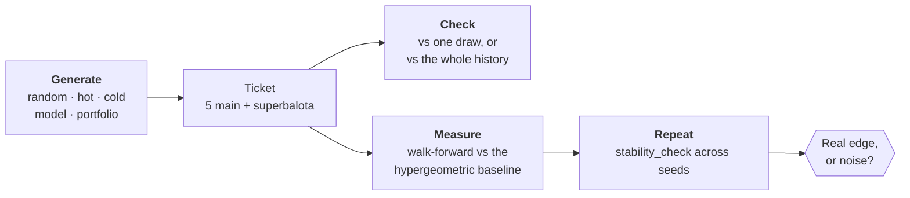

# Tickets: Generating, Checking, Measuring

`analysis/tickets.py` — the experimental surface of the project. Generate plays,
check them against real draws, and measure whether a way of choosing them does
better than picking at random.

> **The framing matters.** Generating numbers is legitimate and so is checking
> them. What no strategy can do is make one ticket *more likely* to win than
> another, because all 15,401,568 combinations are equally probable. This module
> does not ask you to take that on faith — `evaluate_strategy` and
> `stability_check` measure it on your own data.

## 1. The three jobs



## 2. The Ticket type

```python
from analysis.tickets import Ticket

t = Ticket(main=(3, 12, 19, 27, 41), super_ball=8)
print(t)          # 3 - 12 - 19 - 27 - 41  +  8
t.main_set        # frozenset({3, 12, 19, 27, 41})
```

Validated on construction: exactly 5 **distinct** main numbers in 1–43, and a
superbalota in 1–16. An invalid ticket raises rather than silently scoring wrong.

The superbalota is drawn independently, so it may numerically coincide with a main
number — that is not a duplicate.

## 3. Generating

| Function | What it does |
| --- | --- |
| `random_ticket(rng)` | Uniform pick. **The honest default.** |
| `hot_ticket(balls_expanded, rng)` | Weighted toward the most-drawn numbers |
| `cold_ticket(balls_expanded, rng)` | Weighted toward the least-drawn numbers |
| `ticket_from_predictions(preds, rng)` | Turns a model's `{position: number}` into a valid ticket |
| `generate_portfolio(n, strategy, ...)` | Several tickets at once |

```python
from analysis.tickets import random_ticket, generate_portfolio, portfolio_coverage

ticket = random_ticket()
tickets = generate_portfolio(5, strategy="random", disjoint=True)
print(portfolio_coverage(tickets))
```

`hot` and `cold` exist so that `evaluate_strategy` can **measure** them rather than
leaving them as an argument. They are the two most common lottery heuristics, and
they are exact opposites — which is itself informative: if either worked, the other
would have to fail badly.

### Model predictions and collisions

`ticket_from_predictions` handles a real quirk. Models frequently predict the same
number in several positions — a symptom of having no signal to tell the slots
apart — which would leave fewer than five distinct numbers. Missing slots are
filled at random.

```python
preds = {0: 22, 1: 22, 2: 23, 3: 22, 4: 24, 5: 9}   # three positions collided
ticket_from_predictions(preds)                       # 22 - 23 - 24 - 34 - 36  +  9
```

### Portfolios and what is genuinely optimizable

This is the one place where structure legitimately matters. You cannot improve a
single ticket, but a **set** of tickets has properties worth choosing:

```python
generate_portfolio(5, disjoint=True)    # main numbers never repeat across tickets
```

`portfolio_coverage()` returns exact figures — no estimation:

| Tickets | Distinct numbers | Pool coverage | Jackpot odds |
| --- | --- | --- | --- |
| 1 | 5 | 12% | 1 in 15,401,568 |
| 5 | 25 | 58% | 1 in 3,080,314 |
| 8 | 40 | 93% | 1 in 1,925,196 |

Read that table correctly. Buying N tickets divides the jackpot odds by N — that is
arithmetic, not strategy, and it costs N times as much. Spreading tickets over more
of the pool changes how outcomes are *distributed* across the set; it does not
change the expected value of any ticket, nor of the portfolio.

## 4. Checking

```python
from analysis.tickets import check_ticket, check_against_history, history_summary, draw_from_row

main_drawn, super_drawn = draw_from_row(balls_expanded.iloc[-1])
check_ticket(ticket, main_drawn, super_drawn)
# {'main_matches': 1, 'super_match': False, 'category': '1 aciertos', 'matched_numbers': [12]}

results = check_against_history(ticket, df, balls_expanded)   # every draw, one row each
history_summary(results)                                       # counts per prize category
```

Category naming matches `analysis/prizes.py`, so the observed distribution can be
compared directly against the exact probabilities.

A typical result over 400 draws:

| category | times | share_pct | exact probability |
| --- | --- | --- | --- |
| 0 aciertos | 208 | 52.0% | 48.9% |
| 1 aciertos | 135 | 33.8% | 35.9% |
| 2 aciertos | 30 | 7.5% | 8.2% |
| 3 aciertos | 4 | 1.0% | 0.68% |

Any other ticket would give a statistically equivalent distribution. That is the
point.

## 5. Measuring: the accuracy system

```python
from analysis.tickets import evaluate_strategy, compare_strategies, stability_check

evaluate_strategy("hot", df, balls_expanded, n_draws_back=300, tickets_per_draw=20)
compare_strategies(df, balls_expanded)
stability_check(df, balls_expanded, strategy="random", n_seeds=30)
```

`evaluate_strategy` walks forward: for each of the last `n_draws_back` draws it
generates tickets using **only the draws before it**, then scores them against what
actually came out. The hit counts go through the same exact hypergeometric test the
model backtest uses ([Evaluation §3](evaluation.md#3-the-chance-baseline)).

| Key | Meaning |
| --- | --- |
| `avg_main_matches` | Observed average |
| `chance_avg_main_matches` | Exact expectation, 5×5/43 = 0.5814 |
| `p_value_better_than_chance` | One-sided. Small = evidence of an edge |
| `beats_chance` | Naive per-test verdict at α = 0.05 |
| `best_result` | Best single ticket in the run |

### Multiple comparisons

`compare_strategies` tests several strategies at once, which means several chances
at a false positive: with three strategies at α = 0.05 there is a **~14%** chance
at least one signal-free strategy looks like a winner. It therefore also returns
`beats_chance_corrected`, using a Bonferroni threshold of α/k. **Read the corrected
column.**

### Stability — run this before believing anything

A single run is one draw from a noisy process. At α = 0.05, a strategy with no edge
whatsoever still looks like a winner about **1 run in 20**. That is not a flaw in
the test; it is what α means, and it is the single most common way people convince
themselves a lottery system works.

```python
stability_check(df, balls_expanded, strategy="random", n_seeds=30)
# {'times_flagged': 2, 'flag_rate': 0.067, 'expected_flag_rate_if_no_edge': 0.05, ...}
```

`random` is the control: it **cannot** have an edge, so its flag rate is your
measured false-positive floor. A strategy that does not flag clearly more often
than `random` has demonstrated nothing.

Measured on synthetic i.i.d. data (200 draws, 5 tickets each, 30 seeds):

| strategy | flagged | rate | median p |
| --- | --- | --- | --- |
| random | 2/30 | 7% | 0.572 |
| hot | 2/30 | 7% | 0.526 |
| cold | 0/30 | 0% | 0.693 |

All three land near the 5% floor. That is the expected — and correct — result.

### Note on `tickets_per_draw`

For history-dependent strategies (`hot`, `cold`), tickets generated for the same
draw are correlated with each other: they all concentrate on the same hot numbers,
so when those numbers come up the tickets *all* score high together. `random` is
unaffected — its match distribution does not depend on which numbers were drawn,
so its tickets stay independent.

> **This is worse than "slightly less information", and it is now measured.**
> `evaluate_strategy` feeds every ticket to `beats_chance_test` as an independent
> observation, so the positive within-draw correlation understates the standard
> error and inflates z. On data with **no bias at all**, `hot` flags a winner
> 17.5% of the time at 5 tickets per draw, against a nominal α of 5% — while
> `random` stays at 0%. See
> [Power and Sensitivity](power-and-sensitivity.md#what-this-found-tickets_per_draw-inflates-the-false-positive-rate).
>
> Until it is fixed, read `hot`/`cold` verdicts at `tickets_per_draw = 1`, or take
> `stability_check`'s measured flag rate — not α — as the floor. The principled
> fix is a cluster-robust variance: treat each draw as one cluster and estimate
> the variance from across-draw variation.

## 6. In the dashboard

The **Jugadas** tab wraps all of this — see [Dashboard](dashboard.md#6--jugadas--generate-check-measure).

## 7. Adding a strategy

1. Write `your_strategy(balls_expanded, rng) -> Ticket`, using only the history
   passed in — `evaluate_strategy` truncates it per window, and reaching outside it
   leaks the future.
2. Register it in the `STRATEGIES` dict.
3. It is now available in `compare_strategies`, `stability_check`, and the
   dashboard selector automatically.

Then measure it. If it does not clear `random` in `stability_check`, it has shown
nothing — which is the expected outcome, and a perfectly publishable one.

---

**Next:** [Evaluation](evaluation.md) · [Domain and Premise](domain-and-premise.md)
